<!-- Code generated by protoc-gen-store. DO NOT EDIT. -->

# `freebusy` — GORM models

Go structs with GORM struct tags — one package per schema.

Generated from Protobuf by protoc-gen-store. Source of truth is the `.proto` files — regenerate rather than editing.

| Models | Enums |
| ---: | ---: |
| 46 | 26 |

## Entity relationships

```mermaid
erDiagram
    direction LR
    Adjustment {
        string id PK
        string amount_delta_id FK
    }
    Attachment {
        string id PK
    }
    AvailabilityException {
        string id PK
        string window_id FK
        string date_range_id FK
    }
    Booking {
        string id PK
        string customer FK
        string promo_code FK
        string contact_id FK
        string occupancy_id FK
        string window_id FK
        string price_id FK
        string discount_id FK
        string total_id FK
        string refund_amount_id FK
    }
    BufferSettings {
        string id PK
    }
    CancellationPolicy {
        string id PK
    }
    Channel {
        string id PK
    }
    ChannelSyncStatus {
        string id PK
    }
    Contact {
        string id PK
    }
    DateRange {
        string id PK
    }
    DateRange {
        string id PK
    }
    Discount {
        string id PK
        string amount_off_id FK
    }
    DynamicBand {
        string id PK
        string dynamic_rule_id FK
        string adjustment_id FK
    }
    DynamicRule {
        string id PK
        string rate_plan_id FK
    }
    Fee {
        string id PK
        string rate_plan_id FK
        string amount_id FK
    }
    ForeignerDetails {
        string id PK
    }
    Guest {
        string id PK
        string booking_id FK
        string id_document_id FK
        string permanent_address_id FK
        string local_address_id FK
        string foreigner_id FK
        string preferences_id FK
    }
    GuestPreferences {
        string id PK
    }
    Hold {
        string id PK
    }
    IdDocument {
        string id PK
        string attachment_id FK
    }
    IdempotencyKey {
        string id PK
    }
    Licence {
        string id PK
        string attachment_id FK
    }
    LosDiscount {
        string id PK
        string rate_plan_id FK
        string amount_off_id FK
    }
    Member {
        string id PK
        string user FK
        string inviter FK
        string organisation_id FK
    }
    Money {
        string id PK
    }
    Occupancy {
        string id PK
    }
    Organisation {
        string id PK
    }
    PostalAddress {
        string id PK
    }
    PriceBounds {
        string id PK
        string floor_id FK
        string ceiling_id FK
    }
    PriceComponent {
        string id PK
        string booking_id FK
        string amount_id FK
    }
    PromoCode {
        string id PK
        string discount_id FK
        string window_id FK
        string limits_id FK
        string scope_id FK
    }
    RateOverride {
        string id PK
        string rate_plan_id FK
        string date_range_id FK
        string price_id FK
    }
    RatePlan {
        string id PK
        string price_id FK
        string bounds_id FK
    }
    RecurringRule {
        string id PK
        string schedule_id FK
    }
    Redemption {
        string id PK
        string customer FK
        string booking FK
        string promo_code_id FK
        string amount_applied_id FK
    }
    RedemptionWindow {
        string id PK
    }
    RefundTier {
        string id PK
        string cancellation_policy_id FK
    }
    Schedule {
        string id PK
        string buffers_id FK
        string stay_constraints_id FK
        string cancellation_policy_id FK
    }
    ScheduleExceptions {
        string id PK
        string schedule_id FK
        string availability_exception_id FK
    }
    Scope {
        string id PK
        string min_subtotal_id FK
    }
    StayConstraints {
        string id PK
    }
    Tax {
        string id PK
        string rate_plan_id FK
    }
    TimeWindow {
        string id PK
    }
    UnitMapping {
        string id PK
        string channel_id FK
    }
    UsageLimits {
        string id PK
    }
    User {
        string id PK
    }
    Adjustment }o--|| Money : "amount_delta_id"
    AvailabilityException }o--|| TimeWindow : "window_id"
    AvailabilityException }o--|| DateRange : "date_range_id"
    Booking }o--|| User : "customer"
    Booking }o--|| PromoCode : "promo_code"
    Booking }o--|| Contact : "contact_id"
    Booking }o--|| Occupancy : "occupancy_id"
    Booking }o--|| TimeWindow : "window_id"
    Booking }o--|| Money : "price_id"
    Booking }o--|| Money : "discount_id"
    Booking }o--|| Money : "total_id"
    Booking }o--|| Money : "refund_amount_id"
    Discount }o--|| Money : "amount_off_id"
    DynamicBand }o--|| DynamicRule : "dynamic_rule_id"
    DynamicBand }o--|| Adjustment : "adjustment_id"
    DynamicRule }o--|| RatePlan : "rate_plan_id"
    Fee }o--|| RatePlan : "rate_plan_id"
    Fee }o--|| Money : "amount_id"
    Guest }o--|| Booking : "booking_id"
    Guest }o--|| IdDocument : "id_document_id"
    Guest }o--|| PostalAddress : "permanent_address_id"
    Guest }o--|| PostalAddress : "local_address_id"
    Guest }o--|| ForeignerDetails : "foreigner_id"
    Guest }o--|| GuestPreferences : "preferences_id"
    IdDocument }o--|| Attachment : "attachment_id"
    Licence }o--|| Attachment : "attachment_id"
    LosDiscount }o--|| RatePlan : "rate_plan_id"
    LosDiscount }o--|| Money : "amount_off_id"
    Member }o--|| User : "user"
    Member }o--|| User : "inviter"
    Member }o--|| Organisation : "organisation_id"
    PriceBounds }o--|| Money : "floor_id"
    PriceBounds }o--|| Money : "ceiling_id"
    PriceComponent }o--|| Booking : "booking_id"
    PriceComponent }o--|| Money : "amount_id"
    PromoCode }o--|| Discount : "discount_id"
    PromoCode }o--|| RedemptionWindow : "window_id"
    PromoCode }o--|| UsageLimits : "limits_id"
    PromoCode }o--|| Scope : "scope_id"
    RateOverride }o--|| RatePlan : "rate_plan_id"
    RateOverride }o--|| DateRange : "date_range_id"
    RateOverride }o--|| Money : "price_id"
    RatePlan }o--|| Money : "price_id"
    RatePlan }o--|| PriceBounds : "bounds_id"
    RecurringRule }o--|| Schedule : "schedule_id"
    Redemption }o--|| User : "customer"
    Redemption }o--|| Booking : "booking"
    Redemption }o--|| PromoCode : "promo_code_id"
    Redemption }o--|| Money : "amount_applied_id"
    RefundTier }o--|| CancellationPolicy : "cancellation_policy_id"
    Schedule }o--|| BufferSettings : "buffers_id"
    Schedule }o--|| StayConstraints : "stay_constraints_id"
    Schedule }o--|| CancellationPolicy : "cancellation_policy_id"
    ScheduleExceptions }o--|| Schedule : "schedule_id"
    ScheduleExceptions }o--|| AvailabilityException : "availability_exception_id"
    Scope }o--|| Money : "min_subtotal_id"
    Tax }o--|| RatePlan : "rate_plan_id"
    UnitMapping }o--|| Channel : "channel_id"
```

## Output

- `<schema>/models.go` — one Go package per schema, one struct per table.
- `migrate.go` — a factory `Registry` (with a preloaded `Default`) that migrates every model in one call; emitted when the `go_module` opt is set. Call `Default.EnsureSchemas(db)` before `Default.Migrate(db)` so the schema-qualified tables have their Postgres schemas.
- Nullable columns are pointer types; proto enums become string-typed Go enums.
- Attach in main: `Default.EnsureSchemas(db)` then `Default.Migrate(db)`, or wire the structs into a `*gorm.DB` and run AutoMigrate yourself.
- `<schema>/<model>_store.go` — a typed CRUD store per resource (Create, GetByID, List, Count, Update, DeleteByID, plus GetBy/ListBy finders for unique and foreign-key columns); emitted when the `stores` opt is set (which also requires `go_module`). Requires `gorm.io/gorm`.
- `gormx/gormx.go` — the shared runtime every store imports: `ListOptions`, the generic `Store[M]` interface every store satisfies, a `GenericStore[M]` engine that runs CRUD for any model with no per-entity code, and `EnsureSchemas`. Lets one generic engine drive every entity.
- `telemetry/telemetry.go` — the first-party telemetry adapter: `New(o)` wraps an SDK handle as the `gormx.Telemetry` the stores observe through (`WithTelemetry(telemetry.New(o))`), and `Plugin(o)` is the SQL-level gorm plugin. Emitted with the `telemetry` opt; requires `github.com/the-protobuf-project/telemetry/telemetry-go`.
- `Registry.Instrument(db, o)` in `migrate.go` — installs the generated telemetry gorm plugin so every query emits a span (and metric) through the SDK handle.

## Schema `allocation`

### `Hold` → `holds`

A Hold is a temporary, expiring claim on one or more bookable resources for a window, taken before payment or confirmation so two callers cannot be sold the same thing. Native, with no RFC behind it, and the comment says why (the same trade protobuf.shared.project.v1 records upstream). RFC 5545 section 3.2.12's PARTSTAT=TENTATIVE can express that a claim is provisional, and RFC 5546's iTIP can carry the request that created it, but neither specifies a lapse time, and an expiring claim is the one thing a commercial booking engine cannot do without. The resources held are RFC 9073 VRESOURCEs and the window is measured against their RFC 7953 availability; only the clock is ours. Holds are allocated, not requested: CreateHold names candidate resources and a quantity, and the server decides which concrete resources are taken. That keeps "which bay did I get" a server decision made under a lock, rather than a client guess that races.

| Column | Type | Null |
| --- | --- | --- |
| `id` | `CHAR(26)` | not null |
| `name` | `VARCHAR(255)` | not null |
| `window` | `TSTZRANGE` | not null |
| `quantity` | `INTEGER` | nullable |
| `expire_time` | `TIMESTAMPTZ` | nullable |
| `state` | `HoldState` | nullable |
| `idempotency_key` | `VARCHAR(255)` | nullable |
| `create_time` | `TIMESTAMPTZ` | not null |
| `update_time` | `TIMESTAMPTZ` | not null |
| `etag` | `VARCHAR(255)` | nullable |
| `organizational_unit_id` | `CHAR(26)` | not null |
| `resources` | `VARCHAR(255)[]` | nullable |
| `candidate_resources` | `VARCHAR(255)[]` | nullable |

### Enums

- `HoldState`: ACTIVE, RELEASED, EXPIRED, CONVERTED

## Schema `channel`

### `Channel` → `resource`

A connection between one property and one distribution channel (OTA/GDS). It is the anchor for 2-way ARI: availability/rates/inventory are pushed out per mapped unit, and reservations made on the channel are pulled in as bookings. Credentials are never carried in the API — only an opaque handle to where they are stored.

| Column | Type | Null |
| --- | --- | --- |
| `id` | `CHAR(26)` | not null |
| `name` | `VARCHAR(255)` | not null |
| `property` | `VARCHAR(255)` | not null |
| `type` | `ChannelType` | not null |
| `display_name` | `VARCHAR(255)` | nullable |
| `external_property_id` | `VARCHAR(255)` | nullable |
| `credential_ref` | `VARCHAR(255)` | nullable |
| `state` | `ChannelState` | nullable |
| `last_sync_time` | `TIMESTAMPTZ` | nullable |
| `create_time` | `TIMESTAMPTZ` | not null |
| `update_time` | `TIMESTAMPTZ` | not null |
| `etag` | `VARCHAR(255)` | nullable |

### `UnitMapping` → `unit_mappings`

Maps a freebusy Unit to its counterpart on the channel. ARI for a unit only flows once a MAPPED mapping exists: the external room-type and rate-plan ids key the availability/rate/restriction push and resolve inbound reservations back to the right unit.

| Column | Type | Null |
| --- | --- | --- |
| `id` | `CHAR(26)` | not null |
| `name` | `VARCHAR(255)` | not null |
| `unit` | `VARCHAR(255)` | not null |
| `external_room_type_id` | `VARCHAR(255)` | not null |
| `external_rate_plan_id` | `VARCHAR(255)` | nullable |
| `state` | `MappingState` | nullable |
| `create_time` | `TIMESTAMPTZ` | not null |
| `update_time` | `TIMESTAMPTZ` | not null |
| `etag` | `VARCHAR(255)` | nullable |
| `channel_id` | `CHAR(26)` | not null |

### `ChannelSyncStatus` → `sync_statuses`

A rollup of a channel's sync health, modeled as a singleton sub-resource of the channel (one per channel) and read via GetChannelSyncStatus.

| Column | Type | Null |
| --- | --- | --- |
| `id` | `CHAR(26)` | not null |
| `name` | `VARCHAR(255)` | not null |
| `state` | `ChannelState` | nullable |
| `last_sync_time` | `TIMESTAMPTZ` | nullable |
| `pending_count` | `INTEGER` | nullable |
| `failed_count` | `INTEGER` | nullable |
| `last_error` | `VARCHAR(255)` | nullable |

### Enums

- `ChannelType`: AGODA, BOOKING_COM, EXPEDIA, AIRBNB, MAKEMYTRIP, GOIBIBO, GDS, DIRECT
- `ChannelState`: CONNECTED, DISABLED, ERROR
- `MappingState`: MAPPED, UNMAPPED

## Schema `identity`

### `User` → `users`

A signed-in person. Identity is deliberately thin: actual login is an OIDC redirect flow handled over plain HTTP by the IdP, so most of "auth" never appears as an RPC. Email and identity come from the IdP and are read-only here; only profile preferences are editable.

| Column | Type | Null |
| --- | --- | --- |
| `id` | `CHAR(26)` | not null |
| `name` | `VARCHAR(255)` | not null |
| `email` | `VARCHAR(255)` | nullable |
| `display_name` | `VARCHAR(255)` | nullable |
| `avatar_url` | `VARCHAR(255)` | nullable |
| `locale` | `VARCHAR(255)` | nullable |
| `time_zone` | `VARCHAR(255)` | nullable |
| `create_time` | `TIMESTAMPTZ` | not null |
| `update_time` | `TIMESTAMPTZ` | not null |
| `etag` | `VARCHAR(255)` | nullable |

### `Guest` → `guests`

A guest is a person who stays under a booking. It is one of three distinct people the system models, all in the identity domain: - User   (identity.proto): the account that signs in and books online. - Guest  (this message):   a person actually staying — the party on a booking. - Member (organisation):   hotel staff who manage the chain/property. The booker (a User, or an anonymous contact) is not necessarily a guest, and a booking has one or more guests. This message captures what a hotel records on a Guest Registration Card at check-in — identity, nationality, and ID — plus the foreigner-registration details required for foreign nationals (e.g. India's Form C / FRRO), and the guest's own stay preferences. It is an embedded value on a booking, not an addressable account resource.

| Column | Type | Null |
| --- | --- | --- |
| `id` | `CHAR(26)` | not null |
| `display_name` | `VARCHAR(255)` | not null |
| `primary` | `BOOLEAN` | nullable |
| `gender` | `Gender` | nullable |
| `birth_date` | `DATE` | nullable |
| `age_group` | `AgeGroup` | nullable |
| `nationality` | `VARCHAR(255)` | nullable |
| `email` | `VARCHAR(255)` | nullable |
| `phone_number` | `VARCHAR(255)` | nullable |
| `booking_id` | `CHAR(26)` | not null |
| `id_document_id` | `CHAR(26)` | nullable |
| `permanent_address_id` | `CHAR(26)` | nullable |
| `local_address_id` | `CHAR(26)` | nullable |
| `foreigner_id` | `CHAR(26)` | nullable |
| `preferences_id` | `CHAR(26)` | nullable |

### `IdDocument` → `id_documents`

A government identity document. Passport fields are required for foreign nationals; domestic guests may present any accepted document type.

| Column | Type | Null |
| --- | --- | --- |
| `id` | `CHAR(26)` | not null |
| `type` | `IdDocumentType` | not null |
| `number` | `VARCHAR(255)` | not null |
| `issuing_country` | `VARCHAR(255)` | nullable |
| `issue_place` | `VARCHAR(255)` | nullable |
| `issue_date` | `DATE` | nullable |
| `expiry_date` | `DATE` | nullable |
| `attachment_id` | `CHAR(26)` | nullable |

### `ForeignerDetails` → `foreigner_details`

Foreigner-registration details a hotel must capture for foreign nationals to file Form C with the FRRO within 24 hours of arrival (India). Nationals of exempt countries (e.g. Nepal, Bhutan) and diplomats may omit these.

| Column | Type | Null |
| --- | --- | --- |
| `id` | `CHAR(26)` | not null |
| `visa_number` | `VARCHAR(255)` | nullable |
| `visa_type` | `VARCHAR(255)` | nullable |
| `visa_issue_place` | `VARCHAR(255)` | nullable |
| `visa_issue_date` | `DATE` | nullable |
| `visa_expiry_date` | `DATE` | nullable |
| `arrival_date` | `DATE` | nullable |
| `entry_port` | `VARCHAR(255)` | nullable |
| `origin` | `VARCHAR(255)` | nullable |
| `next_destination` | `VARCHAR(255)` | nullable |
| `visit_purpose` | `VARCHAR(255)` | nullable |

### `GuestPreferences` → `guest_preferences`

A guest's stay preferences and special requests. All optional; used to guide unit assignment and to surface requests to housekeeping / front desk.

| Column | Type | Null |
| --- | --- | --- |
| `id` | `CHAR(26)` | not null |
| `smoking` | `SmokingPreference` | nullable |
| `bed` | `BedPreference` | nullable |
| `dietary` | `VARCHAR(255)[]` | nullable |
| `accessibility` | `VARCHAR(255)[]` | nullable |
| `floor_preference` | `INTEGER` | nullable |
| `loyalty_number` | `VARCHAR(255)` | nullable |
| `special_requests` | `VARCHAR(255)[]` | nullable |
| `notes` | `VARCHAR(255)` | nullable |

### Enums

- `Gender`: MALE, FEMALE, OTHER, UNDISCLOSED
- `AgeGroup`: ADULT, CHILD, INFANT
- `IdDocumentType`: PASSPORT, NATIONAL_ID, DRIVING_LICENSE, AADHAAR, VOTER_ID, OTHER
- `SmokingPreference`: NON_SMOKING, SMOKING
- `BedPreference`: NO_PREFERENCE, KING, QUEEN, TWIN, SINGLE

## Schema `organisation`

### `Organisation` → `resource`

A chain: the hotel brand/company that owns one or more properties, and the unit of multi-tenancy. The shell enforces isolation with row-level security keyed off the caller's organisation. Each Property references the Organisation it belongs to; members here are the chain's administrators, not its guests (guests relate to a property only through bookings).

| Column | Type | Null |
| --- | --- | --- |
| `id` | `CHAR(26)` | not null |
| `name` | `VARCHAR(255)` | not null |
| `display_name` | `VARCHAR(255)` | not null |
| `slug` | `VARCHAR(255)` | nullable |
| `billing_email` | `VARCHAR(255)` | nullable |
| `state` | `OrganisationState` | nullable |
| `settings` | `JSONB` | nullable |
| `member_count` | `BIGINT` | nullable |
| `create_time` | `TIMESTAMPTZ` | not null |
| `update_time` | `TIMESTAMPTZ` | not null |
| `etag` | `VARCHAR(255)` | nullable |

### `Member` → `members`

The membership of a user in an organisation, with their role.

| Column | Type | Null |
| --- | --- | --- |
| `id` | `CHAR(26)` | not null |
| `name` | `VARCHAR(255)` | not null |
| `user` | `CHAR(26)` | nullable |
| `email` | `VARCHAR(255)` | not null |
| `display_name` | `VARCHAR(255)` | nullable |
| `role` | `OrganisationRole` | not null |
| `state` | `MemberState` | nullable |
| `inviter` | `CHAR(26)` | nullable |
| `create_time` | `TIMESTAMPTZ` | not null |
| `update_time` | `TIMESTAMPTZ` | not null |
| `etag` | `VARCHAR(255)` | nullable |
| `organisation_id` | `CHAR(26)` | not null |

### Enums

- `OrganisationState`: ACTIVE, SUSPENDED
- `OrganisationRole`: OWNER, ADMIN, MEMBER, VIEWER
- `MemberState`: INVITED, ACTIVE, SUSPENDED

## Schema `pricing`

### `RatePlan` → `rate_plans`

A RatePlan is what a bookable resource costs: a base price, the calendar of overrides that move it, and the fees and taxes layered on top. Native, with no RFC behind it, and this is the one gap the audit could not close. The IETF has never standardised commerce — RFC 8905's `payto:` names a payment *address*, not an amount — so while every statement this engine makes about time comes from a published RFC, every statement it makes about money is ours. `google.type.Money` carries the amounts, which is the closest thing to a standard available and is exempt from the cross-package rule. A resource of its own rather than fields on the thing being priced: the same resource is sold at different rates to different channels and seasons, a rate plan is edited on a cadence entirely unlike the resource's, and a booking must still be explainable under the plan that priced it long after that plan stops being offered. Pricing attaches to a resource by reference, so an RFC 9073 VRESOURCE stays a description of a bookable thing and never grows a price.

| Column | Type | Null |
| --- | --- | --- |
| `id` | `CHAR(26)` | not null |
| `name` | `VARCHAR(255)` | not null |
| `resource` | `VARCHAR(255)` | not null |
| `display_name` | `VARCHAR(255)` | not null |
| `description` | `TEXT` | nullable |
| `pricing_unit` | `PricingUnit` | nullable |
| `state` | `RatePlanState` | nullable |
| `create_time` | `TIMESTAMPTZ` | not null |
| `update_time` | `TIMESTAMPTZ` | not null |
| `etag` | `VARCHAR(255)` | nullable |
| `price_id` | `CHAR(26)` | not null |
| `bounds_id` | `CHAR(26)` | nullable |

### `RateOverride` → `rate_overrides`

A price that replaces a plan's base rate for a span of dates, specific weekdays, or both.

| Column | Type | Null |
| --- | --- | --- |
| `id` | `CHAR(26)` | not null |
| `weekdays` | `` | nullable |
| `rate_plan_id` | `CHAR(26)` | not null |
| `date_range_id` | `CHAR(26)` | nullable |
| `price_id` | `CHAR(26)` | not null |

### `LosDiscount` → `los_discounts`

A discount applied once a stay reaches `min_nights`. Exactly one of `percent_off` or `amount_off` is set.

| Column | Type | Null |
| --- | --- | --- |
| `id` | `CHAR(26)` | not null |
| `min_nights` | `INTEGER` | not null |
| `percent_off` | `INTEGER` | nullable |
| `rate_plan_id` | `CHAR(26)` | not null |
| `amount_off_id` | `CHAR(26)` | nullable |

### `Fee` → `fees`

A charge added on top of the base subtotal. Exactly one of `amount` or `percent` is set.

| Column | Type | Null |
| --- | --- | --- |
| `id` | `CHAR(26)` | not null |
| `code` | `VARCHAR(255)` | not null |
| `display_name` | `VARCHAR(255)` | nullable |
| `percent` | `INTEGER` | nullable |
| `pricing_unit` | `PricingUnit` | nullable |
| `taxable` | `BOOLEAN` | nullable |
| `rate_plan_id` | `CHAR(26)` | not null |
| `amount_id` | `CHAR(26)` | nullable |

### `Tax` → `taxes`

A tax on the taxable base — the subtotal plus every fee marked taxable.

| Column | Type | Null |
| --- | --- | --- |
| `id` | `CHAR(26)` | not null |
| `code` | `VARCHAR(255)` | not null |
| `display_name` | `VARCHAR(255)` | nullable |
| `percent` | `DOUBLE PRECISION` | not null |
| `rate_plan_id` | `CHAR(26)` | not null |

### `DynamicRule` → `dynamic_rules`

A rule that moves price according to something measured at quote time. Bands are evaluated against the trigger's measured value and at most one band matches per rule, because bands of a single rule partition a range. Rules compound across triggers; bands do not compound within one.

| Column | Type | Null |
| --- | --- | --- |
| `id` | `CHAR(26)` | not null |
| `trigger` | `DynamicTrigger` | not null |
| `rate_plan_id` | `CHAR(26)` | not null |

### `PriceBounds` → `price_bounds`

Hard limits on a computed price, applied last — after every override, discount, dynamic rule and fee, and before tax. Applied last on purpose: bounding an intermediate step would let a later rule carry the price back out of range, which is exactly the failure the bounds exist to prevent.

| Column | Type | Null |
| --- | --- | --- |
| `id` | `CHAR(26)` | not null |
| `floor_id` | `CHAR(26)` | nullable |
| `ceiling_id` | `CHAR(26)` | nullable |

### `DateRange` → `date_ranges`

An inclusive-start, exclusive-end span of calendar dates. Declared here rather than reused from freebusy.shared.v1: AIP-215 permits no cross-package message reference, and a shared types package was exactly what produced the foreign-type findings this package is written to avoid. The duplication is the documented cost of that rule.

| Column | Type | Null |
| --- | --- | --- |
| `id` | `CHAR(26)` | not null |
| `start_date` | `DATE` | not null |
| `end_date` | `DATE` | not null |

### `DynamicBand` → `dynamic_bands`

One threshold band of a DynamicRule: the range the measured value must fall in, and what happens to the price when it does.

| Column | Type | Null |
| --- | --- | --- |
| `id` | `CHAR(26)` | not null |
| `min_threshold` | `INTEGER` | not null |
| `max_threshold` | `INTEGER` | nullable |
| `display_name` | `VARCHAR(255)` | nullable |
| `dynamic_rule_id` | `CHAR(26)` | not null |
| `adjustment_id` | `CHAR(26)` | not null |

### `Adjustment` → `adjustments`

A price adjustment expressed as a proportion or a flat amount. Exactly one is set; both may be negative, which is how a discount is written.

| Column | Type | Null |
| --- | --- | --- |
| `id` | `CHAR(26)` | not null |
| `percent_delta` | `INTEGER` | nullable |
| `amount_delta_id` | `CHAR(26)` | nullable |

### Enums

- `PricingUnit`: PER_BOOKING, PER_NIGHT, PER_PERSON
- `RatePlanState`: ACTIVE, ARCHIVED
- `DynamicTrigger`: OCCUPANCY, LEAD_TIME, LENGTH_OF_STAY

## Schema `promocode`

### `PromoCode` → `resource`

A redeemable discount applied to a booking's subtotal. Scoped by a redemption window, usage caps, a minimum subtotal, and an optional set of properties / units it applies to.

| Column | Type | Null |
| --- | --- | --- |
| `id` | `CHAR(26)` | not null |
| `name` | `VARCHAR(255)` | not null |
| `code` | `VARCHAR(255)` | not null |
| `display_name` | `VARCHAR(255)` | nullable |
| `description` | `TEXT` | nullable |
| `redemption_count` | `BIGINT` | nullable |
| `state` | `PromoCodeState` | nullable |
| `disabled` | `BOOLEAN` | nullable |
| `create_time` | `TIMESTAMPTZ` | not null |
| `update_time` | `TIMESTAMPTZ` | not null |
| `etag` | `VARCHAR(255)` | nullable |
| `discount_id` | `CHAR(26)` | not null |
| `window_id` | `CHAR(26)` | nullable |
| `limits_id` | `CHAR(26)` | nullable |
| `scope_id` | `CHAR(26)` | nullable |

### `Redemption` → `redemptions`

Redemption is a single use of a promo code, modeled as a sub-resource of PromoCode rather than an inline list — so it has its own name/lifecycle and is listed with paging (ListRedemptions). The {promo_code} parent segment generates the promo_code_id FK back to the owning code (1:n into promocode.redemptions); amount_applied is the shared google.type.Money in common.moneys. Redemptions are created during CreateBooking, never directly.

| Column | Type | Null |
| --- | --- | --- |
| `id` | `CHAR(26)` | not null |
| `name` | `VARCHAR(255)` | not null |
| `customer` | `CHAR(26)` | not null |
| `booking` | `CHAR(26)` | not null |
| `redeemed_time` | `TIMESTAMPTZ` | nullable |
| `promo_code_id` | `CHAR(26)` | not null |
| `amount_applied_id` | `CHAR(26)` | nullable |

### `Discount` → `discounts`

Discount describes how a promo code reduces a subtotal. Nested value object → belongs-to child table promocode.discounts (FK discount_id on promo_codes). Exactly one of percent_off / amount_off is set; the oneof case is the discriminator, so no separate type enum is needed.

| Column | Type | Null |
| --- | --- | --- |
| `id` | `CHAR(26)` | not null |
| `percent_off` | `INTEGER` | nullable |
| `amount_case` | `DiscountAmountCase` | nullable |
| `amount_off_id` | `CHAR(26)` | nullable |

### `RedemptionWindow` → `redemption_windows`

RedemptionWindow bounds when a code can be redeemed; an unset bound is open-ended. Nested value object → belongs-to promocode.redemption_windows.

| Column | Type | Null |
| --- | --- | --- |
| `id` | `CHAR(26)` | not null |
| `start_time` | `TIMESTAMPTZ` | nullable |
| `end_time` | `TIMESTAMPTZ` | nullable |

### `UsageLimits` → `usage_limits`

UsageLimits caps how often a code can be redeemed. Nested value object → belongs-to promocode.usage_limits. The caps are wrapper types so "unset" (unlimited) is distinct from an explicit value, including 0.

| Column | Type | Null |
| --- | --- | --- |
| `id` | `CHAR(26)` | not null |
| `max_redemptions` | `BIGINT` | nullable |
| `per_customer_limit` | `INTEGER` | nullable |

### `Scope` → `scopes`

Scope restricts which bookings a code applies to. Nested value object → belongs-to promocode.scopes. Its repeated resource references and Money normalize one level deeper (array columns / common.moneys).

| Column | Type | Null |
| --- | --- | --- |
| `id` | `CHAR(26)` | not null |
| `min_subtotal_id` | `CHAR(26)` | nullable |
| `applicable_properties` | `VARCHAR(255)[]` | nullable |
| `applicable_units` | `VARCHAR(255)[]` | nullable |

### Enums

- `PromoCodeState`: ACTIVE, DISABLED, EXPIRED
- `DiscountAmountCase`: PERCENT_OFF, AMOUNT_OFF

## Schema `property`

### `Licence` → `licences`

A regulatory licence or certificate held by a site or one of its bookable resources (e.g. trade licence, fire safety NOC, per-room liquor licence). Native, and it stays native because no RFC covers it: the IETF standardises calendars and directories, not the paperwork a jurisdiction demands to operate. It parents onto an RFC 4519 organizationalUnit and names an RFC 9073 resource, so the only thing freebusy defines here is the licence itself. One resource covers both scopes: `target` says which, and a resource-scoped licence names it in `unit`. `expiry_date` is filterable so renewals due can be listed; the certificate itself rides in `attachment`.

| Column | Type | Null |
| --- | --- | --- |
| `id` | `CHAR(26)` | not null |
| `name` | `VARCHAR(255)` | not null |
| `target` | `LicenceTarget` | nullable |
| `unit` | `VARCHAR(255)` | nullable |
| `type` | `LicenceType` | not null |
| `licence_number` | `VARCHAR(255)` | nullable |
| `issuing_authority` | `VARCHAR(255)` | nullable |
| `issue_date` | `DATE` | nullable |
| `expiry_date` | `DATE` | nullable |
| `notes` | `VARCHAR(255)` | nullable |
| `state` | `LicenceState` | nullable |
| `create_time` | `TIMESTAMPTZ` | not null |
| `update_time` | `TIMESTAMPTZ` | not null |
| `etag` | `VARCHAR(255)` | nullable |
| `organizational_unit_id` | `CHAR(26)` | not null |
| `attachment_id` | `CHAR(26)` | nullable |

### Enums

- `LicenceTarget`: PROPERTY, UNIT
- `LicenceType`: TRADE, FIRE_SAFETY, LIQUOR, FOOD_SAFETY, TOURISM, HEALTH, OTHER
- `LicenceState`: ACTIVE, ARCHIVED

## Schema `schedule`

### `AvailabilityException` → `availability_exceptions`

An override of a unit's normal hours on a specific span: a blackout / holiday closure, or extra hours beyond the recurring rules.

| Column | Type | Null |
| --- | --- | --- |
| `id` | `CHAR(26)` | not null |
| `name` | `VARCHAR(255)` | not null |
| `kind` | `ExceptionKind` | not null |
| `reason` | `VARCHAR(255)` | nullable |
| `create_time` | `TIMESTAMPTZ` | not null |
| `span_case` | `AvailabilityExceptionSpanCase` | nullable |
| `property_id` | `CHAR(26)` | not null |
| `unit_id` | `CHAR(26)` | not null |
| `window_id` | `CHAR(26)` | nullable |
| `date_range_id` | `CHAR(26)` | nullable |

### `Schedule` → `resource`

Aggregate read view of a unit's availability configuration: the inputs the freebusy engine consumes. Modeled as a singleton resource, one per unit.

| Column | Type | Null |
| --- | --- | --- |
| `id` | `CHAR(26)` | not null |
| `name` | `VARCHAR(255)` | not null |
| `etag` | `VARCHAR(255)` | nullable |
| `property_id` | `CHAR(26)` | not null |
| `buffers_id` | `CHAR(26)` | nullable |
| `stay_constraints_id` | `CHAR(26)` | nullable |
| `cancellation_policy_id` | `CHAR(26)` | nullable |

### `RecurringRule` → `recurring_rules`

A recurring availability window expressed as an RRULE plus a daily open span. The freebusy engine expands these against the unit's timezone.

| Column | Type | Null |
| --- | --- | --- |
| `id` | `CHAR(26)` | not null |
| `rrule` | `VARCHAR(255)` | not null |
| `opens` | `VARCHAR(255)` | nullable |
| `closes` | `VARCHAR(255)` | nullable |
| `schedule_id` | `CHAR(26)` | not null |

### `BufferSettings` → `buffer_settings`

Buffer and notice settings applied around bookings.

| Column | Type | Null |
| --- | --- | --- |
| `id` | `CHAR(26)` | not null |
| `start_delta` | `INTERVAL` | nullable |
| `end_delta` | `INTERVAL` | nullable |
| `min_notice` | `INTERVAL` | nullable |
| `max_advance` | `INTERVAL` | nullable |
| `gap` | `INTERVAL` | nullable |

### `StayConstraints` → `stay_constraints`

Stay rules that affect bookability for NIGHTLY units.

| Column | Type | Null |
| --- | --- | --- |
| `id` | `CHAR(26)` | not null |
| `min_nights` | `INTEGER` | nullable |
| `max_nights` | `INTEGER` | nullable |
| `checkin_weekdays` | `` | nullable |
| `checkout_weekdays` | `` | nullable |
| `advance_min_days` | `INTEGER` | nullable |
| `advance_max_days` | `INTEGER` | nullable |

### `CancellationPolicy` → `cancellation_policies`

Refund rules graded by how far ahead of a booking's start it is cancelled.

| Column | Type | Null |
| --- | --- | --- |
| `id` | `CHAR(26)` | not null |

### `RefundTier` → `refund_tiers`

One tier of a CancellationPolicy: cancel at least `cutoff` before the booking start to receive `refund_percent` of the total back.

| Column | Type | Null |
| --- | --- | --- |
| `id` | `CHAR(26)` | not null |
| `cutoff` | `INTERVAL` | not null |
| `refund_percent` | `INTEGER` | not null |
| `cancellation_policy_id` | `CHAR(26)` | not null |

### `ScheduleExceptions` → `exceptions`

Join table for the many-to-many relation Schedule.exceptions ↔ AvailabilityException.

| Column | Type | Null |
| --- | --- | --- |
| `id` | `CHAR(26)` | not null |
| `schedule_id` | `CHAR(26)` | not null |
| `availability_exception_id` | `CHAR(26)` | not null |
| `availability_exception_name` | `TEXT` | not null |

### Enums

- `ExceptionKind`: CLOSURE, EXTRA_HOURS
- `AvailabilityExceptionSpanCase`: WINDOW, DATE_RANGE

## Schema `scheduling`

### `Booking` → `bookings`

A reservation against a unit. The hold lifecycle lives here as states rather than a separate service: CreateBooking places a PENDING_HOLD, confirmation flips it to CONFIRMED, and an internal sweeper expires holds that are never confirmed.

| Column | Type | Null |
| --- | --- | --- |
| `id` | `CHAR(26)` | not null |
| `name` | `VARCHAR(255)` | not null |
| `unit` | `VARCHAR(255)` | not null |
| `customer` | `CHAR(26)` | nullable |
| `units` | `INTEGER` | nullable |
| `assigned_unit` | `VARCHAR(255)` | nullable |
| `state` | `BookingState` | nullable |
| `hold_expire_time` | `TIMESTAMPTZ` | nullable |
| `promo_code` | `CHAR(26)` | nullable |
| `notes` | `VARCHAR(255)` | nullable |
| `attributes` | `JSONB` | nullable |
| `cancel_reason` | `CancelReason` | nullable |
| `create_time` | `TIMESTAMPTZ` | not null |
| `update_time` | `TIMESTAMPTZ` | not null |
| `confirm_time` | `TIMESTAMPTZ` | nullable |
| `cancel_time` | `TIMESTAMPTZ` | nullable |
| `refund_percent` | `INTEGER` | nullable |
| `hold_ttl` | `INTERVAL` | nullable |
| `etag` | `VARCHAR(255)` | nullable |
| `contact_id` | `CHAR(26)` | nullable |
| `occupancy_id` | `CHAR(26)` | nullable |
| `window_id` | `CHAR(26)` | not null |
| `price_id` | `CHAR(26)` | nullable |
| `discount_id` | `CHAR(26)` | nullable |
| `total_id` | `CHAR(26)` | nullable |
| `refund_amount_id` | `CHAR(26)` | nullable |

### `Occupancy` → `occupancies`

Occupancy is a party-size breakdown by age bracket. `adults + children` is the headcount charged against a unit's `max_occupancy`; infants are typically not counted. When a booking also lists `guests`, these counts must reconcile with that list.

| Column | Type | Null |
| --- | --- | --- |
| `id` | `CHAR(26)` | not null |
| `adults` | `INTEGER` | nullable |
| `children` | `INTEGER` | nullable |
| `infants` | `INTEGER` | nullable |

### Enums

- `BookingState`: PENDING_HOLD, CONFIRMED, CANCELLED, EXPIRED, COMPLETED, NO_SHOW
- `CancelReason`: REQUESTED_BY_CUSTOMER, REQUESTED_BY_OPERATOR, PAYMENT_FAILED, NO_SHOW, OTHER

## Schema `shared`

### `IdempotencyKey` → `idempotency_keys`

The record behind every `request_id` field in this API: it remembers what the first call with a given id returned, so a retry replays that response instead of attempting the write twice. Storage only — no service exposes it, and no caller constructs one. It lives in freebusy.shared.v1 because request_id is API-wide (booking, property, promo code, channel, organisation, schedule) and one interceptor records them all; homing it in any single service's package would make every other service import that service to dedupe its own writes. The id is derived, not random: it is a digest of (method, request_id), so the primary key itself is the uniqueness constraint that makes a concurrent duplicate lose the race rather than double-write.

| Column | Type | Null |
| --- | --- | --- |
| `id` | `CHAR(26)` | not null |
| `name` | `VARCHAR(255)` | not null |
| `method` | `VARCHAR(255)` | not null |
| `request_id` | `VARCHAR(255)` | not null |
| `state` | `IdempotencyState` | not null |
| `response` | `TEXT` | nullable |
| `create_time` | `TIMESTAMPTZ` | not null |
| `update_time` | `TIMESTAMPTZ` | not null |

### `Attachment` → `attachments`

An uploaded file attached to a document- or licence-carrying record (e.g. a guest's IdDocument scan, or a property/unit licence certificate). The bytes are stored inline in `content` today; `uri` is populated once the file is migrated to object storage (S3 or any CDN-fronted host). At most one of the two is authoritative at a time — prefer `uri` when both are set.

| Column | Type | Null |
| --- | --- | --- |
| `id` | `CHAR(26)` | not null |
| `filename` | `VARCHAR(255)` | nullable |
| `mime_type` | `VARCHAR(255)` | nullable |
| `size_bytes` | `BIGINT` | nullable |
| `content` | `BYTEA` | nullable |
| `uri` | `VARCHAR(255)` | nullable |
| `upload_time` | `TIMESTAMPTZ` | nullable |

### `TimeWindow` → `time_windows`

A half-open time interval [start_time, end_time). Used for query windows and for a booking's reserved span in both TIME_SLOT and NIGHTLY modes.

| Column | Type | Null |
| --- | --- | --- |
| `id` | `CHAR(26)` | not null |
| `start_time` | `TIMESTAMPTZ` | not null |
| `end_time` | `TIMESTAMPTZ` | not null |

### `DateRange` → `date_ranges`

A half-open range of calendar dates [start_date, end_date), evaluated in the resource's local timezone. The natural query and exception shape for NIGHTLY resources: end_date is the check-out date and is not itself included.

| Column | Type | Null |
| --- | --- | --- |
| `id` | `CHAR(26)` | not null |
| `start_date` | `DATE` | not null |
| `end_date` | `DATE` | not null |

### `Contact` → `contacts`

Contact details for the person a booking is for. When a booking carries a `customer` (a users/{user} reference) these typically mirror the user's profile; for walk-in or email-only bookings made by someone who is not a registered user, this is the only contact information captured. The server requires at least one reachable channel (email or phone) when no customer is set.

| Column | Type | Null |
| --- | --- | --- |
| `id` | `CHAR(26)` | not null |
| `display_name` | `VARCHAR(255)` | nullable |
| `email` | `VARCHAR(255)` | nullable |
| `phone_number` | `VARCHAR(255)` | nullable |

### `PriceComponent` → `price_components`

One line in a price breakdown: a base charge, a fee, a tax, or a discount. Clients branch on `type` and `code`; the signed `amount` rolls up to the booking total (charges positive, discounts negative).

| Column | Type | Null |
| --- | --- | --- |
| `id` | `CHAR(26)` | not null |
| `type` | `Type` | nullable |
| `code` | `VARCHAR(255)` | nullable |
| `display_name` | `VARCHAR(255)` | nullable |
| `booking_id` | `CHAR(26)` | not null |
| `amount_id` | `CHAR(26)` | nullable |

### Enums

- `IdempotencyState`: IN_FLIGHT, DONE
- `Type`: BASE, FEE, TAX, DISCOUNT

## Schema `common`

### `Money` → `moneys`

Represents an amount of money with its currency type.

| Column | Type | Null |
| --- | --- | --- |
| `id` | `CHAR(26)` | not null |
| `currency_code` | `VARCHAR(255)` | nullable |
| `units` | `BIGINT` | nullable |
| `nanos` | `INTEGER` | nullable |

### `PostalAddress` → `postal_address`

Represents a postal address, such as for postal delivery or payments addresses. With a postal address, a postal service can deliver items to a premise, P.O. box, or similar. A postal address is not intended to model geographical locations like roads, towns, or mountains. In typical usage, an address would be created by user input or from importing existing data, depending on the type of process. Advice on address input or editing: - Use an internationalization-ready address widget such as https://github.com/google/libaddressinput. - Users should not be presented with UI elements for input or editing of fields outside countries where that field is used. For more guidance on how to use this schema, see: https://support.google.com/business/answer/6397478.

| Column | Type | Null |
| --- | --- | --- |
| `id` | `CHAR(26)` | not null |
| `revision` | `INTEGER` | nullable |
| `region_code` | `VARCHAR(255)` | nullable |
| `language_code` | `VARCHAR(255)` | nullable |
| `postal_code` | `VARCHAR(255)` | nullable |
| `sorting_code` | `VARCHAR(255)` | nullable |
| `administrative_area` | `VARCHAR(255)` | nullable |
| `locality` | `VARCHAR(255)` | nullable |
| `sublocality` | `VARCHAR(255)` | nullable |
| `address_lines` | `VARCHAR(255)[]` | nullable |
| `recipients` | `VARCHAR(255)[]` | nullable |
| `organization` | `VARCHAR(255)` | nullable |
