<!-- Code generated by protoc-gen-store. DO NOT EDIT. -->

# `rfc` — GORM models

Go structs with GORM struct tags — one package per schema.

Generated from Protobuf by protoc-gen-store. Source of truth is the `.proto` files — regenerate rather than editing.

| Models | Enums |
| ---: | ---: |
| 66 | 45 |

## Entity relationships

```mermaid
erDiagram
    direction LR
    Address {
        string id PK
        string contact_id FK
    }
    Address {
        string id PK
        string user_id FK
    }
    Alarm {
        string id PK
        string event_id FK
    }
    Attendee {
        string id PK
        string event_id FK
        string alarm_id FK
    }
    Attribute {
        string id PK
        string user_id FK
    }
    Availability {
        string id PK
        string calendar_id FK
        string start_id FK
        string end_id FK
    }
    AvailablePeriod {
        string id PK
        string availability_id FK
        string start_id FK
        string end_id FK
    }
    Calendar {
        string id PK
        string time_zone_id FK
    }
    CalendarTime {
        string id PK
    }
    CalendarTime {
        string id PK
    }
    CalendarTime {
        string id PK
    }
    CalendarTime {
        string id PK
        string event_id FK
    }
    Card {
        string id PK
        string name_components_id FK
        string speech_id FK
    }
    Contact {
        string id PK
        string name_components_id FK
        string birthday_id FK
        string anniversary_id FK
    }
    DateOrText {
        string id PK
    }
    Email {
        string id PK
        string contact_id FK
    }
    EnterpriseUser {
        string id PK
        string manager_id FK
    }
    Event {
        string id PK
        string calendar_id FK
        string start_id FK
        string end_id FK
        string recurrence_id FK
        string organizer_id FK
    }
    ExtensionProperty {
        string id PK
        string todo_id FK
    }
    ExtensionProperty {
        string id PK
        string calendar_id FK
    }
    ExtensionProperty {
        string id PK
        string availability_id FK
        string available_period_id FK
    }
    ExtensionProperty {
        string id PK
        string journal_id FK
    }
    ExtensionProperty {
        string id PK
        string contact_id FK
    }
    ExtensionProperty {
        string id PK
        string event_id FK
    }
    Geo {
        string id PK
        string contact_id FK
    }
    GrammaticalGender {
        string id PK
        string contact_id FK
    }
    Group {
        string id PK
    }
    InstantMessage {
        string id PK
        string contact_id FK
    }
    Journal {
        string id PK
        string calendar_id FK
        string start_id FK
    }
    Language {
        string id PK
        string contact_id FK
    }
    LdapGroup {
        string id PK
    }
    Link {
        string id PK
        string event_id FK
    }
    Location {
        string id PK
        string event_id FK
        string participant_id FK
    }
    Manager {
        string id PK
    }
    Member {
        string id PK
        string group_id FK
    }
    Membership {
        string id PK
        string ldap_group_id FK
    }
    Name {
        string id PK
    }
    Name {
        string id PK
    }
    Name {
        string id PK
    }
    NameComponent {
        string id PK
        string name_id FK
    }
    Nickname {
        string id PK
        string contact_id FK
    }
    Organization {
        string id PK
        string contact_id FK
    }
    Organization {
        string id PK
    }
    OrganizationalUnit {
        string id PK
    }
    Organizer {
        string id PK
    }
    Participant {
        string id PK
        string event_id FK
    }
    Project {
        string id PK
    }
    Pronouns {
        string id PK
        string contact_id FK
    }
    Recurrence {
        string id PK
        string until_id FK
    }
    Relation {
        string id PK
        string contact_id FK
    }
    Resource {
        string id PK
        string event_id FK
        string participant_id FK
    }
    Resource {
        string id PK
        string calendar FK
        string organizational_unit FK
    }
    Role {
        string id PK
        string contact_id FK
    }
    SocialProfile {
        string id PK
        string contact_id FK
    }
    Speech {
        string id PK
    }
    StructuredData {
        string id PK
        string event_id FK
        string participant_id FK
        string location_id FK
        string resource_id FK
    }
    StructuredData {
        string id PK
        string resource_id FK
    }
    StyledDescription {
        string id PK
        string event_id FK
        string participant_id FK
    }
    Telephone {
        string id PK
        string contact_id FK
    }
    TimeZone {
        string id PK
    }
    Timezone {
        string id PK
        string contact_id FK
    }
    Todo {
        string id PK
        string calendar_id FK
        string start_id FK
        string due_id FK
        string completed_id FK
    }
    Url {
        string id PK
        string contact_id FK
    }
    User {
        string id PK
        string name_components_id FK
        string enterprise_id FK
    }
    Vcard {
        string id PK
        string contact_id FK
    }
    WeekdayNum {
        string id PK
        string recurrence_id FK
    }
    Address }o--|| Contact : "contact_id"
    Address }o--|| User : "user_id"
    Alarm }o--|| Event : "event_id"
    Attendee }o--|| Event : "event_id"
    Attendee }o--|| Alarm : "alarm_id"
    Attribute }o--|| User : "user_id"
    Availability }o--|| Calendar : "calendar_id"
    Availability }o--|| CalendarTime : "start_id"
    Availability }o--|| CalendarTime : "end_id"
    AvailablePeriod }o--|| Availability : "availability_id"
    AvailablePeriod }o--|| CalendarTime : "start_id"
    AvailablePeriod }o--|| CalendarTime : "end_id"
    Calendar }o--|| TimeZone : "time_zone_id"
    CalendarTime }o--|| Event : "event_id"
    Card }o--|| Name : "name_components_id"
    Card }o--|| Speech : "speech_id"
    Contact }o--|| Name : "name_components_id"
    Contact }o--|| DateOrText : "birthday_id"
    Contact }o--|| DateOrText : "anniversary_id"
    Email }o--|| Contact : "contact_id"
    EnterpriseUser }o--|| Manager : "manager_id"
    Event }o--|| Calendar : "calendar_id"
    Event }o--|| CalendarTime : "start_id"
    Event }o--|| CalendarTime : "end_id"
    Event }o--|| Recurrence : "recurrence_id"
    Event }o--|| Organizer : "organizer_id"
    ExtensionProperty }o--|| Todo : "todo_id"
    ExtensionProperty }o--|| Calendar : "calendar_id"
    ExtensionProperty }o--|| Availability : "availability_id"
    ExtensionProperty }o--|| AvailablePeriod : "available_period_id"
    ExtensionProperty }o--|| Journal : "journal_id"
    ExtensionProperty }o--|| Contact : "contact_id"
    ExtensionProperty }o--|| Event : "event_id"
    Geo }o--|| Contact : "contact_id"
    GrammaticalGender }o--|| Contact : "contact_id"
    InstantMessage }o--|| Contact : "contact_id"
    Journal }o--|| Calendar : "calendar_id"
    Journal }o--|| CalendarTime : "start_id"
    Language }o--|| Contact : "contact_id"
    Link }o--|| Event : "event_id"
    Location }o--|| Event : "event_id"
    Location }o--|| Participant : "participant_id"
    Member }o--|| Group : "group_id"
    Membership }o--|| LdapGroup : "ldap_group_id"
    NameComponent }o--|| Name : "name_id"
    Nickname }o--|| Contact : "contact_id"
    Organization }o--|| Contact : "contact_id"
    Participant }o--|| Event : "event_id"
    Pronouns }o--|| Contact : "contact_id"
    Recurrence }o--|| CalendarTime : "until_id"
    Relation }o--|| Contact : "contact_id"
    Resource }o--|| Event : "event_id"
    Resource }o--|| Participant : "participant_id"
    Resource }o--|| Calendar : "calendar"
    Resource }o--|| OrganizationalUnit : "organizational_unit"
    Role }o--|| Contact : "contact_id"
    SocialProfile }o--|| Contact : "contact_id"
    StructuredData }o--|| Event : "event_id"
    StructuredData }o--|| Participant : "participant_id"
    StructuredData }o--|| Location : "location_id"
    StructuredData }o--|| Resource : "resource_id"
    StructuredData }o--|| Resource : "resource_id"
    StyledDescription }o--|| Event : "event_id"
    StyledDescription }o--|| Participant : "participant_id"
    Telephone }o--|| Contact : "contact_id"
    Timezone }o--|| Contact : "contact_id"
    Todo }o--|| Calendar : "calendar_id"
    Todo }o--|| CalendarTime : "start_id"
    Todo }o--|| CalendarTime : "due_id"
    Todo }o--|| CalendarTime : "completed_id"
    Url }o--|| Contact : "contact_id"
    User }o--|| Name : "name_components_id"
    User }o--|| EnterpriseUser : "enterprise_id"
    Vcard }o--|| Contact : "contact_id"
    WeekdayNum }o--|| Recurrence : "recurrence_id"
```

## Output

- `<schema>/models.go` — one Go package per schema, one struct per table.
- `migrate.go` — a factory `Registry` (with a preloaded `Default`) that migrates every model in one call; emitted when the `go_module` opt is set. Call `Default.EnsureSchemas(db)` before `Default.Migrate(db)` so the schema-qualified tables have their Postgres schemas.
- Nullable columns are pointer types; proto enums become string-typed Go enums.
- Attach in main: `Default.EnsureSchemas(db)` then `Default.Migrate(db)`, or wire the structs into a `*gorm.DB` and run AutoMigrate yourself.
- `<schema>/<model>_store.go` — a typed CRUD store per resource (Create, GetByID, List, Count, Update, DeleteByID, plus GetBy/ListBy finders for unique and foreign-key columns); emitted when the `stores` opt is set (which also requires `go_module`). Requires `gorm.io/gorm`.
- `gormx/gormx.go` — the shared runtime every store imports: `ListOptions`, the generic `Store[M]` interface every store satisfies, a `GenericStore[M]` engine that runs CRUD for any model with no per-entity code, and `EnsureSchemas`. Lets one generic engine drive every entity.
- `telemetry/telemetry.go` — the first-party telemetry adapter: `New(o)` wraps an SDK handle as the `gormx.Telemetry` the stores observe through (`WithTelemetry(telemetry.New(o))`), and `Plugin(o)` is the SQL-level gorm plugin. Emitted with the `telemetry` opt; requires `github.com/the-protobuf-project/telemetry/telemetry-go`.
- `Registry.Instrument(db, o)` in `migrate.go` — installs the generated telemetry gorm plugin so every query emits a span (and metric) through the SDK handle.

## Schema `group`

### `LdapGroup` → `ldap_groups`

LdapGroup is the LDAP 'groupOfNames' object class, RFC 4519 section 3.5 <https://www.rfc-editor.org/rfc/rfc4519.html#section-3.5>. Section 3.5 makes 'member' a mandatory multi-valued attribute of the group itself. This model deliberately does not: membership is Membership, a resource of its own. A repeated string of DNs cannot carry a role, cannot be created or revoked independently, and cannot be listed with a page token. Externalising it is the difference between a group that records who is in it and one that can answer why. A consequence: 'member' is mandatory in the RFC and absent here, so a LdapGroup with no Membership is representable in this API and is not a valid groupOfNames entry. The rule for an exporter: refuse, not synthesise. Section 3.5 gives no value that could stand in for an absent member -- inventing one (the group's own DN, an owner, a sentinel) asserts a membership nothing in this model states, which misleads every LDAP consumer of the export more than an explicit error would. An exporter targeting LDAP MUST reject a LdapGroup with zero Memberships rather than emit an invalid or fabricated entry. Reference: RFC 4519 "LDAP: Schema for User Applications", section 3.5. https://www.rfc-editor.org/rfc/rfc4519.html#section-3.5

| Column | Type | Null |
| --- | --- | --- |
| `id` | `CHAR(26)` | not null |
| `name` | `VARCHAR(255)` | not null |
| `uid` | `VARCHAR(255)` | nullable |
| `display_names` | `VARCHAR(255)[]` | not null |
| `descriptions` | `VARCHAR(255)[]` | nullable |
| `owners` | `VARCHAR(255)[]` | nullable |
| `organization` | `VARCHAR(255)` | nullable |
| `business_categories` | `VARCHAR(255)[]` | nullable |
| `create_time` | `TIMESTAMPTZ` | not null |
| `update_time` | `TIMESTAMPTZ` | not null |
| `etag` | `VARCHAR(255)` | nullable |
| `delete_time` | `TIMESTAMPTZ` | nullable |
| `expire_time` | `TIMESTAMPTZ` | nullable |

### `Group` → `resource`

Group is the SCIM Group resource, RFC 7643 section 4.2 <https://www.rfc-editor.org/rfc/rfc7643.html#section-4.2>. **The canonical group model** under rule 14, holding the plain name RFC 4519's `groupOfNames` gave up when it became `LdapGroup`. Membership is a field here, not a separate resource. That is the opposite of the choice protobuf.rfc4519.membership.v1 made, and deliberately so: section 4.2 defines `members` as an attribute of the Group and RFC 7644 changes it by PATCHing the Group, so a separate Membership resource would invent an addressing scheme SCIM does not have. The LDAP package split it out because `member` there is a bare DN with no room for a role; SCIM's member has `type` and `$ref` and needs no such rescue. The cost is the one rule 6 already names in reverse: creating a group with members is one call here and two in the LDAP package, and the two lineages therefore do not have matching call graphs. Reference: RFC 7643 "System for Cross-domain Identity Management: Core Schema", section 4.2. https://www.rfc-editor.org/rfc/rfc7643.html#section-4.2

| Column | Type | Null |
| --- | --- | --- |
| `id` | `CHAR(26)` | not null |
| `name` | `VARCHAR(255)` | not null |
| `uid` | `VARCHAR(255)` | nullable |
| `external_uid` | `VARCHAR(255)` | nullable |
| `display_name` | `VARCHAR(255)` | not null |
| `etag` | `VARCHAR(255)` | nullable |
| `delete_time` | `TIMESTAMPTZ` | nullable |
| `expire_time` | `TIMESTAMPTZ` | nullable |
| `create_time` | `TIMESTAMPTZ` | not null |
| `update_time` | `TIMESTAMPTZ` | not null |

### `Member` → `members`

Member is one entry of a Group's "members", RFC 7643 section 4.2 <https://www.rfc-editor.org/rfc/rfc7643.html#section-4.2>. Section 4.2 makes every sub-attribute immutable: a membership is added and removed, never edited in place. That is the same reasoning that made protobuf.rfc4519.membership.v1's Membership delete permanently rather than soft-delete -- an edge either exists or it does not. Reference: RFC 7643 "System for Cross-domain Identity Management: Core Schema", section 4.2. https://www.rfc-editor.org/rfc/rfc7643.html#section-4.2

| Column | Type | Null |
| --- | --- | --- |
| `id` | `CHAR(26)` | not null |
| `value` | `VARCHAR(255)` | not null |
| `reference_uri` | `VARCHAR(255)` | nullable |
| `attribute_type` | `VARCHAR(255)` | nullable |
| `display` | `VARCHAR(255)` | nullable |
| `group_id` | `CHAR(26)` | not null |

## Schema `membership`

### `Membership` → `resource`

Membership is one entry's presence in a Group. This is the 'member' attribute of section 2.17 <https://www.rfc-editor.org/rfc/rfc4519.html#section-2.17> promoted to a resource. It exists because a membership carries attributes of its own -- at minimum a role -- and an attribute needs something to hang on. Section 3.6 offers 'groupOfUniqueNames' with 'uniqueMember' (section 2.40 <https://www.rfc-editor.org/rfc/rfc4519.html#section-2.40>), which appends an optional UID to the DN so a reused name does not silently inherit an old membership. The uid field below solves that problem more directly, so only 'member' is modelled. Reference: RFC 4519 "LDAP: Schema for User Applications", section 2.17. https://www.rfc-editor.org/rfc/rfc4519.html#section-2.17

| Column | Type | Null |
| --- | --- | --- |
| `id` | `CHAR(26)` | not null |
| `name` | `VARCHAR(255)` | not null |
| `uid` | `VARCHAR(255)` | nullable |
| `member` | `VARCHAR(255)` | not null |
| `role` | `VARCHAR(255)` | nullable |
| `create_time` | `TIMESTAMPTZ` | not null |
| `update_time` | `TIMESTAMPTZ` | not null |
| `etag` | `VARCHAR(255)` | nullable |
| `ldap_group_id` | `CHAR(26)` | not null |

## Schema `organization`

### `Organization` → `resource`

Organization is the LDAP 'organization' object class, RFC 4519 section 3.8 <https://www.rfc-editor.org/rfc/rfc4519.html#section-3.8>. Attributes are repeated because LDAP attribute types are multi-valued by default. Section 3.8 lists twenty-one optional attributes; the four here are the ones that carry meaning outside a directory server. Reference: RFC 4519 "LDAP: Schema for User Applications", section 3.8. https://www.rfc-editor.org/rfc/rfc4519.html#section-3.8

| Column | Type | Null |
| --- | --- | --- |
| `id` | `CHAR(26)` | not null |
| `name` | `VARCHAR(255)` | not null |
| `uid` | `VARCHAR(255)` | nullable |
| `display_names` | `VARCHAR(255)[]` | not null |
| `descriptions` | `VARCHAR(255)[]` | nullable |
| `business_categories` | `VARCHAR(255)[]` | nullable |
| `see_also` | `VARCHAR(255)[]` | nullable |
| `create_time` | `TIMESTAMPTZ` | not null |
| `update_time` | `TIMESTAMPTZ` | not null |
| `etag` | `VARCHAR(255)` | nullable |
| `delete_time` | `TIMESTAMPTZ` | nullable |
| `expire_time` | `TIMESTAMPTZ` | nullable |

## Schema `organizational_unit`

### `OrganizationalUnit` → `resource`

OrganizationalUnit is the LDAP 'organizationalUnit' object class, RFC 4519 section 3.11 <https://www.rfc-editor.org/rfc/rfc4519.html#section-3.11>. A flat resource, "organizationalUnits/{organizationalUnit}", not nested under Organization: section 3.11 defines MUST and MAY attributes and says nothing about DIT placement, so "organizations/{o}/organizationalUnits/{ou}" would assert a hierarchy the RFC does not require. Group faced the same question for its own optional 'o' reference and was built flat for the same reason -- this resource follows that precedent instead of inventing a new one. Attributes are repeated because LDAP attribute types are multi-valued by default. Section 3.11 lists twenty MAY attributes; the three modelled here -- description, businessCategory, seeAlso -- are the ones Organization already carries, kept identical rather than picking a different subset for two object classes whose optional attributes overlap this heavily. Reference: RFC 4519 "LDAP: Schema for User Applications", section 3.11. https://www.rfc-editor.org/rfc/rfc4519.html#section-3.11

| Column | Type | Null |
| --- | --- | --- |
| `id` | `CHAR(26)` | not null |
| `name` | `VARCHAR(255)` | not null |
| `uid` | `VARCHAR(255)` | nullable |
| `display_names` | `VARCHAR(255)[]` | not null |
| `descriptions` | `VARCHAR(255)[]` | nullable |
| `business_categories` | `VARCHAR(255)[]` | nullable |
| `see_also` | `VARCHAR(255)[]` | nullable |
| `organization` | `VARCHAR(255)` | nullable |
| `create_time` | `TIMESTAMPTZ` | not null |
| `update_time` | `TIMESTAMPTZ` | not null |
| `etag` | `VARCHAR(255)` | nullable |
| `delete_time` | `TIMESTAMPTZ` | nullable |
| `expire_time` | `TIMESTAMPTZ` | nullable |

## Schema `calendar`

### `Calendar` → `resource`

Calendar is the iCalendar object, RFC 5545 section 3.4 <https://www.rfc-editor.org/rfc/rfc5545.html#section-3.4>. The collection an Event belongs to. Event's resource name is "calendars/{calendar}/events/{event}", so this is the parent that name refers to; without it every event would live under a collection nothing could create or delete. PRODID (section 3.7.3 <https://www.rfc-editor.org/rfc/rfc5545.html#section-3.7.3>) and VERSION (section 3.7.4 <https://www.rfc-editor.org/rfc/rfc5545.html#section-3.7.4>) are deliberately absent. Both describe the iCalendar *stream* rather than the calendar -- which product wrote the file, and which version of the format it used -- so they belong to the codec that produces the stream, not to a stored resource. Reference: RFC 5545 "Internet Calendaring and Scheduling Core Object Specification (iCalendar)", section 3.4. https://www.rfc-editor.org/rfc/rfc5545.html#section-3.4

| Column | Type | Null |
| --- | --- | --- |
| `id` | `CHAR(26)` | not null |
| `name` | `VARCHAR(255)` | not null |
| `uid` | `VARCHAR(255)` | nullable |
| `display_name` | `VARCHAR(255)` | not null |
| `description` | `VARCHAR(255)` | nullable |
| `scale` | `CalendarScale` | nullable |
| `etag` | `VARCHAR(255)` | nullable |
| `delete_time` | `TIMESTAMPTZ` | nullable |
| `expire_time` | `TIMESTAMPTZ` | nullable |
| `create_time` | `TIMESTAMPTZ` | not null |
| `update_time` | `TIMESTAMPTZ` | not null |
| `max_resource_size` | `BIGINT` | nullable |
| `min_date_time` | `TIMESTAMPTZ` | nullable |
| `max_date_time` | `TIMESTAMPTZ` | nullable |
| `max_instances` | `INTEGER` | nullable |
| `max_attendees_per_instance` | `INTEGER` | nullable |
| `time_zone_id` | `VARCHAR(255)` | nullable |

### `ExtensionProperty` → `extension_properties`

CalendarScale is the CALSCALE property, RFC 5545 section 3.7.1 <https://www.rfc-editor.org/rfc/rfc5545.html#section-3.7.1>. ExtensionProperty carries an iCalendar property this schema does not model. Not a hole punched in a typed schema: RFC 5545 section 3.8.8.1 <https://www.rfc-editor.org/rfc/rfc5545.html#section-3.8.8.1> reserves IANA-registered properties and section 3.8.8.2 <https://www.rfc-editor.org/rfc/rfc5545.html#section-3.8.8.2> non-standard X- properties, and requires that applications ignore what they do not recognise rather than reject it. A calendar that round-trips without them is lossy by construction. It is also what keeps the modelled properties honest. Anything the schema has not earned a typed field for survives here instead of forcing a speculative field table, and a property graduates out of this message when a consumer needs to query it. Reference: RFC 5545 "Internet Calendaring and Scheduling Core Object Specification (iCalendar)", section 3.8.8.2. https://www.rfc-editor.org/rfc/rfc5545.html#section-3.8.8.2

| Column | Type | Null |
| --- | --- | --- |
| `id` | `CHAR(26)` | not null |
| `key` | `VARCHAR(255)` | not null |
| `values` | `VARCHAR(255)[]` | nullable |
| `parameters` | `JSONB` | nullable |
| `calendar_id` | `CHAR(26)` | not null |

### Enums

- `CalendarScale`: GREGORIAN

## Schema `event`

### `Event` → `resource`

Event is the VEVENT component, RFC 5545 section 3.6.1 <https://www.rfc-editor.org/rfc/rfc5545.html#section-3.6.1>. Unlike User, which wraps an RFC-shaped value object, the calendar properties sit directly on the resource. VEVENT has no separable property bag: DTSTART, RRULE and STATUS are what an event *is*, not a payload it carries. Recurrence is the only part with enough structure to be its own type. Scope is the properties a scheduler needs. Section 3.6.1 permits about thirty more -- ATTENDEE, ORGANIZER, ATTACH, CATEGORIES, VALARM sub-components -- added when a consumer needs them. Reference: RFC 5545 "Internet Calendaring and Scheduling Core Object Specification (iCalendar)", section 3.6.1. https://www.rfc-editor.org/rfc/rfc5545.html#section-3.6.1

| Column | Type | Null |
| --- | --- | --- |
| `id` | `CHAR(26)` | not null |
| `name` | `VARCHAR(255)` | not null |
| `uid` | `VARCHAR(255)` | nullable |
| `ical_uid` | `VARCHAR(255)` | nullable |
| `summary` | `VARCHAR(255)` | nullable |
| `description` | `VARCHAR(255)` | nullable |
| `location` | `VARCHAR(255)` | nullable |
| `duration` | `INTERVAL` | nullable |
| `confirmation` | `Confirmation` | nullable |
| `classification` | `Classification` | nullable |
| `transparency` | `Transparency` | nullable |
| `sequence` | `INTEGER` | nullable |
| `create_time` | `TIMESTAMPTZ` | not null |
| `update_time` | `TIMESTAMPTZ` | not null |
| `etag` | `VARCHAR(255)` | nullable |
| `delete_time` | `TIMESTAMPTZ` | nullable |
| `expire_time` | `TIMESTAMPTZ` | nullable |
| `position` | `POINT` | nullable |
| `concepts` | `VARCHAR(255)[]` | nullable |
| `refids` | `VARCHAR(255)[]` | nullable |
| `ends_case` | `EventEndsCase` | nullable |
| `calendar_id` | `CHAR(26)` | not null |
| `start_id` | `CHAR(26)` | not null |
| `end_id` | `CHAR(26)` | nullable |
| `recurrence_id` | `CHAR(26)` | nullable |
| `organizer_id` | `CHAR(26)` | nullable |

### `CalendarTime` → `calendar_times`

Confirmation is the STATUS property for a VEVENT, RFC 5545 section 3.8.1.11. Not named Status or State. AIP-216 <https://aip.dev/216> reserves both for server-owned lifecycle enums and requires such a field to be OUTPUT_ONLY, but an organiser sets this one -- moving an event from tentative to confirmed is the whole point. The name describes what the property records; the values are the RFC's. ExtensionProperty carries an iCalendar property this schema does not model. Not a hole punched in a typed schema: RFC 5545 section 3.8.8.1 <https://www.rfc-editor.org/rfc/rfc5545.html#section-3.8.8.1> reserves IANA-registered properties and section 3.8.8.2 <https://www.rfc-editor.org/rfc/rfc5545.html#section-3.8.8.2> non-standard X- properties, and requires that applications ignore what they do not recognise rather than reject it. A calendar that round-trips without them is lossy by construction. It is also what keeps the modelled properties honest. Anything the schema has not earned a typed field for survives here instead of forcing a speculative field table, and a property graduates out of this message when a consumer needs to query it. CalendarTime is an iCalendar DATE or DATE-TIME value, RFC 5545 sections 3.3.4 <https://www.rfc-editor.org/rfc/rfc5545.html#section-3.3.4> and 3.3.5 <https://www.rfc-editor.org/rfc/rfc5545.html#section-3.3.5>. google.protobuf.Timestamp cannot express what iCalendar needs. Section 3.3.5 <https://www.rfc-editor.org/rfc/rfc5545.html#section-3.3.5> gives DATE-TIME three forms and a Timestamp holds only one: form #1, floating    local time, no zone -- "09:00 wherever you are" form #2, UTC         an absolute instant form #3, with TZID   local time plus a zone reference The difference is not academic. A recurring 09:00 standup is floating time: it stays at 09:00 across a DST boundary, where an absolute instant shifts by an hour. Section 3.3.4 <https://www.rfc-editor.org/rfc/rfc5545.html#section-3.3.4> adds a fourth case, the all-day DATE, which a Timestamp can only approximate by picking a midnight in some zone. google.type.DateTime carries all three date-time forms: omit its time_offset for floating, set utc_offset for absolute, set time_zone for a zone reference. It is a google.* type, so AIP-215 <https://aip.dev/215> permits referencing it across packages -- which is the only reason this value object can be built from shared parts rather than hand-rolled. Reference: RFC 5545 "Internet Calendaring and Scheduling Core Object Specification (iCalendar)", section 3.3.5. https://www.rfc-editor.org/rfc/rfc5545.html#section-3.3.5

| Column | Type | Null |
| --- | --- | --- |
| `id` | `CHAR(26)` | not null |
| `date` | `DATE` | nullable |
| `date_time` | `TIMESTAMPTZ` | nullable |
| `value_case` | `CalendarTimeValueCase` | nullable |
| `event_id` | `CHAR(26)` | not null |

### `Recurrence` → `recurrences`

Recurrence is the RECUR value type, RFC 5545 section 3.3.10 <https://www.rfc-editor.org/rfc/rfc5545.html#section-3.3.10>, carried by the RRULE property of section 3.8.5.3 <https://www.rfc-editor.org/rfc/rfc5545.html#section-3.8.5.3>. Structured rather than the raw "FREQ=MONTHLY;BYDAY=-1FR" string. The string is what iCalendar puts on the wire, but it is opaque to a database: a structured rule is what makes "which billing schedules fire on the last Friday" answerable without parsing every row. Reference: RFC 5545 "Internet Calendaring and Scheduling Core Object Specification (iCalendar)", section 3.3.10. https://www.rfc-editor.org/rfc/rfc5545.html#section-3.3.10

| Column | Type | Null |
| --- | --- | --- |
| `id` | `CHAR(26)` | not null |
| `frequency` | `Frequency` | not null |
| `count` | `INTEGER` | nullable |
| `interval` | `INTEGER` | nullable |
| `second_numbers` | `INTEGER[]` | nullable |
| `minute_numbers` | `INTEGER[]` | nullable |
| `hour_numbers` | `INTEGER[]` | nullable |
| `month_days` | `INTEGER[]` | nullable |
| `year_days` | `INTEGER[]` | nullable |
| `week_numbers` | `INTEGER[]` | nullable |
| `months` | `` | nullable |
| `set_positions` | `INTEGER[]` | nullable |
| `week_start` | `DayOfWeek` | nullable |
| `rscale` | `VARCHAR(255)` | nullable |
| `skip` | `RecurrenceSkip` | nullable |
| `leap_months` | `` | nullable |
| `bound_case` | `RecurrenceBoundCase` | nullable |
| `until_id` | `CHAR(26)` | nullable |

### `Organizer` → `organizers`

Organizer is the ORGANIZER property, RFC 5545 section 3.8.4.3 <https://www.rfc-editor.org/rfc/rfc5545.html#section-3.8.4.3>. Distinct from an Attendee with ROLE=CHAIR: the organizer owns the event and is who iTIP replies are addressed to, which is a scheduling fact rather than a statement about who runs the meeting. Reference: RFC 5545 "Internet Calendaring and Scheduling Core Object Specification (iCalendar)", section 3.8.4.3. https://www.rfc-editor.org/rfc/rfc5545.html#section-3.8.4.3

| Column | Type | Null |
| --- | --- | --- |
| `id` | `CHAR(26)` | not null |
| `address` | `VARCHAR(255)` | not null |
| `display_name` | `VARCHAR(255)` | nullable |
| `sender` | `VARCHAR(255)` | nullable |

### `Attendee` → `attendees`

Attendee is the ATTENDEE property, RFC 5545 section 3.8.4.1 <https://www.rfc-editor.org/rfc/rfc5545.html#section-3.8.4.1>. The property value is a CAL-ADDRESS -- in practice a mailto: URI -- and everything that makes an attendee useful is carried in its parameters rather than its value. Those parameters are the fields below. Reference: RFC 5545 "Internet Calendaring and Scheduling Core Object Specification (iCalendar)", section 3.8.4.1. https://www.rfc-editor.org/rfc/rfc5545.html#section-3.8.4.1

| Column | Type | Null |
| --- | --- | --- |
| `id` | `CHAR(26)` | not null |
| `address` | `VARCHAR(255)` | not null |
| `display_name` | `VARCHAR(255)` | nullable |
| `role` | `ParticipationRole` | nullable |
| `participation` | `Participation` | nullable |
| `user_type` | `CalendarUserType` | nullable |
| `rsvp` | `BOOLEAN` | nullable |
| `delegatees` | `VARCHAR(255)[]` | nullable |
| `delegators` | `VARCHAR(255)[]` | nullable |
| `event_id` | `CHAR(26)` | not null |
| `alarm_id` | `CHAR(26)` | not null |

### `Alarm` → `alarms`

Alarm is the VALARM component, RFC 5545 section 3.6.6 <https://www.rfc-editor.org/rfc/rfc5545.html#section-3.6.6>, as extended by RFC 9074 <https://www.rfc-editor.org/rfc/rfc9074.html>. A sub-component of VEVENT and VTODO, not a component of its own. It is a value object here for the same reason: an alarm has no identity, is never addressed, and disappears with the event that owns it. It gets no resource, no service and no messages file. Which properties are required depends on `action`, which section 3.6.6 <https://www.rfc-editor.org/rfc/rfc5545.html#section-3.6.6> specifies as three different property sets rather than one with optional members. That is expressed here as documented constraints rather than a oneof, because the shared properties -- trigger, repeat -- apply to all three and a oneof would force them to be repeated per branch. Reference: RFC 5545 "Internet Calendaring and Scheduling Core Object Specification (iCalendar)", section 3.6.6. https://www.rfc-editor.org/rfc/rfc5545.html#section-3.6.6

| Column | Type | Null |
| --- | --- | --- |
| `id` | `CHAR(26)` | not null |
| `action` | `AlarmAction` | not null |
| `trigger_offset` | `INTERVAL` | nullable |
| `trigger_time` | `TIMESTAMPTZ` | nullable |
| `trigger_relation` | `TriggerRelation` | nullable |
| `repeat_interval` | `INTERVAL` | nullable |
| `repeat_count` | `INTEGER` | nullable |
| `description` | `VARCHAR(255)` | nullable |
| `summary` | `VARCHAR(255)` | nullable |
| `ical_uid` | `VARCHAR(255)` | nullable |
| `acknowledged_time` | `TIMESTAMPTZ` | nullable |
| `proximity` | `Proximity` | nullable |
| `snoozed_alarm_uid` | `VARCHAR(255)` | nullable |
| `trigger_case` | `AlarmTriggerCase` | nullable |
| `event_id` | `CHAR(26)` | not null |

### `ExtensionProperty` → `extension_properties`

Reference: RFC 5545 "Internet Calendaring and Scheduling Core Object Specification (iCalendar)", section 3.8.8.2. https://www.rfc-editor.org/rfc/rfc5545.html#section-3.8.8.2

| Column | Type | Null |
| --- | --- | --- |
| `id` | `CHAR(26)` | not null |
| `key` | `VARCHAR(255)` | not null |
| `values` | `VARCHAR(255)[]` | nullable |
| `parameters` | `JSONB` | nullable |
| `event_id` | `CHAR(26)` | not null |

### `Link` → `links`

Link is the LINK property, RFC 9253 section 8.2 <https://www.rfc-editor.org/rfc/rfc9253.html#section-8.2>. A reference to information related to the component. Section 8.2 gives it three value types -- URI, UID and XML-REFERENCE -- and requires VALUE to say which, so the oneof carries the same distinction rather than guessing from the string's shape. This is deliberately not the same thing as ATTACH (RFC 5545 section 3.8.1.1 <https://www.rfc-editor.org/rfc/rfc5545.html#section-3.8.1.1>). ATTACH carries a document belonging to the event; LINK states a typed relationship to something else, which is what `relation` names. Reference: RFC 9253 "Support for iCalendar Relationships", section 8.2. https://www.rfc-editor.org/rfc/rfc9253.html#section-8.2

| Column | Type | Null |
| --- | --- | --- |
| `id` | `CHAR(26)` | not null |
| `uri` | `VARCHAR(255)` | nullable |
| `ical_uid` | `VARCHAR(255)` | nullable |
| `xml_reference` | `VARCHAR(255)` | nullable |
| `relation` | `VARCHAR(255)` | not null |
| `format_type` | `VARCHAR(255)` | nullable |
| `label` | `VARCHAR(255)` | nullable |
| `language_code` | `VARCHAR(255)` | nullable |
| `value_case` | `LinkValueCase` | nullable |
| `event_id` | `CHAR(26)` | not null |

### `Participant` → `participants`

Participant is the PARTICIPANT component, RFC 9073 section 7.1 <https://www.rfc-editor.org/rfc/rfc9073.html#section-7.1>. **Not an Attendee.** RFC 5545 section 3.8.4.1 <https://www.rfc-editor.org/rfc/rfc5545.html#section-3.8.4.1>'s ATTENDEE is a scheduling party: someone iTIP sends invitations to and collects replies from, keyed on a calendar address they must have. A Participant is someone the event *involves* -- a speaker, a sponsor, a performer, an emergency contact -- who may have no calendar address at all and is never sent a REQUEST. The two overlap without either containing the other, which is why RFC 9073 added a component instead of a parameter on ATTENDEE, and why this is a separate message rather than a field on Attendee. A person who both speaks at an event and is invited to it appears as both, and that is correct. Reference: RFC 9073 "Event Publishing Extensions to iCalendar", section 7.1. https://www.rfc-editor.org/rfc/rfc9073.html#section-7.1

| Column | Type | Null |
| --- | --- | --- |
| `id` | `CHAR(26)` | not null |
| `ical_uid` | `VARCHAR(255)` | nullable |
| `participant_types` | `` | not null |
| `calendar_address` | `VARCHAR(255)` | nullable |
| `summary` | `VARCHAR(255)` | nullable |
| `description` | `VARCHAR(255)` | nullable |
| `url` | `VARCHAR(255)` | nullable |
| `position` | `POINT` | nullable |
| `event_id` | `CHAR(26)` | not null |

### `Location` → `locations`

Location is the VLOCATION component, RFC 9073 section 7.2 <https://www.rfc-editor.org/rfc/rfc9073.html#section-7.2>. Structured location information, as opposed to Event.location, which is RFC 5545 section 3.8.1.7 <https://www.rfc-editor.org/rfc/rfc5545.html#section-3.8.1.7>'s single free-text line. An event may have several -- a venue, its car park, the station to arrive at -- and `location_type` says which is which, so a client can route to the right one rather than guessing from prose. Reference: RFC 9073 "Event Publishing Extensions to iCalendar", section 7.2. https://www.rfc-editor.org/rfc/rfc9073.html#section-7.2

| Column | Type | Null |
| --- | --- | --- |
| `id` | `CHAR(26)` | not null |
| `ical_uid` | `VARCHAR(255)` | nullable |
| `display_name` | `VARCHAR(255)` | nullable |
| `description` | `VARCHAR(255)` | nullable |
| `location_types` | `VARCHAR(255)[]` | nullable |
| `position` | `POINT` | nullable |
| `event_id` | `CHAR(26)` | not null |
| `participant_id` | `CHAR(26)` | not null |

### `Resource` → `resources`

Resource is the VRESOURCE component, RFC 9073 section 7.3 <https://www.rfc-editor.org/rfc/rfc9073.html#section-7.3>. Something the event needs that is not a person and not a place: a projector, a minibus, a signer. RFC 5545 section 3.8.1.10 <https://www.rfc-editor.org/rfc/rfc5545.html#section-3.8.1.10> already had a free-text RESOURCES property; this is its structured replacement, and that one is deliberately not modelled rather than carried alongside as a second way to say the same thing. Reference: RFC 9073 "Event Publishing Extensions to iCalendar", section 7.3. https://www.rfc-editor.org/rfc/rfc9073.html#section-7.3

| Column | Type | Null |
| --- | --- | --- |
| `id` | `CHAR(26)` | not null |
| `ical_uid` | `VARCHAR(255)` | nullable |
| `display_name` | `VARCHAR(255)` | nullable |
| `description` | `VARCHAR(255)` | nullable |
| `resource_types` | `VARCHAR(255)[]` | nullable |
| `position` | `POINT` | nullable |
| `event_id` | `CHAR(26)` | not null |
| `participant_id` | `CHAR(26)` | not null |

### `StyledDescription` → `styled_descriptions`

StyledDescription is the STYLED-DESCRIPTION property, RFC 9073 section 6.5 <https://www.rfc-editor.org/rfc/rfc9073.html#section-6.5>. A rich-text description, where RFC 5545 section 3.8.1.5 <https://www.rfc-editor.org/rfc/rfc5545.html#section-3.8.1.5>'s DESCRIPTION is plain text only. Section 6.5 requires that a component carrying one also carry a plain DESCRIPTION saying the same thing, so a client that cannot render HTML is never left with nothing -- which is why this supplements Event.description rather than replacing it. Reference: RFC 9073 "Event Publishing Extensions to iCalendar", section 6.5. https://www.rfc-editor.org/rfc/rfc9073.html#section-6.5

| Column | Type | Null |
| --- | --- | --- |
| `id` | `CHAR(26)` | not null |
| `text` | `VARCHAR(255)` | nullable |
| `uri` | `VARCHAR(255)` | nullable |
| `format_type` | `VARCHAR(255)` | nullable |
| `derived` | `BOOLEAN` | nullable |
| `value_case` | `StyledDescriptionValueCase` | nullable |
| `event_id` | `CHAR(26)` | not null |
| `participant_id` | `CHAR(26)` | not null |

### `StructuredData` → `structured_datas`

StructuredData is the STRUCTURED-DATA property, RFC 9073 section 6.6 <https://www.rfc-editor.org/rfc/rfc9073.html#section-6.6>. Machine-readable data about the component, for a consumer that understands the named schema -- a schema.org Event, a vCard, a JSON-LD graph. It is the escape hatch for publishing detail iCalendar has no property for, and is deliberately opaque here: this schema does not parse it. Reference: RFC 9073 "Event Publishing Extensions to iCalendar", section 6.6. https://www.rfc-editor.org/rfc/rfc9073.html#section-6.6

| Column | Type | Null |
| --- | --- | --- |
| `id` | `CHAR(26)` | not null |
| `text` | `VARCHAR(255)` | nullable |
| `uri` | `VARCHAR(255)` | nullable |
| `binary` | `BYTEA` | nullable |
| `format_type` | `VARCHAR(255)` | nullable |
| `schema` | `VARCHAR(255)` | nullable |
| `value_case` | `StructuredDataValueCase` | nullable |
| `event_id` | `CHAR(26)` | not null |
| `participant_id` | `CHAR(26)` | not null |
| `location_id` | `CHAR(26)` | not null |
| `resource_id` | `CHAR(26)` | not null |

### `WeekdayNum` → `weekday_nums`

WeekdayNum is one BYDAY entry, RFC 5545 section 3.3.10 <https://www.rfc-editor.org/rfc/rfc5545.html#section-3.3.10>. Reference: RFC 5545 "Internet Calendaring and Scheduling Core Object Specification (iCalendar)", section 3.3.10. https://www.rfc-editor.org/rfc/rfc5545.html#section-3.3.10

| Column | Type | Null |
| --- | --- | --- |
| `id` | `CHAR(26)` | not null |
| `day` | `DayOfWeek` | not null |
| `ordinal` | `INTEGER` | nullable |
| `recurrence_id` | `CHAR(26)` | not null |

### Enums

- `Confirmation`: TENTATIVE, CONFIRMED, CANCELLED
- `Classification`: PUBLIC, PRIVATE, CONFIDENTIAL
- `Transparency`: OPAQUE, TRANSPARENT
- `EventEndsCase`: END, DURATION
- `CalendarTimeValueCase`: DATE, DATE_TIME
- `Frequency`: SECONDLY, MINUTELY, HOURLY, DAILY, WEEKLY, MONTHLY, YEARLY
- `DayOfWeek`: MONDAY, TUESDAY, WEDNESDAY, THURSDAY, FRIDAY, SATURDAY, SUNDAY
- `RecurrenceSkip`: OMIT, BACKWARD, FORWARD
- `RecurrenceBoundCase`: UNTIL, COUNT
- `ParticipationRole`: CHAIR, REQUIRED, OPTIONAL, NON_PARTICIPANT
- `Participation`: NEEDS_ACTION, ACCEPTED, DECLINED, TENTATIVE, DELEGATED
- `CalendarUserType`: INDIVIDUAL, GROUP, RESOURCE, ROOM, UNKNOWN
- `AlarmAction`: AUDIO, DISPLAY, EMAIL
- `TriggerRelation`: START, END
- `Proximity`: ARRIVE, DEPART, CONNECT, DISCONNECT
- `AlarmTriggerCase`: TRIGGER_OFFSET, TRIGGER_TIME
- `LinkValueCase`: URI, ICAL_UID, XML_REFERENCE
- `StyledDescriptionValueCase`: TEXT, URI
- `StructuredDataValueCase`: TEXT, URI, BINARY

## Schema `journal`

### `Journal` → `resource`

Journal is the VJOURNAL component, RFC 5545 section 3.6.3 <https://www.rfc-editor.org/rfc/rfc5545.html#section-3.6.3>. A dated note attached to a calendar. Unlike Event and Todo it consumes no time -- section 3.6.3 <https://www.rfc-editor.org/rfc/rfc5545.html#section-3.6.3> gives it no DTEND, DURATION or DUE, and it never affects free/busy. Scope note: its Classification enum is a copy of the one in protobuf.rfc5545.event.v1, not a reference. AIP-215 permits no cross-package message reference, so value types shared between iCalendar components are duplicated per component package. Reference: RFC 5545 "Internet Calendaring and Scheduling Core Object Specification (iCalendar)", section 3.6.3. https://www.rfc-editor.org/rfc/rfc5545.html#section-3.6.3

| Column | Type | Null |
| --- | --- | --- |
| `id` | `CHAR(26)` | not null |
| `name` | `VARCHAR(255)` | not null |
| `uid` | `VARCHAR(255)` | nullable |
| `ical_uid` | `VARCHAR(255)` | nullable |
| `summary` | `VARCHAR(255)` | nullable |
| `descriptions` | `VARCHAR(255)[]` | nullable |
| `publication` | `Publication` | nullable |
| `classification` | `Classification` | nullable |
| `etag` | `VARCHAR(255)` | nullable |
| `delete_time` | `TIMESTAMPTZ` | nullable |
| `expire_time` | `TIMESTAMPTZ` | nullable |
| `create_time` | `TIMESTAMPTZ` | not null |
| `update_time` | `TIMESTAMPTZ` | not null |
| `calendar_id` | `CHAR(26)` | not null |
| `start_id` | `CHAR(26)` | not null |

### `CalendarTime` → `calendar_times`

Publication is the STATUS property for a VJOURNAL, RFC 5545 section 3.8.1.11 <https://www.rfc-editor.org/rfc/rfc5545.html#section-3.8.1.11>. Not named Status or State: AIP-216 <https://aip.dev/216> reserves both for server-owned lifecycle. An author sets this one by publishing. VEVENT and VTODO define different value sets for the same property, so each has its own enum. ExtensionProperty carries an iCalendar property this schema does not model. Not a hole punched in a typed schema: RFC 5545 section 3.8.8.1 <https://www.rfc-editor.org/rfc/rfc5545.html#section-3.8.8.1> reserves IANA-registered properties and section 3.8.8.2 <https://www.rfc-editor.org/rfc/rfc5545.html#section-3.8.8.2> non-standard X- properties, and requires that applications ignore what they do not recognise rather than reject it. A calendar that round-trips without them is lossy by construction. It is also what keeps the modelled properties honest. Anything the schema has not earned a typed field for survives here instead of forcing a speculative field table, and a property graduates out of this message when a consumer needs to query it. CalendarTime is an iCalendar DATE or DATE-TIME value, RFC 5545 sections 3.3.4 <https://www.rfc-editor.org/rfc/rfc5545.html#section-3.3.4> and 3.3.5 <https://www.rfc-editor.org/rfc/rfc5545.html#section-3.3.5>. google.protobuf.Timestamp cannot express what iCalendar needs. Section 3.3.5 <https://www.rfc-editor.org/rfc/rfc5545.html#section-3.3.5> gives DATE-TIME three forms and a Timestamp holds only one: form #1, floating    local time, no zone -- "09:00 wherever you are" form #2, UTC         an absolute instant form #3, with TZID   local time plus a zone reference The difference is not academic. A recurring 09:00 standup is floating time: it stays at 09:00 across a DST boundary, where an absolute instant shifts by an hour. Section 3.3.4 <https://www.rfc-editor.org/rfc/rfc5545.html#section-3.3.4> adds a fourth case, the all-day DATE, which a Timestamp can only approximate by picking a midnight in some zone. google.type.DateTime carries all three date-time forms: omit its time_offset for floating, set utc_offset for absolute, set time_zone for a zone reference. It is a google.* type, so AIP-215 <https://aip.dev/215> permits referencing it across packages -- which is the only reason this value object can be built from shared parts rather than hand-rolled. Reference: RFC 5545 "Internet Calendaring and Scheduling Core Object Specification (iCalendar)", section 3.3.5. https://www.rfc-editor.org/rfc/rfc5545.html#section-3.3.5

| Column | Type | Null |
| --- | --- | --- |
| `id` | `CHAR(26)` | not null |
| `date` | `DATE` | nullable |
| `date_time` | `TIMESTAMPTZ` | nullable |
| `value_case` | `CalendarTimeValueCase` | nullable |

### `ExtensionProperty` → `extension_properties`

Reference: RFC 5545 "Internet Calendaring and Scheduling Core Object Specification (iCalendar)", section 3.8.8.2. https://www.rfc-editor.org/rfc/rfc5545.html#section-3.8.8.2

| Column | Type | Null |
| --- | --- | --- |
| `id` | `CHAR(26)` | not null |
| `key` | `VARCHAR(255)` | not null |
| `values` | `VARCHAR(255)[]` | nullable |
| `parameters` | `JSONB` | nullable |
| `journal_id` | `CHAR(26)` | not null |

### Enums

- `Publication`: DRAFT, FINAL, CANCELLED
- `Classification`: PUBLIC, PRIVATE, CONFIDENTIAL
- `CalendarTimeValueCase`: DATE, DATE_TIME

## Schema `todo`

### `Todo` → `resource`

Todo is the VTODO component, RFC 5545 section 3.6.2 <https://www.rfc-editor.org/rfc/rfc5545.html#section-3.6.2>. Same shape as Event: a resource whose calendar properties sit directly on it, parented by a Calendar. What it adds over an event is a notion of finishing -- a due date, a completion instant, and a percentage. Scope note: CLASS is modelled here, and its enum is a copy of the one in protobuf.rfc5545.event.v1 rather than a reference. AIP-215 permits no cross-package message reference, so every value type shared between iCalendar components must be duplicated per component package. RRULE, ATTENDEE, ORGANIZER and VALARM are therefore deliberately absent until a consumer needs them on a todo -- see the AIP-215 duplication tax in docs/decisions.md. Reference: RFC 5545 "Internet Calendaring and Scheduling Core Object Specification (iCalendar)", section 3.6.2. https://www.rfc-editor.org/rfc/rfc5545.html#section-3.6.2

| Column | Type | Null |
| --- | --- | --- |
| `id` | `CHAR(26)` | not null |
| `name` | `VARCHAR(255)` | not null |
| `uid` | `VARCHAR(255)` | nullable |
| `ical_uid` | `VARCHAR(255)` | nullable |
| `summary` | `VARCHAR(255)` | nullable |
| `description` | `VARCHAR(255)` | nullable |
| `location` | `VARCHAR(255)` | nullable |
| `duration` | `INTERVAL` | nullable |
| `percent_complete` | `INTEGER` | nullable |
| `priority` | `INTEGER` | nullable |
| `completion` | `Completion` | nullable |
| `classification` | `Classification` | nullable |
| `etag` | `VARCHAR(255)` | nullable |
| `delete_time` | `TIMESTAMPTZ` | nullable |
| `expire_time` | `TIMESTAMPTZ` | nullable |
| `create_time` | `TIMESTAMPTZ` | not null |
| `update_time` | `TIMESTAMPTZ` | not null |
| `deadline_case` | `TodoDeadlineCase` | nullable |
| `calendar_id` | `CHAR(26)` | not null |
| `start_id` | `CHAR(26)` | nullable |
| `due_id` | `CHAR(26)` | nullable |
| `completed_id` | `CHAR(26)` | nullable |

### `CalendarTime` → `calendar_times`

Completion is the STATUS property for a VTODO, RFC 5545 section 3.8.1.11 <https://www.rfc-editor.org/rfc/rfc5545.html#section-3.8.1.11>. Not named Status or State: AIP-216 <https://aip.dev/216> reserves both for server-owned lifecycle and requires OUTPUT_ONLY, but a client sets this one by working on the todo. The values are the RFC's; VEVENT and VJOURNAL define different sets for the same property, so each component has its own enum. ExtensionProperty carries an iCalendar property this schema does not model. Not a hole punched in a typed schema: RFC 5545 section 3.8.8.1 <https://www.rfc-editor.org/rfc/rfc5545.html#section-3.8.8.1> reserves IANA-registered properties and section 3.8.8.2 <https://www.rfc-editor.org/rfc/rfc5545.html#section-3.8.8.2> non-standard X- properties, and requires that applications ignore what they do not recognise rather than reject it. A calendar that round-trips without them is lossy by construction. It is also what keeps the modelled properties honest. Anything the schema has not earned a typed field for survives here instead of forcing a speculative field table, and a property graduates out of this message when a consumer needs to query it. CalendarTime is an iCalendar DATE or DATE-TIME value, RFC 5545 sections 3.3.4 <https://www.rfc-editor.org/rfc/rfc5545.html#section-3.3.4> and 3.3.5 <https://www.rfc-editor.org/rfc/rfc5545.html#section-3.3.5>. google.protobuf.Timestamp cannot express what iCalendar needs. Section 3.3.5 <https://www.rfc-editor.org/rfc/rfc5545.html#section-3.3.5> gives DATE-TIME three forms and a Timestamp holds only one: form #1, floating    local time, no zone -- "09:00 wherever you are" form #2, UTC         an absolute instant form #3, with TZID   local time plus a zone reference The difference is not academic. A recurring 09:00 standup is floating time: it stays at 09:00 across a DST boundary, where an absolute instant shifts by an hour. Section 3.3.4 <https://www.rfc-editor.org/rfc/rfc5545.html#section-3.3.4> adds a fourth case, the all-day DATE, which a Timestamp can only approximate by picking a midnight in some zone. google.type.DateTime carries all three date-time forms: omit its time_offset for floating, set utc_offset for absolute, set time_zone for a zone reference. It is a google.* type, so AIP-215 <https://aip.dev/215> permits referencing it across packages -- which is the only reason this value object can be built from shared parts rather than hand-rolled. Reference: RFC 5545 "Internet Calendaring and Scheduling Core Object Specification (iCalendar)", section 3.3.5. https://www.rfc-editor.org/rfc/rfc5545.html#section-3.3.5

| Column | Type | Null |
| --- | --- | --- |
| `id` | `CHAR(26)` | not null |
| `date` | `DATE` | nullable |
| `date_time` | `TIMESTAMPTZ` | nullable |
| `value_case` | `CalendarTimeValueCase` | nullable |

### `ExtensionProperty` → `extension_properties`

Reference: RFC 5545 "Internet Calendaring and Scheduling Core Object Specification (iCalendar)", section 3.8.8.2. https://www.rfc-editor.org/rfc/rfc5545.html#section-3.8.8.2

| Column | Type | Null |
| --- | --- | --- |
| `id` | `CHAR(26)` | not null |
| `key` | `VARCHAR(255)` | not null |
| `values` | `VARCHAR(255)[]` | nullable |
| `parameters` | `JSONB` | nullable |
| `todo_id` | `CHAR(26)` | not null |

### Enums

- `Completion`: NEEDS_ACTION, IN_PROCESS, COMPLETED, CANCELLED
- `Classification`: PUBLIC, PRIVATE, CONFIDENTIAL
- `TodoDeadlineCase`: DUE, DURATION
- `CalendarTimeValueCase`: DATE, DATE_TIME

## Schema `vcard`

### `Vcard` → `resource`

Vcard is an addressable person, as RFC 6350 describes one. Identity is ours, the property vocabulary is RFC 6350's. This is the shape to copy for Event, Todo and the rest: a thin resource shell over an RFC-shaped value object. Named for the format rather than for what it holds, per rule 14: RFC 6350 is the legacy layer of the contact lineage, and the canonical `User` of RFC 7643 takes the plain name. A vCard is what this is, so `VcardUser` would only repeat itself. Reference: RFC 6350 "vCard Format Specification". https://www.rfc-editor.org/rfc/rfc6350.html

| Column | Type | Null |
| --- | --- | --- |
| `id` | `CHAR(26)` | not null |
| `name` | `VARCHAR(255)` | not null |
| `uid` | `VARCHAR(255)` | nullable |
| `vcard_uid` | `VARCHAR(255)` | nullable |
| `vcard_create_time` | `TIMESTAMPTZ` | nullable |
| `create_time` | `TIMESTAMPTZ` | not null |
| `update_time` | `TIMESTAMPTZ` | not null |
| `etag` | `VARCHAR(255)` | nullable |
| `delete_time` | `TIMESTAMPTZ` | nullable |
| `expire_time` | `TIMESTAMPTZ` | nullable |
| `contact_id` | `CHAR(26)` | not null |

### `Contact` → `contacts`

Contact is the vCard property set, RFC 6350 section 6 <https://www.rfc-editor.org/rfc/rfc6350.html#section-6>. A value object with no identity of its own: Vcard carries the identity and embeds this. RFC 6350 specifies what a contact is and says nothing about how one is named, stored or listed, so a resource name has no place here. Scope is nineteen RFC 6350 properties -- KIND, FN, N, EMAIL, TEL, ADR, ORG, TITLE, NOTE, BDAY, ANNIVERSARY, NICKNAME, URL, ROLE, IMPP, LANG, GEO, TZ, RELATED -- plus CATEGORIES as a flat filter target, and four from RFC 9554: PRONOUNS, GRAMGENDER, SOCIALPROFILE and LANGUAGE. CREATED, the fifth RFC 9554 property, is on Vcard with the other document-level provenance. MEMBER is deliberately not among them: it is the same problem Group and Membership already solve, in protobuf.rfc4519.membership.v1, so it stays there rather than duplicating group affiliation as a second mechanism on Contact -- see Relation for the reasoning. Section 6 defines roughly fifteen more properties; they get added when a consumer needs them. Reference: RFC 6350 "vCard Format Specification", section 6. https://www.rfc-editor.org/rfc/rfc6350.html#section-6 Reference: RFC 9554 "vCard Format Extensions for JSContact", section 3. https://www.rfc-editor.org/rfc/rfc9554.html#section-3

| Column | Type | Null |
| --- | --- | --- |
| `id` | `CHAR(26)` | not null |
| `kind` | `Kind` | nullable |
| `display_names` | `VARCHAR(255)[]` | not null |
| `titles` | `VARCHAR(255)[]` | nullable |
| `notes` | `VARCHAR(255)[]` | nullable |
| `categories` | `VARCHAR(255)[]` | nullable |
| `default_language_code` | `VARCHAR(255)` | nullable |
| `name_components_id` | `CHAR(26)` | nullable |
| `birthday_id` | `CHAR(26)` | nullable |
| `anniversary_id` | `CHAR(26)` | nullable |

### `Name` → `names`

Name is the N property, RFC 6350 section 6.2.2 <https://www.rfc-editor.org/rfc/rfc6350.html#section-6.2.2>, as extended by RFC 9554 section 2.2 <https://www.rfc-editor.org/rfc/rfc9554.html#section-2.2>. RFC 6350 defined five components; RFC 9554 section 2.2 appends two more, secondary surname and generation, so that names which distinguish a paternal from a maternal surname, or carry "Jr"/"III" as a distinct component rather than a honorific suffix, survive conversion to JSContact. Component order in the wire format is the order of the fields here. Split into its own file rather than living in types.proto: rule 2 caps every file at 200 lines and the phonetic parameters below do not fit there. Reference: RFC 6350 "vCard Format Specification", section 6.2.2. https://www.rfc-editor.org/rfc/rfc6350.html#section-6.2.2 Reference: RFC 9554 "vCard Format Extensions for JSContact", section 2.2. https://www.rfc-editor.org/rfc/rfc9554.html#section-2.2

| Column | Type | Null |
| --- | --- | --- |
| `id` | `CHAR(26)` | not null |
| `family_name` | `VARCHAR(255)[]` | nullable |
| `given_name` | `VARCHAR(255)[]` | nullable |
| `middle_names` | `VARCHAR(255)[]` | nullable |
| `honorific_prefixes` | `VARCHAR(255)[]` | nullable |
| `honorific_suffixes` | `VARCHAR(255)[]` | nullable |
| `secondary_surnames` | `VARCHAR(255)[]` | nullable |
| `generations` | `VARCHAR(255)[]` | nullable |
| `phonetic` | `PhoneticSystem` | nullable |
| `script` | `VARCHAR(255)` | nullable |

### `Email` → `emails`

Email is the EMAIL property, RFC 6350 section 6.4.2 <https://www.rfc-editor.org/rfc/rfc6350.html#section-6.4.2>. Reference: RFC 6350 "vCard Format Specification", section 6.4.2. https://www.rfc-editor.org/rfc/rfc6350.html#section-6.4.2

| Column | Type | Null |
| --- | --- | --- |
| `id` | `CHAR(26)` | not null |
| `value` | `VARCHAR(255)` | not null |
| `types` | `` | nullable |
| `pref` | `INTEGER` | nullable |
| `contact_id` | `CHAR(26)` | not null |

### `Telephone` → `telephones`

Telephone is the TEL property, RFC 6350 section 6.4.1 <https://www.rfc-editor.org/rfc/rfc6350.html#section-6.4.1>. Reference: RFC 6350 "vCard Format Specification", section 6.4.1. https://www.rfc-editor.org/rfc/rfc6350.html#section-6.4.1

| Column | Type | Null |
| --- | --- | --- |
| `id` | `CHAR(26)` | not null |
| `uri` | `VARCHAR(255)` | nullable |
| `text` | `VARCHAR(255)` | nullable |
| `types` | `` | nullable |
| `features` | `` | nullable |
| `pref` | `INTEGER` | nullable |
| `value_case` | `TelephoneValueCase` | nullable |
| `contact_id` | `CHAR(26)` | not null |

### `Address` → `address`

Address is the ADR property, RFC 6350 section 6.3.1 <https://www.rfc-editor.org/rfc/rfc6350.html#section-6.3.1>, as extended by RFC 9554 section 2.1 <https://www.rfc-editor.org/rfc/rfc9554.html#section-2.1>. RFC 6350 fixed seven components in a defined order; RFC 9554 section 2.1 appends eleven more, so an address can name a room, a floor, a block or a landmark instead of flattening all of it into street_addresses. This is what makes addresses outside the seven-component Western model representable, and it is why google.type.PostalAddress was rejected for this package -- see docs/adding-data.md. Component order in the wire format is the order of the fields here. Reference: RFC 6350 "vCard Format Specification", section 6.3.1. https://www.rfc-editor.org/rfc/rfc6350.html#section-6.3.1 Reference: RFC 9554 "vCard Format Extensions for JSContact", section 2.1. https://www.rfc-editor.org/rfc/rfc9554.html#section-2.1

| Column | Type | Null |
| --- | --- | --- |
| `id` | `CHAR(26)` | not null |
| `post_office_box` | `VARCHAR(255)[]` | nullable |
| `extended_addresses` | `VARCHAR(255)[]` | nullable |
| `street_addresses` | `VARCHAR(255)[]` | nullable |
| `localities` | `VARCHAR(255)[]` | nullable |
| `regions` | `VARCHAR(255)[]` | nullable |
| `postal_codes` | `VARCHAR(255)[]` | nullable |
| `countries` | `VARCHAR(255)[]` | nullable |
| `types` | `` | nullable |
| `pref` | `INTEGER` | nullable |
| `rooms` | `VARCHAR(255)[]` | nullable |
| `apartments` | `VARCHAR(255)[]` | nullable |
| `floors` | `VARCHAR(255)[]` | nullable |
| `street_numbers` | `VARCHAR(255)[]` | nullable |
| `streets` | `VARCHAR(255)[]` | nullable |
| `buildings` | `VARCHAR(255)[]` | nullable |
| `blocks` | `VARCHAR(255)[]` | nullable |
| `subdistricts` | `VARCHAR(255)[]` | nullable |
| `districts` | `VARCHAR(255)[]` | nullable |
| `landmarks` | `VARCHAR(255)[]` | nullable |
| `directions` | `VARCHAR(255)[]` | nullable |
| `label` | `VARCHAR(255)` | nullable |
| `phonetic` | `PhoneticSystem` | nullable |
| `script` | `VARCHAR(255)` | nullable |
| `contact_id` | `CHAR(26)` | not null |

### `Organization` → `organizations`

Organization is the ORG property, RFC 6350 section 6.6.4 <https://www.rfc-editor.org/rfc/rfc6350.html#section-6.6.4>. Semicolon-separated on the wire: the first component is the organization, the rest are progressively narrower units. Reference: RFC 6350 "vCard Format Specification", section 6.6.4. https://www.rfc-editor.org/rfc/rfc6350.html#section-6.6.4

| Column | Type | Null |
| --- | --- | --- |
| `id` | `CHAR(26)` | not null |
| `value` | `VARCHAR(255)` | not null |
| `units` | `VARCHAR(255)[]` | nullable |
| `types` | `` | nullable |
| `contact_id` | `CHAR(26)` | not null |

### `ExtensionProperty` → `extension_properties`

Kind is the KIND property, RFC 6350 section 6.1.4 <https://www.rfc-editor.org/rfc/rfc6350.html#section-6.1.4>. ExtensionProperty carries a vCard property this schema does not model. Not a hole punched in a typed schema: RFC 6350 section 6.10 <https://www.rfc-editor.org/rfc/rfc6350.html#section-6.10> defines exactly this, and section 3.3 <https://www.rfc-editor.org/rfc/rfc6350.html#section-3.3> types a property name as `iana-token / x-name`. Properties "with a name starting with X- may be defined bilaterally between two cooperating agents without outside registration", so a vCard that round-trips without them is lossy by construction. It is also what keeps the nine modelled properties honest. Anything the schema has not earned a typed field for survives here instead of forcing a speculative field table, and a property graduates out of this message when a consumer needs to query it. Reference: RFC 6350 "vCard Format Specification", section 6.10. https://www.rfc-editor.org/rfc/rfc6350.html#section-6.10

| Column | Type | Null |
| --- | --- | --- |
| `id` | `CHAR(26)` | not null |
| `key` | `VARCHAR(255)` | not null |
| `values` | `VARCHAR(255)[]` | nullable |
| `parameters` | `JSONB` | nullable |
| `group` | `VARCHAR(255)` | nullable |
| `contact_id` | `CHAR(26)` | not null |

### `DateOrText` → `date_or_texts`

DateOrText is vCard's DATE-AND-OR-TIME value type, RFC 6350 section 4.3.4 <https://www.rfc-editor.org/rfc/rfc6350.html#section-4.3.4>, including the text alternative every property using it permits. Three branches because the RFC needs all three: date       "19960415", and crucially "--0415" -- a birthday with no year, which is the common case in an address book. google.type.Date allows year 0 for exactly this; a Timestamp cannot express it. date_time  "19531015T231000Z", when a time of day is recorded too. text       "circa 1800". Section 6.2.5 <https://www.rfc-editor.org/rfc/rfc6350.html#section-6.2.5> explicitly permits resetting the value to text, and a schema that drops it loses data a conforming vCard is allowed to carry. Reference: RFC 6350 "vCard Format Specification", section 4.3.4. https://www.rfc-editor.org/rfc/rfc6350.html#section-4.3.4

| Column | Type | Null |
| --- | --- | --- |
| `id` | `CHAR(26)` | not null |
| `date` | `DATE` | nullable |
| `date_time` | `TIMESTAMPTZ` | nullable |
| `text` | `VARCHAR(255)` | nullable |
| `value_case` | `DateOrTextValueCase` | nullable |

### `Nickname` → `nicknames`

Nickname is the NICKNAME property, RFC 6350 section 6.2.3 <https://www.rfc-editor.org/rfc/rfc6350.html#section-6.2.3>. Reference: RFC 6350 "vCard Format Specification", section 6.2.3. https://www.rfc-editor.org/rfc/rfc6350.html#section-6.2.3

| Column | Type | Null |
| --- | --- | --- |
| `id` | `CHAR(26)` | not null |
| `values` | `VARCHAR(255)[]` | not null |
| `types` | `` | nullable |
| `pref` | `INTEGER` | nullable |
| `contact_id` | `CHAR(26)` | not null |

### `Url` → `urls`

Url is the URL property, RFC 6350 section 6.7.8 <https://www.rfc-editor.org/rfc/rfc6350.html#section-6.7.8>. Reference: RFC 6350 "vCard Format Specification", section 6.7.8. https://www.rfc-editor.org/rfc/rfc6350.html#section-6.7.8

| Column | Type | Null |
| --- | --- | --- |
| `id` | `CHAR(26)` | not null |
| `value` | `VARCHAR(255)` | not null |
| `types` | `` | nullable |
| `pref` | `INTEGER` | nullable |
| `contact_id` | `CHAR(26)` | not null |

### `Role` → `roles`

Role is the ROLE property, RFC 6350 section 6.6.2 <https://www.rfc-editor.org/rfc/rfc6350.html#section-6.6.2>. A distinct property from TITLE, section 6.6.1 <https://www.rfc-editor.org/rfc/rfc6350.html#section-6.6.1>: TITLE is a job title, ROLE is the function performed, kept separate to match the RFC's own distinction rather than merged into one field. Reference: RFC 6350 "vCard Format Specification", section 6.6.2. https://www.rfc-editor.org/rfc/rfc6350.html#section-6.6.2

| Column | Type | Null |
| --- | --- | --- |
| `id` | `CHAR(26)` | not null |
| `value` | `VARCHAR(255)` | not null |
| `types` | `` | nullable |
| `pref` | `INTEGER` | nullable |
| `contact_id` | `CHAR(26)` | not null |

### `InstantMessage` → `instant_messages`

InstantMessage is the IMPP property, RFC 6350 section 6.4.3 <https://www.rfc-editor.org/rfc/rfc6350.html#section-6.4.3> (Instant Messaging and Presence Protocol). Reference: RFC 6350 "vCard Format Specification", section 6.4.3. https://www.rfc-editor.org/rfc/rfc6350.html#section-6.4.3

| Column | Type | Null |
| --- | --- | --- |
| `id` | `CHAR(26)` | not null |
| `value` | `VARCHAR(255)` | not null |
| `types` | `` | nullable |
| `pref` | `INTEGER` | nullable |
| `contact_id` | `CHAR(26)` | not null |

### `Language` → `languages`

Language is the LANG property, RFC 6350 section 6.4.4 <https://www.rfc-editor.org/rfc/rfc6350.html#section-6.4.4>. Reference: RFC 6350 "vCard Format Specification", section 6.4.4. https://www.rfc-editor.org/rfc/rfc6350.html#section-6.4.4

| Column | Type | Null |
| --- | --- | --- |
| `id` | `CHAR(26)` | not null |
| `value` | `VARCHAR(255)` | not null |
| `types` | `` | nullable |
| `pref` | `INTEGER` | nullable |
| `contact_id` | `CHAR(26)` | not null |

### `Geo` → `geos`

Geo is the GEO property, RFC 6350 section 6.5.2 <https://www.rfc-editor.org/rfc/rfc6350.html#section-6.5.2>. Reference: RFC 6350 "vCard Format Specification", section 6.5.2. https://www.rfc-editor.org/rfc/rfc6350.html#section-6.5.2

| Column | Type | Null |
| --- | --- | --- |
| `id` | `CHAR(26)` | not null |
| `value` | `VARCHAR(255)` | not null |
| `types` | `` | nullable |
| `pref` | `INTEGER` | nullable |
| `contact_id` | `CHAR(26)` | not null |

### `Timezone` → `timezones`

Timezone is the TZ property, RFC 6350 section 6.5.1 <https://www.rfc-editor.org/rfc/rfc6350.html#section-6.5.1>. Reference: RFC 6350 "vCard Format Specification", section 6.5.1. https://www.rfc-editor.org/rfc/rfc6350.html#section-6.5.1

| Column | Type | Null |
| --- | --- | --- |
| `id` | `CHAR(26)` | not null |
| `text` | `VARCHAR(255)` | nullable |
| `uri` | `VARCHAR(255)` | nullable |
| `utc_offset` | `VARCHAR(255)` | nullable |
| `types` | `` | nullable |
| `pref` | `INTEGER` | nullable |
| `value_case` | `TimezoneValueCase` | nullable |
| `contact_id` | `CHAR(26)` | not null |

### `Relation` → `relations`

Relation is the RELATED property, RFC 6350 section 6.6.6 <https://www.rfc-editor.org/rfc/rfc6350.html#section-6.6.6>. Not MEMBER (section 6.6.5 <https://www.rfc-editor.org/rfc/rfc6350.html#section-6.6.5>): MEMBER expresses a KIND=group vCard's membership and is not modelled here at all, because it is the same problem `Group` and `Membership` already solve in `rfc4519/v1` -- a KIND_GROUP Contact's members belong in a Membership pointing at `vcards/{vcard}`, not in a second, parallel list on Contact. RELATED is a different, unaddressed capability: a typed relationship between two arbitrary contacts, which Membership's group-affiliation model does not express. Reference: RFC 6350 "vCard Format Specification", section 6.6.6. https://www.rfc-editor.org/rfc/rfc6350.html#section-6.6.6

| Column | Type | Null |
| --- | --- | --- |
| `id` | `CHAR(26)` | not null |
| `uri` | `VARCHAR(255)` | nullable |
| `text` | `VARCHAR(255)` | nullable |
| `relation_types` | `` | nullable |
| `pref` | `INTEGER` | nullable |
| `value_case` | `RelationValueCase` | nullable |
| `contact_id` | `CHAR(26)` | not null |

### `Pronouns` → `pronouns`

Pronouns is the PRONOUNS property, RFC 9554 section 3.4 <https://www.rfc-editor.org/rfc/rfc9554.html#section-3.4>. Free text, not an enumeration: section 3.4 defines the value as a single text value precisely because the set of pronouns is open and varies by language. A closed enum here would reject valid input, so the RFC's own choice is kept. Cardinality * -- repeated, because a person may list pronouns in more than one language, which is what the LANGUAGE parameter distinguishes. Reference: RFC 9554 "vCard Format Extensions for JSContact", section 3.4. https://www.rfc-editor.org/rfc/rfc9554.html#section-3.4

| Column | Type | Null |
| --- | --- | --- |
| `id` | `CHAR(26)` | not null |
| `value` | `VARCHAR(255)` | not null |
| `language_code` | `VARCHAR(255)` | nullable |
| `types` | `` | nullable |
| `pref` | `INTEGER` | nullable |
| `contact_id` | `CHAR(26)` | not null |

### `GrammaticalGender` → `grammatical_genders`

GrammaticalGender is the GRAMGENDER property, RFC 9554 section 3.2 <https://www.rfc-editor.org/rfc/rfc9554.html#section-3.2>. Grammatical gender for generating correct prose about the person in a gendered language. Section 3.2 is explicit that this is a property of the language, not a statement of the person's gender identity -- PRONOUNS carries that -- and the two are deliberately separate properties. Cardinality * -- repeated, one per language, which is why LANGUAGE is on the message rather than on Contact. Reference: RFC 9554 "vCard Format Extensions for JSContact", section 3.2. https://www.rfc-editor.org/rfc/rfc9554.html#section-3.2

| Column | Type | Null |
| --- | --- | --- |
| `id` | `CHAR(26)` | not null |
| `kind` | `GrammaticalGenderKind` | not null |
| `language_code` | `VARCHAR(255)` | nullable |
| `contact_id` | `CHAR(26)` | not null |

### `SocialProfile` → `social_profiles`

SocialProfile is the SOCIALPROFILE property, RFC 9554 section 3.5 <https://www.rfc-editor.org/rfc/rfc9554.html#section-3.5>. A presence on a social service. Section 3.5 gives the value type as URI by default but permits TEXT, because a handle is not always resolvable to a URI -- hence the oneof rather than a single string, which would have to guess which it received. Distinct from InstantMessage (IMPP, RFC 6350 section 6.4.3 <https://www.rfc-editor.org/rfc/rfc6350.html#section-6.4.3>): IMPP addresses a real-time messaging endpoint, this names a profile page or account. A service that is both gets both properties, which is what section 3.5 intends. Reference: RFC 9554 "vCard Format Extensions for JSContact", section 3.5. https://www.rfc-editor.org/rfc/rfc9554.html#section-3.5

| Column | Type | Null |
| --- | --- | --- |
| `id` | `CHAR(26)` | not null |
| `uri` | `VARCHAR(255)` | nullable |
| `text` | `VARCHAR(255)` | nullable |
| `service_type` | `VARCHAR(255)` | nullable |
| `username` | `VARCHAR(255)` | nullable |
| `types` | `` | nullable |
| `pref` | `INTEGER` | nullable |
| `value_case` | `SocialProfileValueCase` | nullable |
| `contact_id` | `CHAR(26)` | not null |

### Enums

- `Kind`: INDIVIDUAL, GROUP, ORG, LOCATION
- `PhoneticSystem`: IPA, PINY, JYUT, SCRIPT
- `TelephoneValueCase`: URI, TEXT
- `DateOrTextValueCase`: DATE, DATE_TIME, TEXT
- `TimezoneValueCase`: TEXT, URI, UTC_OFFSET
- `RelationValueCase`: URI, TEXT
- `GrammaticalGenderKind`: ANIMATE, COMMON, FEMININE, INANIMATE, MASCULINE, NEUTER
- `SocialProfileValueCase`: URI, TEXT

## Schema `user`

### `User` → `resource`

User is the SCIM User resource, RFC 7643 section 4.1 <https://www.rfc-editor.org/rfc/rfc7643.html#section-4.1>. **The canonical identity model** under rule 14, holding the plain name that RFC 6350's vCard gave up when it became `Vcard`. protobuf.rfc4519.group.v1 and its LDAP siblings remain first-class packages with their own CRUD; this is what identity data is stored as. One caution that does not apply to the contact lineage: **there is no IETF-specified SCIM-to-LDAP conversion.** RFC 9555 maps vCard to JSContact element by element, so that codec follows a specification. Nothing equivalent exists here, so any mapping between this and RFC 4519 is a local decision and is labelled as one wherever it appears -- see rule 14 in docs/ontology.md. SCIM's own `id` (section 3.1 <https://www.rfc-editor.org/rfc/rfc7643.html#section-3.1>) is the service provider's identifier, and this schema *is* the service provider, so it maps to `uid` rather than to a second field. `external_uid` is the client's identifier, which is the one that arrives from outside and must survive a round trip -- the same split rule 9 draws everywhere else. Reference: RFC 7643 "System for Cross-domain Identity Management: Core Schema", section 4.1. https://www.rfc-editor.org/rfc/rfc7643.html#section-4.1

| Column | Type | Null |
| --- | --- | --- |
| `id` | `CHAR(26)` | not null |
| `name` | `VARCHAR(255)` | not null |
| `uid` | `VARCHAR(255)` | nullable |
| `external_uid` | `VARCHAR(255)` | nullable |
| `username` | `VARCHAR(255)` | not null |
| `display_name` | `VARCHAR(255)` | nullable |
| `nickname` | `VARCHAR(255)` | nullable |
| `profile_uri` | `VARCHAR(255)` | nullable |
| `title` | `VARCHAR(255)` | nullable |
| `user_type` | `VARCHAR(255)` | nullable |
| `preferred_language_code` | `VARCHAR(255)` | nullable |
| `locale` | `VARCHAR(255)` | nullable |
| `time_zone` | `VARCHAR(255)` | nullable |
| `active` | `BOOLEAN` | nullable |
| `password` | `VARCHAR(255)` | nullable |
| `etag` | `VARCHAR(255)` | nullable |
| `delete_time` | `TIMESTAMPTZ` | nullable |
| `expire_time` | `TIMESTAMPTZ` | nullable |
| `create_time` | `TIMESTAMPTZ` | not null |
| `update_time` | `TIMESTAMPTZ` | not null |
| `name_components_id` | `CHAR(26)` | nullable |
| `enterprise_id` | `CHAR(26)` | nullable |

### `Name` → `names`

Name is the User "name" attribute, RFC 7643 section 4.1.1 <https://www.rfc-editor.org/rfc/rfc7643.html#section-4.1.1>. Positional in the same way vCard's N is, and with the same limitation: five fixed slots plus a formatted string. SCIM predates RFC 9553's componentised model and has no equivalent, so a name that does not fit these slots loses structure here in a way it would not in a JSContact Card. Reference: RFC 7643 "System for Cross-domain Identity Management: Core Schema", section 4.1.1. https://www.rfc-editor.org/rfc/rfc7643.html#section-4.1.1

| Column | Type | Null |
| --- | --- | --- |
| `id` | `CHAR(26)` | not null |
| `display_name` | `VARCHAR(255)` | nullable |
| `family_name` | `VARCHAR(255)` | nullable |
| `given_name` | `VARCHAR(255)` | nullable |
| `middle_names` | `VARCHAR(255)` | nullable |
| `honorific_prefix` | `VARCHAR(255)` | nullable |
| `honorific_suffix` | `VARCHAR(255)` | nullable |

### `Attribute` → `attributes`

Attribute is SCIM's default multi-valued attribute, RFC 7643 section 2.4 <https://www.rfc-editor.org/rfc/rfc7643.html#section-2.4>. One shape for emails, phone numbers, IMs, photos, entitlements, roles and certificates alike -- section 2.4 defines `value`, `display`, `type` and `primary` once and every multi-valued attribute reuses them. That uniformity is deliberate in SCIM and is why this is a single message rather than one per attribute, which is the opposite of the choice RFC 9553 forced in the JSContact package. Reference: RFC 7643 "System for Cross-domain Identity Management: Core Schema", section 2.4. https://www.rfc-editor.org/rfc/rfc7643.html#section-2.4

| Column | Type | Null |
| --- | --- | --- |
| `id` | `CHAR(26)` | not null |
| `value` | `VARCHAR(255)` | nullable |
| `display` | `VARCHAR(255)` | nullable |
| `attribute_type` | `VARCHAR(255)` | nullable |
| `primary` | `BOOLEAN` | nullable |
| `reference_uri` | `VARCHAR(255)` | nullable |
| `user_id` | `CHAR(26)` | not null |

### `Address` → `address`

Address is the User "addresses" attribute, RFC 7643 section 4.1.2 <https://www.rfc-editor.org/rfc/rfc7643.html#section-4.1.2>. Section 4.1.2 gives addresses their own sub-attributes rather than reusing Attribute's `value`, which is why this is a message of its own. Reference: RFC 7643 "System for Cross-domain Identity Management: Core Schema", section 4.1.2. https://www.rfc-editor.org/rfc/rfc7643.html#section-4.1.2

| Column | Type | Null |
| --- | --- | --- |
| `id` | `CHAR(26)` | not null |
| `full_address` | `VARCHAR(255)` | nullable |
| `street_address` | `VARCHAR(255)` | nullable |
| `locality` | `VARCHAR(255)` | nullable |
| `region` | `VARCHAR(255)` | nullable |
| `postal_code` | `VARCHAR(255)` | nullable |
| `region_code` | `VARCHAR(255)` | nullable |
| `attribute_type` | `VARCHAR(255)` | nullable |
| `primary` | `BOOLEAN` | nullable |
| `user_id` | `CHAR(26)` | not null |

### `EnterpriseUser` → `enterprise_users`

EnterpriseUser is the Enterprise User schema extension, RFC 7643 section 4.3 <https://www.rfc-editor.org/rfc/rfc7643.html#section-4.3>. Identified in SCIM by the URN "urn:ietf:params:scim:schemas:extension:enterprise:2.0:User". A schema extension in SCIM is a namespaced block of extra attributes on a resource, which is a nested message here -- it has no identity of its own and no lifecycle apart from the User, so rule 8 makes it a value object. Reference: RFC 7643 "System for Cross-domain Identity Management: Core Schema", section 4.3. https://www.rfc-editor.org/rfc/rfc7643.html#section-4.3

| Column | Type | Null |
| --- | --- | --- |
| `id` | `CHAR(26)` | not null |
| `employee_number` | `VARCHAR(255)` | nullable |
| `cost_center` | `VARCHAR(255)` | nullable |
| `organization` | `VARCHAR(255)` | nullable |
| `division` | `VARCHAR(255)` | nullable |
| `department` | `VARCHAR(255)` | nullable |
| `manager_id` | `CHAR(26)` | nullable |

### `Manager` → `managers`

Manager is the Enterprise User "manager" attribute, RFC 7643 section 4.3 <https://www.rfc-editor.org/rfc/rfc7643.html#section-4.3>. Reference: RFC 7643 "System for Cross-domain Identity Management: Core Schema", section 4.3. https://www.rfc-editor.org/rfc/rfc7643.html#section-4.3

| Column | Type | Null |
| --- | --- | --- |
| `id` | `CHAR(26)` | not null |
| `value` | `VARCHAR(255)` | nullable |
| `reference_uri` | `VARCHAR(255)` | nullable |
| `display_name` | `VARCHAR(255)` | nullable |

## Schema `availability`

### `Availability` → `availabilities`

Availability is the VAVAILABILITY component, RFC 7953 section 3.1 <https://www.rfc-editor.org/rfc/rfc7953.html#section-3.1>. When someone is willing to be scheduled, as distinct from when they happen to be free. An Event says "this time is taken"; this says "this time was never on offer" -- a weekend, or the hours outside a working day. The polarity is inverted from everything else in the calendar, and section 3.1 is explicit about it: the whole range is **busy by default**, and each AvailablePeriod carves out a window that is not. `busy_type` names how the uncarved remainder counts, defaulting to BUSY-UNAVAILABLE. A resource of its own rather than a value object on Calendar, because it has identity and lifecycle: an availability pattern is created, listed, amended and revoked independently of any calendar entry, which is rule 8's test. It sits under a calendar, so the pattern is nested. Free-busy consumers: RFC 7953 section 5 <https://www.rfc-editor.org/rfc/rfc7953.html#section-5> layers these under the events, so a free-busy reply computes availability first and then overlays actual bookings. protobuf.rfc5545.calendar.v1's Calendars.QueryFreeBusy is where that combination surfaces; it does not reference this package, per AIP-215 <https://aip.dev/215>. Reference: RFC 7953 "Calendar Availability", section 3.1. https://www.rfc-editor.org/rfc/rfc7953.html#section-3.1

| Column | Type | Null |
| --- | --- | --- |
| `id` | `CHAR(26)` | not null |
| `name` | `VARCHAR(255)` | not null |
| `uid` | `VARCHAR(255)` | nullable |
| `ical_uid` | `VARCHAR(255)` | nullable |
| `busy_type` | `BusyType` | nullable |
| `duration` | `INTERVAL` | nullable |
| `summary` | `VARCHAR(255)` | nullable |
| `description` | `VARCHAR(255)` | nullable |
| `organizer` | `VARCHAR(255)` | nullable |
| `priority` | `INTEGER` | nullable |
| `categories` | `VARCHAR(255)[]` | nullable |
| `etag` | `VARCHAR(255)` | nullable |
| `delete_time` | `TIMESTAMPTZ` | nullable |
| `expire_time` | `TIMESTAMPTZ` | nullable |
| `create_time` | `TIMESTAMPTZ` | not null |
| `update_time` | `TIMESTAMPTZ` | not null |
| `end_form_case` | `AvailabilityEndFormCase` | nullable |
| `calendar_id` | `CHAR(26)` | not null |
| `start_id` | `CHAR(26)` | nullable |
| `end_id` | `CHAR(26)` | nullable |

### `CalendarTime` → `calendar_times`

CalendarTime is an iCalendar DATE or DATE-TIME value, RFC 5545 sections 3.3.4 <https://www.rfc-editor.org/rfc/rfc5545.html#section-3.3.4> and 3.3.5 <https://www.rfc-editor.org/rfc/rfc5545.html#section-3.3.5>. A copy of the type in protobuf.rfc5545.event.v1, not a reference: AIP-215 <https://aip.dev/215> permits no cross-package message reference, so a value type shared between iCalendar components is duplicated per package. That tax is documented in docs/decisions.md and paid here for the fifth time. google.protobuf.Timestamp cannot express what iCalendar needs: section 3.3.5 <https://www.rfc-editor.org/rfc/rfc5545.html#section-3.3.5> gives DATE-TIME a floating form, a UTC form and a TZID form, and section 3.3.4 <https://www.rfc-editor.org/rfc/rfc5545.html#section-3.3.4> adds the all-day DATE. Availability is exactly where the difference bites -- "I am free 09:00 to 17:00" is a floating local-time statement that must not shift across a DST boundary. Reference: RFC 5545 "Internet Calendaring and Scheduling Core Object Specification (iCalendar)", section 3.3.5. https://www.rfc-editor.org/rfc/rfc5545.html#section-3.3.5

| Column | Type | Null |
| --- | --- | --- |
| `id` | `CHAR(26)` | not null |
| `date` | `DATE` | nullable |
| `date_time` | `TIMESTAMPTZ` | nullable |
| `value_case` | `CalendarTimeValueCase` | nullable |

### `AvailablePeriod` → `available_periods`

AvailablePeriod is the AVAILABLE sub-component, RFC 7953 section 3.1 <https://www.rfc-editor.org/rfc/rfc7953.html#section-3.1>. A window of free time inside an Availability. The enclosing VAVAILABILITY declares its whole range busy by default, and each of these carves out a period that is not -- so an ordinary working week is one Availability with one recurring AvailablePeriod, not five hundred separate ones. A value object, not a resource: section 3.1 defines it only as a sub-component of VAVAILABILITY, and it has no identity or lifecycle apart from its parent. Its own UID (`ical_uid`) is interchange identity, the same distinction rule 9 draws everywhere else. Named AvailablePeriod rather than Available: AIP-140 <https://aip.dev/140> wants a noun, and a bare adjective names no thing. Reference: RFC 7953 "Calendar Availability", section 3.1. https://www.rfc-editor.org/rfc/rfc7953.html#section-3.1

| Column | Type | Null |
| --- | --- | --- |
| `id` | `CHAR(26)` | not null |
| `ical_uid` | `VARCHAR(255)` | nullable |
| `duration` | `INTERVAL` | nullable |
| `summary` | `VARCHAR(255)` | nullable |
| `description` | `VARCHAR(255)` | nullable |
| `location` | `VARCHAR(255)` | nullable |
| `recurrence_rule` | `VARCHAR(255)` | nullable |
| `categories` | `VARCHAR(255)[]` | nullable |
| `comments` | `VARCHAR(255)[]` | nullable |
| `end_form_case` | `AvailablePeriodEndFormCase` | nullable |
| `availability_id` | `CHAR(26)` | not null |
| `start_id` | `CHAR(26)` | not null |
| `end_id` | `CHAR(26)` | nullable |

### `ExtensionProperty` → `extension_properties`

ExtensionProperty carries an iCalendar property this schema does not model. Not a hole punched in a typed schema: RFC 5545 section 3.8.8.1 <https://www.rfc-editor.org/rfc/rfc5545.html#section-3.8.8.1> reserves IANA-registered properties and section 3.8.8.2 <https://www.rfc-editor.org/rfc/rfc5545.html#section-3.8.8.2> non-standard X- properties, and requires applications to ignore what they do not recognise rather than reject it. RFC 7953 section 3.1 <https://www.rfc-editor.org/rfc/rfc7953.html#section-3.1> permits both on VAVAILABILITY and AVAILABLE explicitly. Reference: RFC 5545 "Internet Calendaring and Scheduling Core Object Specification (iCalendar)", section 3.8.8.2. https://www.rfc-editor.org/rfc/rfc5545.html#section-3.8.8.2

| Column | Type | Null |
| --- | --- | --- |
| `id` | `CHAR(26)` | not null |
| `key` | `VARCHAR(255)` | not null |
| `values` | `VARCHAR(255)[]` | nullable |
| `parameters` | `JSONB` | nullable |
| `availability_id` | `CHAR(26)` | not null |
| `available_period_id` | `CHAR(26)` | not null |

### Enums

- `BusyType`: BUSY, BUSY_UNAVAILABLE, BUSY_TENTATIVE
- `AvailabilityEndFormCase`: END, DURATION
- `CalendarTimeValueCase`: DATE, DATE_TIME
- `AvailablePeriodEndFormCase`: END, DURATION

## Schema `resource`

### `Resource` → `entity`

Resource is the VRESOURCE component, RFC 9073 section 7.3 <https://www.rfc-editor.org/rfc/rfc9073.html#section-7.3>. Something bookable that is not a person and not a place: a projector, a meeting room, a parking bay, a minibus. RFC 5545 section 3.8.1.10 <https://www.rfc-editor.org/rfc/rfc5545.html#section-3.8.1.10> had a free-text RESOURCES property; section 7.3 is its structured replacement. A resource of its own, where `protobuf.rfc5545.event.v1.Resource` is a value object on an event. The two are the same component serving the two uses section 7.3 describes: the value object says *this booking needs a room*, and this says *here is the room*, addressable on its own so a catalogue can be listed, amended and retired independently of any booking. That is the test in `docs/adding-data.md` for a package rather than a field, and rule 8's for full CRUD. Neither replaces the other and both stay. A flat collection, "resources/{resource}", for the reason OrganizationalUnit is flat: section 7.3 defines the component's properties and says nothing about where it sits, so nesting it under a calendar or an organizational unit would assert a containment the RFC does not require. Reference: RFC 9073 "Event Publishing Extensions to iCalendar", section 7.3. https://www.rfc-editor.org/rfc/rfc9073.html#section-7.3

| Column | Type | Null |
| --- | --- | --- |
| `id` | `CHAR(26)` | not null |
| `name` | `VARCHAR(255)` | not null |
| `uid` | `VARCHAR(255)` | nullable |
| `ical_uid` | `VARCHAR(255)` | nullable |
| `display_name` | `VARCHAR(255)` | nullable |
| `description` | `VARCHAR(255)` | nullable |
| `resource_types` | `VARCHAR(255)[]` | nullable |
| `position` | `POINT` | nullable |
| `calendar` | `CHAR(26)` | nullable |
| `organizational_unit` | `CHAR(26)` | nullable |
| `create_time` | `TIMESTAMPTZ` | not null |
| `update_time` | `TIMESTAMPTZ` | not null |
| `etag` | `VARCHAR(255)` | nullable |
| `delete_time` | `TIMESTAMPTZ` | nullable |
| `expire_time` | `TIMESTAMPTZ` | nullable |

### `StructuredData` → `structured_datas`

StructuredData is the STRUCTURED-DATA property, RFC 9073 section 6.6 <https://www.rfc-editor.org/rfc/rfc9073.html#section-6.6>. Machine-readable data attached to a resource, with a media type and a schema URI saying how to read it. This is the RFC's own extension point: anything the schema does not model rides here rather than forcing a new field. A copy of `protobuf.rfc5545.event.v1.StructuredData`, not a reference to it. AIP-215 <https://aip.dev/215> permits no cross-package message reference and rule 4 forbids a shared wrapper package, so a value type used by two packages is defined in each. The duplication is the documented cost of that rule; keep the two in step when either changes. Reference: RFC 9073 "Event Publishing Extensions to iCalendar", section 6.6. https://www.rfc-editor.org/rfc/rfc9073.html#section-6.6

| Column | Type | Null |
| --- | --- | --- |
| `id` | `CHAR(26)` | not null |
| `text` | `VARCHAR(255)` | nullable |
| `uri` | `VARCHAR(255)` | nullable |
| `binary` | `BYTEA` | nullable |
| `format_type` | `VARCHAR(255)` | nullable |
| `schema` | `VARCHAR(255)` | nullable |
| `value_case` | `StructuredDataValueCase` | nullable |
| `resource_id` | `CHAR(26)` | not null |

### Enums

- `StructuredDataValueCase`: TEXT, URI, BINARY

## Schema `card`

### `Card` → `resource`

Card is the JSContact Card object, RFC 9553 <https://www.rfc-editor.org/rfc/rfc9553.html> as amended by RFC 9982 <https://www.rfc-editor.org/rfc/rfc9982.html>. **The canonical contact model** under rule 14: what this schema stores. protobuf.rfc6350.vcard.v1 remains a first-class package with its own CRUD, but it is the legacy representation -- a vCard saved through that API is converted here for storage and converted back on read, per RFC 9555. Most multi-valued properties are **maps keyed by a stable id**, not lists. That is section 1.4.1's `Id` type and it is load-bearing: the key must survive across versions of the same Card, because localizations and patches address individual entries by it. A list would renumber on every edit and break both. RFC 9982 makes `jscontact_uid` optional, where RFC 9553 required it -- the later reading is the one implemented, because auto-generating an ephemeral uid during vCard conversion is exactly what 9982 set out to stop. Reference: RFC 9553 "JSContact: A JSON Representation of Contact Data". https://www.rfc-editor.org/rfc/rfc9553.html Reference: RFC 9982 "JSContact Version 2.0". https://www.rfc-editor.org/rfc/rfc9982.html

| Column | Type | Null |
| --- | --- | --- |
| `id` | `CHAR(26)` | not null |
| `name` | `VARCHAR(255)` | not null |
| `uid` | `VARCHAR(255)` | nullable |
| `jscontact_uid` | `VARCHAR(255)` | nullable |
| `kind` | `Kind` | nullable |
| `nicknames` | `JSONB` | nullable |
| `organizations` | `JSONB` | nullable |
| `titles` | `JSONB` | nullable |
| `emails` | `JSONB` | nullable |
| `online_services` | `JSONB` | nullable |
| `phones` | `JSONB` | nullable |
| `preferred_languages` | `JSONB` | nullable |
| `calendars` | `JSONB` | nullable |
| `scheduling_addresses` | `JSONB` | nullable |
| `addresses` | `JSONB` | nullable |
| `crypto_keys` | `JSONB` | nullable |
| `directories` | `JSONB` | nullable |
| `links` | `JSONB` | nullable |
| `media` | `JSONB` | nullable |
| `anniversaries` | `JSONB` | nullable |
| `keywords` | `VARCHAR(255)[]` | nullable |
| `notes` | `JSONB` | nullable |
| `personal_info` | `JSONB` | nullable |
| `relations` | `JSONB` | nullable |
| `members` | `VARCHAR(255)[]` | nullable |
| `language_code` | `VARCHAR(255)` | nullable |
| `product_id` | `VARCHAR(255)` | nullable |
| `jscontact_create_time` | `TIMESTAMPTZ` | nullable |
| `jscontact_update_time` | `TIMESTAMPTZ` | nullable |
| `etag` | `VARCHAR(255)` | nullable |
| `delete_time` | `TIMESTAMPTZ` | nullable |
| `expire_time` | `TIMESTAMPTZ` | nullable |
| `create_time` | `TIMESTAMPTZ` | not null |
| `update_time` | `TIMESTAMPTZ` | not null |
| `jscontact_props` | `JSONB` | nullable |
| `name_components_id` | `CHAR(26)` | nullable |
| `speech_id` | `CHAR(26)` | nullable |

### `Name` → `names`

Name is the Card "name" property, RFC 9553 section 2.2.1.1 <https://www.rfc-editor.org/rfc/rfc9553.html#section-2.2.1.1>. The structural difference from vCard is the point of JSContact. RFC 6350 section 6.2.2 <https://www.rfc-editor.org/rfc/rfc6350.html#section-6.2.2>'s N is five positional components in a fixed order, so a name that does not fit that order cannot be expressed. Here a name is an *ordered list of typed components*, so "given surname2 surname" is as representable as "surname, given" -- and `is_ordered` says whether the order given is meaningful or merely incidental. Reference: RFC 9553 "JSContact: A JSON Representation of Contact Data", section 2.2.1.1. https://www.rfc-editor.org/rfc/rfc9553.html#section-2.2.1.1

| Column | Type | Null |
| --- | --- | --- |
| `id` | `CHAR(26)` | not null |
| `is_ordered` | `BOOLEAN` | nullable |
| `default_separator` | `VARCHAR(255)` | nullable |
| `display_name` | `VARCHAR(255)` | nullable |
| `sort_as` | `JSONB` | nullable |
| `phonetic_script` | `VARCHAR(255)` | nullable |
| `phonetic_system` | `PhoneticSystem` | nullable |

### `Speech` → `speeches`

Speech is the Card "speakToAs" property, RFC 9553 section 2.2.4 <https://www.rfc-editor.org/rfc/rfc9553.html#section-2.2.4>. How to refer to the contact in speech and prose. Named `Speech` rather than the RFC's `SpeakToAs`: AIP-140 <https://aip.dev/140> bans prepositions in field names, so the field cannot be `speak_to_as`, and a message whose name does not match its field reads worse than one renamed honestly. Section 2.2.4 is explicit that grammatical gender "does not allow inferring the gender identities or assigned sex of the contact" -- it is a property of the language being written, and `pronouns` is the separate, self-reported thing. The two are deliberately distinct fields here for that reason. Reference: RFC 9553 "JSContact: A JSON Representation of Contact Data", section 2.2.4. https://www.rfc-editor.org/rfc/rfc9553.html#section-2.2.4

| Column | Type | Null |
| --- | --- | --- |
| `id` | `CHAR(26)` | not null |
| `grammatical_gender` | `GrammaticalGender` | nullable |
| `pronouns` | `JSONB` | nullable |

### `NameComponent` → `name_components`

NameComponent is one typed part of a Name, RFC 9553 section 2.2.1.2 <https://www.rfc-editor.org/rfc/rfc9553.html#section-2.2.1.2>. Reference: RFC 9553 "JSContact: A JSON Representation of Contact Data", section 2.2.1.2. https://www.rfc-editor.org/rfc/rfc9553.html#section-2.2.1.2

| Column | Type | Null |
| --- | --- | --- |
| `id` | `CHAR(26)` | not null |
| `value` | `VARCHAR(255)` | not null |
| `kind` | `NameComponentKind` | not null |
| `phonetic` | `VARCHAR(255)` | nullable |
| `name_id` | `CHAR(26)` | not null |

### Enums

- `Kind`: INDIVIDUAL, GROUP, ORG, LOCATION, DEVICE, APPLICATION
- `PhoneticSystem`: IPA, PINY, JYUT
- `GrammaticalGender`: ANIMATE, COMMON, FEMININE, INANIMATE, MASCULINE, NEUTER
- `NameComponentKind`: TITLE, GIVEN, GIVEN2, SURNAME, SURNAME2, CREDENTIAL, GENERATION, SEPARATOR

## Schema `project`

### `Project` → `resource`

Project is a scope of work with a lifecycle. Native: no RFC defines it, and under the rules of this repository that demands a reason rather than a citation. The reason is that it is not a Group. A Group (RFC 4519 section 3.5 <https://www.rfc-editor.org/rfc/rfc4519.html#section-3.5>) answers *who belongs*, and its membership edges already carry a role. A Project answers *what work is scoped and when* -- it starts, it ends, it is paused or abandoned, and none of that has anywhere to live on a groupOfNames. The test applied before building it: if Project turned out to be a Group with a role, it would not exist, because Membership.role already covers that. It survives because of start_time, end_time and state, which are lifecycle rather than membership. Membership of a project is deliberately absent. If a project needs members, they are a Group referenced from here, not a second membership mechanism -- two overlapping ways to say who belongs is worse than either alone.

| Column | Type | Null |
| --- | --- | --- |
| `id` | `CHAR(26)` | not null |
| `name` | `VARCHAR(255)` | not null |
| `uid` | `VARCHAR(255)` | nullable |
| `display_name` | `VARCHAR(255)` | not null |
| `description` | `VARCHAR(255)` | nullable |
| `owner` | `VARCHAR(255)` | nullable |
| `start_time` | `TIMESTAMPTZ` | nullable |
| `end_time` | `TIMESTAMPTZ` | nullable |
| `state` | `ProjectState` | nullable |
| `etag` | `VARCHAR(255)` | nullable |
| `delete_time` | `TIMESTAMPTZ` | nullable |
| `expire_time` | `TIMESTAMPTZ` | nullable |
| `create_time` | `TIMESTAMPTZ` | not null |
| `update_time` | `TIMESTAMPTZ` | not null |

### Enums

- `ProjectState`: ACTIVE, PAUSED, COMPLETED, CANCELLED

## Schema `common`

### `TimeZone` → `time_zones`

Represents a time zone from the [IANA Time Zone Database](https://www.iana.org/time-zones).

| Column | Type | Null |
| --- | --- | --- |
| `id` | `VARCHAR(255)` | not null |
| `version` | `VARCHAR(255)` | nullable |
