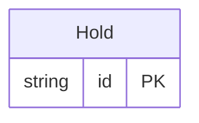

<!-- Code generated by protoc-gen-store. DO NOT EDIT. -->

# `freebusy/allocation/allocation/` — Prisma schema

Generated from Protobuf by protoc-gen-store. Source of truth is the `.proto` files — regenerate rather than editing.

| Models | Enums |
| ---: | ---: |
| 1 | 0 |

## Entity relationships

Schema file: [`allocation.postgres.prisma`](./allocation.postgres.prisma)

### `Hold` → `holds`

A Hold is a temporary, expiring claim on one or more bookable resources for a window, taken before payment or confirmation so two callers cannot be sold the same thing. Native, with no RFC behind it, and the comment says why (the same trade protobuf.shared.project.v1 records upstream). RFC 5545 section 3.2.12's PARTSTAT=TENTATIVE can express that a claim is provisional, and RFC 5546's iTIP can carry the request that created it, but neither specifies a lapse time, and an expiring claim is the one thing a commercial booking engine cannot do without. The resources held are RFC 9073 VRESOURCEs and the window is measured against their RFC 7953 availability; only the clock is ours. Holds are allocated, not requested: CreateHold names candidate resources and a quantity, and the server decides which concrete resources are taken. That keeps "which bay did I get" a server decision made under a lock, rather than a client guess that races.

| Column | Type | Null |
| --- | --- | --- |
| `id` | `CHAR(26)` | not null |
| `name` | `VARCHAR(255)` | not null |
| `window` | `TSTZRANGE` | not null |
| `quantity` | `INTEGER` | nullable |
| `expire_time` | `TIMESTAMPTZ` | nullable |
| `state` | `HoldState` | nullable |
| `idempotency_key` | `VARCHAR(255)` | nullable |
| `create_time` | `TIMESTAMPTZ` | not null |
| `update_time` | `TIMESTAMPTZ` | not null |
| `etag` | `VARCHAR(255)` | nullable |
| `organizational_unit_id` | `CHAR(26)` | not null |
| `resources` | `VARCHAR(255)[]` | nullable |
| `candidate_resources` | `VARCHAR(255)[]` | nullable |
