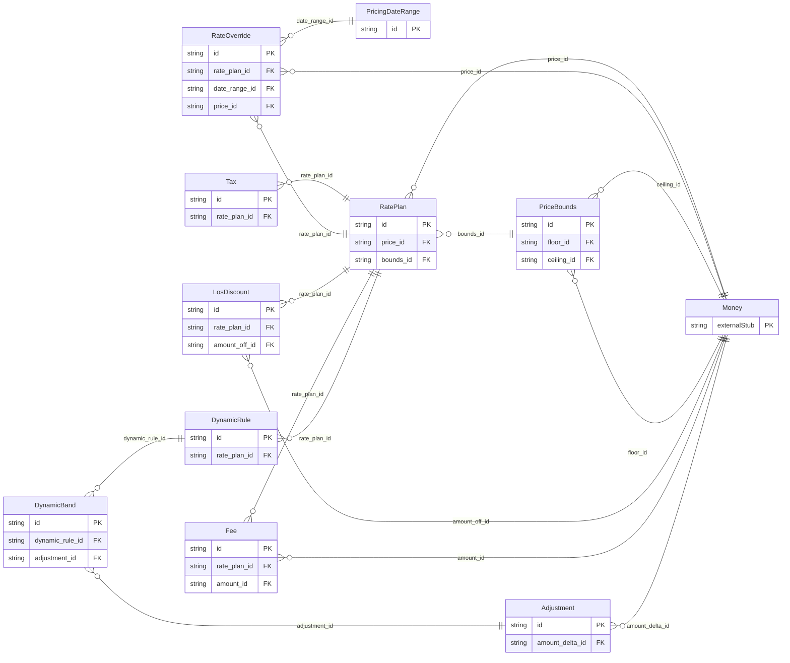

<!-- Code generated by protoc-gen-store. DO NOT EDIT. -->

# `freebusy/pricing/pricing/` — Prisma schema

Generated from Protobuf by protoc-gen-store. Source of truth is the `.proto` files — regenerate rather than editing.

| Models | Enums |
| ---: | ---: |
| 10 | 0 |

## Entity relationships

Schema file: [`pricing.postgres.prisma`](./pricing.postgres.prisma)

### `RatePlan` → `rate_plans`

A RatePlan is what a bookable resource costs: a base price, the calendar of overrides that move it, and the fees and taxes layered on top. Native, with no RFC behind it, and this is the one gap the audit could not close. The IETF has never standardised commerce — RFC 8905's `payto:` names a payment *address*, not an amount — so while every statement this engine makes about time comes from a published RFC, every statement it makes about money is ours. `google.type.Money` carries the amounts, which is the closest thing to a standard available and is exempt from the cross-package rule. A resource of its own rather than fields on the thing being priced: the same resource is sold at different rates to different channels and seasons, a rate plan is edited on a cadence entirely unlike the resource's, and a booking must still be explainable under the plan that priced it long after that plan stops being offered. Pricing attaches to a resource by reference, so an RFC 9073 VRESOURCE stays a description of a bookable thing and never grows a price.

| Column | Type | Null |
| --- | --- | --- |
| `id` | `CHAR(26)` | not null |
| `name` | `VARCHAR(255)` | not null |
| `resource` | `VARCHAR(255)` | not null |
| `display_name` | `VARCHAR(255)` | not null |
| `description` | `TEXT` | nullable |
| `pricing_unit` | `PricingUnit` | nullable |
| `state` | `RatePlanState` | nullable |
| `create_time` | `TIMESTAMPTZ` | not null |
| `update_time` | `TIMESTAMPTZ` | not null |
| `etag` | `VARCHAR(255)` | nullable |
| `price_id` | `CHAR(26)` | not null |
| `bounds_id` | `CHAR(26)` | nullable |

### `RateOverride` → `rate_overrides`

A price that replaces a plan's base rate for a span of dates, specific weekdays, or both.

| Column | Type | Null |
| --- | --- | --- |
| `id` | `CHAR(26)` | not null |
| `weekdays` | `` | nullable |
| `rate_plan_id` | `CHAR(26)` | not null |
| `date_range_id` | `CHAR(26)` | nullable |
| `price_id` | `CHAR(26)` | not null |

### `LosDiscount` → `los_discounts`

A discount applied once a stay reaches `min_nights`. Exactly one of `percent_off` or `amount_off` is set.

| Column | Type | Null |
| --- | --- | --- |
| `id` | `CHAR(26)` | not null |
| `min_nights` | `INTEGER` | not null |
| `percent_off` | `INTEGER` | nullable |
| `rate_plan_id` | `CHAR(26)` | not null |
| `amount_off_id` | `CHAR(26)` | nullable |

### `Fee` → `fees`

A charge added on top of the base subtotal. Exactly one of `amount` or `percent` is set.

| Column | Type | Null |
| --- | --- | --- |
| `id` | `CHAR(26)` | not null |
| `code` | `VARCHAR(255)` | not null |
| `display_name` | `VARCHAR(255)` | nullable |
| `percent` | `INTEGER` | nullable |
| `pricing_unit` | `PricingUnit` | nullable |
| `taxable` | `BOOLEAN` | nullable |
| `rate_plan_id` | `CHAR(26)` | not null |
| `amount_id` | `CHAR(26)` | nullable |

### `Tax` → `taxes`

A tax on the taxable base — the subtotal plus every fee marked taxable.

| Column | Type | Null |
| --- | --- | --- |
| `id` | `CHAR(26)` | not null |
| `code` | `VARCHAR(255)` | not null |
| `display_name` | `VARCHAR(255)` | nullable |
| `percent` | `DOUBLE PRECISION` | not null |
| `rate_plan_id` | `CHAR(26)` | not null |

### `DynamicRule` → `dynamic_rules`

A rule that moves price according to something measured at quote time. Bands are evaluated against the trigger's measured value and at most one band matches per rule, because bands of a single rule partition a range. Rules compound across triggers; bands do not compound within one.

| Column | Type | Null |
| --- | --- | --- |
| `id` | `CHAR(26)` | not null |
| `trigger` | `DynamicTrigger` | not null |
| `rate_plan_id` | `CHAR(26)` | not null |

### `PriceBounds` → `price_bounds`

Hard limits on a computed price, applied last — after every override, discount, dynamic rule and fee, and before tax. Applied last on purpose: bounding an intermediate step would let a later rule carry the price back out of range, which is exactly the failure the bounds exist to prevent.

| Column | Type | Null |
| --- | --- | --- |
| `id` | `CHAR(26)` | not null |
| `floor_id` | `CHAR(26)` | nullable |
| `ceiling_id` | `CHAR(26)` | nullable |

### `PricingDateRange` → `date_ranges`

An inclusive-start, exclusive-end span of calendar dates. Declared here rather than reused from freebusy.shared.v1: AIP-215 permits no cross-package message reference, and a shared types package was exactly what produced the foreign-type findings this package is written to avoid. The duplication is the documented cost of that rule.

| Column | Type | Null |
| --- | --- | --- |
| `id` | `CHAR(26)` | not null |
| `start_date` | `DATE` | not null |
| `end_date` | `DATE` | not null |

### `DynamicBand` → `dynamic_bands`

One threshold band of a DynamicRule: the range the measured value must fall in, and what happens to the price when it does.

| Column | Type | Null |
| --- | --- | --- |
| `id` | `CHAR(26)` | not null |
| `min_threshold` | `INTEGER` | not null |
| `max_threshold` | `INTEGER` | nullable |
| `display_name` | `VARCHAR(255)` | nullable |
| `dynamic_rule_id` | `CHAR(26)` | not null |
| `adjustment_id` | `CHAR(26)` | not null |

### `Adjustment` → `adjustments`

A price adjustment expressed as a proportion or a flat amount. Exactly one is set; both may be negative, which is how a discount is written.

| Column | Type | Null |
| --- | --- | --- |
| `id` | `CHAR(26)` | not null |
| `percent_delta` | `INTEGER` | nullable |
| `amount_delta_id` | `CHAR(26)` | nullable |
