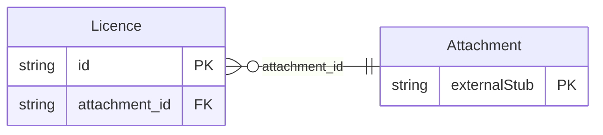

<!-- Code generated by protoc-gen-store. DO NOT EDIT. -->

# `freebusy/property/property/` — Prisma schema

Generated from Protobuf by protoc-gen-store. Source of truth is the `.proto` files — regenerate rather than editing.

| Models | Enums |
| ---: | ---: |
| 1 | 0 |

## Entity relationships

Schema file: [`property.postgres.prisma`](./property.postgres.prisma)

### `Licence` → `licences`

A regulatory licence or certificate held by a site or one of its bookable resources (e.g. trade licence, fire safety NOC, per-room liquor licence). Native, and it stays native because no RFC covers it: the IETF standardises calendars and directories, not the paperwork a jurisdiction demands to operate. It parents onto an RFC 4519 organizationalUnit and names an RFC 9073 resource, so the only thing freebusy defines here is the licence itself. One resource covers both scopes: `target` says which, and a resource-scoped licence names it in `unit`. `expiry_date` is filterable so renewals due can be listed; the certificate itself rides in `attachment`.

| Column | Type | Null |
| --- | --- | --- |
| `id` | `CHAR(26)` | not null |
| `name` | `VARCHAR(255)` | not null |
| `target` | `LicenceTarget` | nullable |
| `unit` | `VARCHAR(255)` | nullable |
| `type` | `LicenceType` | not null |
| `licence_number` | `VARCHAR(255)` | nullable |
| `issuing_authority` | `VARCHAR(255)` | nullable |
| `issue_date` | `DATE` | nullable |
| `expiry_date` | `DATE` | nullable |
| `notes` | `VARCHAR(255)` | nullable |
| `state` | `LicenceState` | nullable |
| `create_time` | `TIMESTAMPTZ` | not null |
| `update_time` | `TIMESTAMPTZ` | not null |
| `etag` | `VARCHAR(255)` | nullable |
| `organizational_unit_id` | `CHAR(26)` | not null |
| `attachment_id` | `CHAR(26)` | nullable |
