<!-- Code generated by protoc-gen-store. DO NOT EDIT. -->

# `rfc/` — Prisma schema

Generated from Protobuf by protoc-gen-store. Source of truth is the `.proto` files — regenerate rather than editing.

| Models | Enums |
| ---: | ---: |
| 66 | 45 |

## Entity relationships

```mermaid
erDiagram
    direction LR
    Alarm {
        string id PK
        string event_id FK
    }
    Attendee {
        string id PK
        string event_id FK
        string alarm_id FK
    }
    Attribute {
        string id PK
        string user_id FK
    }
    Availability {
        string id PK
        string calendar_id FK
        string start_id FK
        string end_id FK
    }
    AvailabilityCalendarTime {
        string id PK
    }
    AvailabilityExtensionProperty {
        string id PK
        string availability_id FK
        string available_period_id FK
    }
    AvailablePeriod {
        string id PK
        string availability_id FK
        string start_id FK
        string end_id FK
    }
    Calendar {
        string id PK
        string time_zone_id FK
    }
    CalendarExtensionProperty {
        string id PK
        string calendar_id FK
    }
    Card {
        string id PK
        string name_components_id FK
        string speech_id FK
    }
    CardName {
        string id PK
    }
    Contact {
        string id PK
        string name_components_id FK
        string birthday_id FK
        string anniversary_id FK
    }
    DateOrText {
        string id PK
    }
    Email {
        string id PK
        string contact_id FK
    }
    EnterpriseUser {
        string id PK
        string manager_id FK
    }
    Event {
        string id PK
        string calendar_id FK
        string start_id FK
        string end_id FK
        string recurrence_id FK
        string organizer_id FK
    }
    EventCalendarTime {
        string id PK
        string event_id FK
    }
    EventExtensionProperty {
        string id PK
        string event_id FK
    }
    EventResource {
        string id PK
        string event_id FK
        string participant_id FK
    }
    EventStructuredData {
        string id PK
        string event_id FK
        string participant_id FK
        string location_id FK
        string resource_id FK
    }
    Geo {
        string id PK
        string contact_id FK
    }
    GrammaticalGender {
        string id PK
        string contact_id FK
    }
    Group {
        string id PK
    }
    InstantMessage {
        string id PK
        string contact_id FK
    }
    Journal {
        string id PK
        string calendar_id FK
        string start_id FK
    }
    JournalCalendarTime {
        string id PK
    }
    JournalExtensionProperty {
        string id PK
        string journal_id FK
    }
    Language {
        string id PK
        string contact_id FK
    }
    LdapGroup {
        string id PK
    }
    Link {
        string id PK
        string event_id FK
    }
    Location {
        string id PK
        string event_id FK
        string participant_id FK
    }
    Manager {
        string id PK
    }
    Member {
        string id PK
        string group_id FK
    }
    Membership {
        string id PK
        string ldap_group_id FK
    }
    NameComponent {
        string id PK
        string name_id FK
    }
    Nickname {
        string id PK
        string contact_id FK
    }
    OrganizationOrganization {
        string id PK
    }
    OrganizationalUnit {
        string id PK
    }
    Organizer {
        string id PK
    }
    Participant {
        string id PK
        string event_id FK
    }
    Project {
        string id PK
    }
    Pronouns {
        string id PK
        string contact_id FK
    }
    Recurrence {
        string id PK
        string until_id FK
    }
    Relation {
        string id PK
        string contact_id FK
    }
    ResourceResource {
        string id PK
        string calendar FK
        string organizational_unit FK
    }
    ResourceStructuredData {
        string id PK
        string resource_id FK
    }
    Role {
        string id PK
        string contact_id FK
    }
    SocialProfile {
        string id PK
        string contact_id FK
    }
    Speech {
        string id PK
    }
    StyledDescription {
        string id PK
        string event_id FK
        string participant_id FK
    }
    Telephone {
        string id PK
        string contact_id FK
    }
    TimeZone {
        string id PK
    }
    Timezone {
        string id PK
        string contact_id FK
    }
    Todo {
        string id PK
        string calendar_id FK
        string start_id FK
        string due_id FK
        string completed_id FK
    }
    TodoCalendarTime {
        string id PK
    }
    TodoExtensionProperty {
        string id PK
        string todo_id FK
    }
    Url {
        string id PK
        string contact_id FK
    }
    User {
        string id PK
        string name_components_id FK
        string enterprise_id FK
    }
    UserAddress {
        string id PK
        string user_id FK
    }
    UserName {
        string id PK
    }
    Vcard {
        string id PK
        string contact_id FK
    }
    VcardAddress {
        string id PK
        string contact_id FK
    }
    VcardExtensionProperty {
        string id PK
        string contact_id FK
    }
    VcardName {
        string id PK
    }
    VcardOrganization {
        string id PK
        string contact_id FK
    }
    WeekdayNum {
        string id PK
        string recurrence_id FK
    }
    Alarm }o--|| Event : "event_id"
    Attendee }o--|| Event : "event_id"
    Attendee }o--|| Alarm : "alarm_id"
    Attribute }o--|| User : "user_id"
    Availability }o--|| Calendar : "calendar_id"
    Availability }o--|| AvailabilityCalendarTime : "start_id"
    Availability }o--|| AvailabilityCalendarTime : "end_id"
    AvailabilityExtensionProperty }o--|| Availability : "availability_id"
    AvailabilityExtensionProperty }o--|| AvailablePeriod : "available_period_id"
    AvailablePeriod }o--|| Availability : "availability_id"
    AvailablePeriod }o--|| AvailabilityCalendarTime : "start_id"
    AvailablePeriod }o--|| AvailabilityCalendarTime : "end_id"
    Calendar }o--|| TimeZone : "time_zone_id"
    CalendarExtensionProperty }o--|| Calendar : "calendar_id"
    Card }o--|| CardName : "name_components_id"
    Card }o--|| Speech : "speech_id"
    Contact }o--|| VcardName : "name_components_id"
    Contact }o--|| DateOrText : "birthday_id"
    Contact }o--|| DateOrText : "anniversary_id"
    Email }o--|| Contact : "contact_id"
    EnterpriseUser }o--|| Manager : "manager_id"
    Event }o--|| Calendar : "calendar_id"
    Event }o--|| EventCalendarTime : "start_id"
    Event }o--|| EventCalendarTime : "end_id"
    Event }o--|| Recurrence : "recurrence_id"
    Event }o--|| Organizer : "organizer_id"
    EventCalendarTime }o--|| Event : "event_id"
    EventExtensionProperty }o--|| Event : "event_id"
    EventResource }o--|| Event : "event_id"
    EventResource }o--|| Participant : "participant_id"
    EventStructuredData }o--|| Event : "event_id"
    EventStructuredData }o--|| Participant : "participant_id"
    EventStructuredData }o--|| Location : "location_id"
    EventStructuredData }o--|| EventResource : "resource_id"
    Geo }o--|| Contact : "contact_id"
    GrammaticalGender }o--|| Contact : "contact_id"
    InstantMessage }o--|| Contact : "contact_id"
    Journal }o--|| Calendar : "calendar_id"
    Journal }o--|| JournalCalendarTime : "start_id"
    JournalExtensionProperty }o--|| Journal : "journal_id"
    Language }o--|| Contact : "contact_id"
    Link }o--|| Event : "event_id"
    Location }o--|| Event : "event_id"
    Location }o--|| Participant : "participant_id"
    Member }o--|| Group : "group_id"
    Membership }o--|| LdapGroup : "ldap_group_id"
    NameComponent }o--|| CardName : "name_id"
    Nickname }o--|| Contact : "contact_id"
    Participant }o--|| Event : "event_id"
    Pronouns }o--|| Contact : "contact_id"
    Recurrence }o--|| EventCalendarTime : "until_id"
    Relation }o--|| Contact : "contact_id"
    ResourceResource }o--|| Calendar : "calendar"
    ResourceResource }o--|| OrganizationalUnit : "organizational_unit"
    ResourceStructuredData }o--|| ResourceResource : "resource_id"
    Role }o--|| Contact : "contact_id"
    SocialProfile }o--|| Contact : "contact_id"
    StyledDescription }o--|| Event : "event_id"
    StyledDescription }o--|| Participant : "participant_id"
    Telephone }o--|| Contact : "contact_id"
    Timezone }o--|| Contact : "contact_id"
    Todo }o--|| Calendar : "calendar_id"
    Todo }o--|| TodoCalendarTime : "start_id"
    Todo }o--|| TodoCalendarTime : "due_id"
    Todo }o--|| TodoCalendarTime : "completed_id"
    TodoExtensionProperty }o--|| Todo : "todo_id"
    Url }o--|| Contact : "contact_id"
    User }o--|| UserName : "name_components_id"
    User }o--|| EnterpriseUser : "enterprise_id"
    UserAddress }o--|| User : "user_id"
    Vcard }o--|| Contact : "contact_id"
    VcardAddress }o--|| Contact : "contact_id"
    VcardExtensionProperty }o--|| Contact : "contact_id"
    VcardOrganization }o--|| Contact : "contact_id"
    WeekdayNum }o--|| Recurrence : "recurrence_id"
```

## Subfolders

- [`rfc4519/`](./rfc4519/README.md)
- [`rfc5545/`](./rfc5545/README.md)
- [`rfc6350/`](./rfc6350/README.md)
- [`rfc7643/`](./rfc7643/README.md)
- [`rfc7953/`](./rfc7953/README.md)
- [`rfc9073/`](./rfc9073/README.md)
- [`rfc9553/`](./rfc9553/README.md)
- [`shared/`](./shared/README.md)
- [`type/`](./type/README.md)
