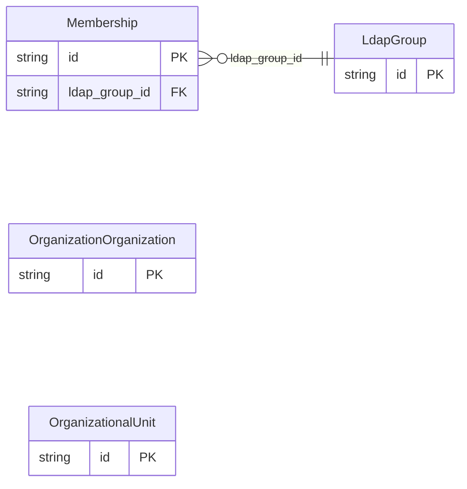

<!-- Code generated by protoc-gen-store. DO NOT EDIT. -->

# `rfc/rfc4519/` — Prisma schema

Generated from Protobuf by protoc-gen-store. Source of truth is the `.proto` files — regenerate rather than editing.

| Models | Enums |
| ---: | ---: |
| 4 | 0 |

## Entity relationships

## Subfolders

- [`group/`](./group/README.md)
- [`membership/`](./membership/README.md)
- [`organization/`](./organization/README.md)
- [`organizational_unit/`](./organizational_unit/README.md)
