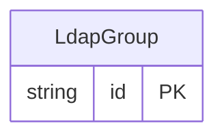

<!-- Code generated by protoc-gen-store. DO NOT EDIT. -->

# `rfc/rfc4519/group/ldap_group/` — Prisma schema

Generated from Protobuf by protoc-gen-store. Source of truth is the `.proto` files — regenerate rather than editing.

| Models | Enums |
| ---: | ---: |
| 1 | 0 |

## Entity relationships

Schema file: [`ldap_group.postgres.prisma`](./ldap_group.postgres.prisma)

### `LdapGroup` → `ldap_groups`

LdapGroup is the LDAP 'groupOfNames' object class, RFC 4519 section 3.5 <https://www.rfc-editor.org/rfc/rfc4519.html#section-3.5>. Section 3.5 makes 'member' a mandatory multi-valued attribute of the group itself. This model deliberately does not: membership is Membership, a resource of its own. A repeated string of DNs cannot carry a role, cannot be created or revoked independently, and cannot be listed with a page token. Externalising it is the difference between a group that records who is in it and one that can answer why. A consequence: 'member' is mandatory in the RFC and absent here, so a LdapGroup with no Membership is representable in this API and is not a valid groupOfNames entry. The rule for an exporter: refuse, not synthesise. Section 3.5 gives no value that could stand in for an absent member -- inventing one (the group's own DN, an owner, a sentinel) asserts a membership nothing in this model states, which misleads every LDAP consumer of the export more than an explicit error would. An exporter targeting LDAP MUST reject a LdapGroup with zero Memberships rather than emit an invalid or fabricated entry. Reference: RFC 4519 "LDAP: Schema for User Applications", section 3.5. https://www.rfc-editor.org/rfc/rfc4519.html#section-3.5

| Column | Type | Null |
| --- | --- | --- |
| `id` | `CHAR(26)` | not null |
| `name` | `VARCHAR(255)` | not null |
| `uid` | `VARCHAR(255)` | nullable |
| `display_names` | `VARCHAR(255)[]` | not null |
| `descriptions` | `VARCHAR(255)[]` | nullable |
| `owners` | `VARCHAR(255)[]` | nullable |
| `organization` | `VARCHAR(255)` | nullable |
| `business_categories` | `VARCHAR(255)[]` | nullable |
| `create_time` | `TIMESTAMPTZ` | not null |
| `update_time` | `TIMESTAMPTZ` | not null |
| `etag` | `VARCHAR(255)` | nullable |
| `delete_time` | `TIMESTAMPTZ` | nullable |
| `expire_time` | `TIMESTAMPTZ` | nullable |
