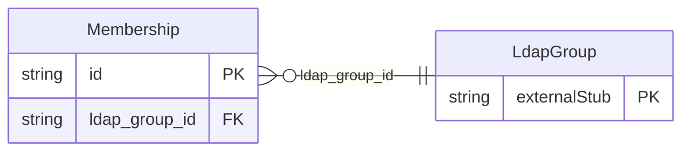

<!-- Code generated by protoc-gen-store. DO NOT EDIT. -->

# `rfc/rfc4519/membership/membership/` — Prisma schema

Generated from Protobuf by protoc-gen-store. Source of truth is the `.proto` files — regenerate rather than editing.

| Models | Enums |
| ---: | ---: |
| 1 | 0 |

## Entity relationships

Schema file: [`membership.postgres.prisma`](./membership.postgres.prisma)

### `Membership` → `resource`

Membership is one entry's presence in a Group. This is the 'member' attribute of section 2.17 <https://www.rfc-editor.org/rfc/rfc4519.html#section-2.17> promoted to a resource. It exists because a membership carries attributes of its own -- at minimum a role -- and an attribute needs something to hang on. Section 3.6 offers 'groupOfUniqueNames' with 'uniqueMember' (section 2.40 <https://www.rfc-editor.org/rfc/rfc4519.html#section-2.40>), which appends an optional UID to the DN so a reused name does not silently inherit an old membership. The uid field below solves that problem more directly, so only 'member' is modelled. Reference: RFC 4519 "LDAP: Schema for User Applications", section 2.17. https://www.rfc-editor.org/rfc/rfc4519.html#section-2.17

| Column | Type | Null |
| --- | --- | --- |
| `id` | `CHAR(26)` | not null |
| `name` | `VARCHAR(255)` | not null |
| `uid` | `VARCHAR(255)` | nullable |
| `member` | `VARCHAR(255)` | not null |
| `role` | `VARCHAR(255)` | nullable |
| `create_time` | `TIMESTAMPTZ` | not null |
| `update_time` | `TIMESTAMPTZ` | not null |
| `etag` | `VARCHAR(255)` | nullable |
| `ldap_group_id` | `CHAR(26)` | not null |
