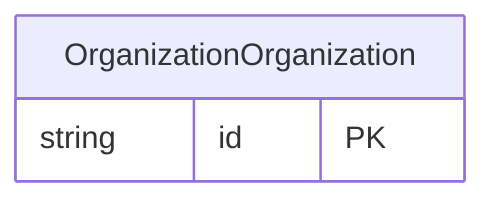

<!-- Code generated by protoc-gen-store. DO NOT EDIT. -->

# `rfc/rfc4519/organization/organization/` — Prisma schema

Generated from Protobuf by protoc-gen-store. Source of truth is the `.proto` files — regenerate rather than editing.

| Models | Enums |
| ---: | ---: |
| 1 | 0 |

## Entity relationships

Schema file: [`organization.postgres.prisma`](./organization.postgres.prisma)

### `OrganizationOrganization` → `resource`

Organization is the LDAP 'organization' object class, RFC 4519 section 3.8 <https://www.rfc-editor.org/rfc/rfc4519.html#section-3.8>. Attributes are repeated because LDAP attribute types are multi-valued by default. Section 3.8 lists twenty-one optional attributes; the four here are the ones that carry meaning outside a directory server. Reference: RFC 4519 "LDAP: Schema for User Applications", section 3.8. https://www.rfc-editor.org/rfc/rfc4519.html#section-3.8

| Column | Type | Null |
| --- | --- | --- |
| `id` | `CHAR(26)` | not null |
| `name` | `VARCHAR(255)` | not null |
| `uid` | `VARCHAR(255)` | nullable |
| `display_names` | `VARCHAR(255)[]` | not null |
| `descriptions` | `VARCHAR(255)[]` | nullable |
| `business_categories` | `VARCHAR(255)[]` | nullable |
| `see_also` | `VARCHAR(255)[]` | nullable |
| `create_time` | `TIMESTAMPTZ` | not null |
| `update_time` | `TIMESTAMPTZ` | not null |
| `etag` | `VARCHAR(255)` | nullable |
| `delete_time` | `TIMESTAMPTZ` | nullable |
| `expire_time` | `TIMESTAMPTZ` | nullable |
