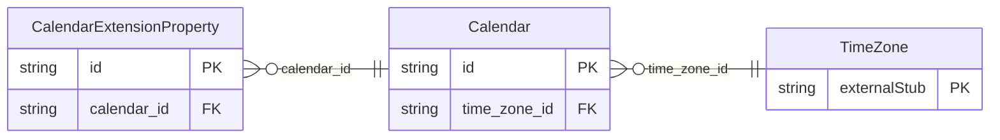

<!-- Code generated by protoc-gen-store. DO NOT EDIT. -->

# `rfc/rfc5545/calendar/calendar/` — Prisma schema

Generated from Protobuf by protoc-gen-store. Source of truth is the `.proto` files — regenerate rather than editing.

| Models | Enums |
| ---: | ---: |
| 2 | 1 |

## Entity relationships

Schema file: [`calendar.postgres.prisma`](./calendar.postgres.prisma)

### `Calendar` → `resource`

Calendar is the iCalendar object, RFC 5545 section 3.4 <https://www.rfc-editor.org/rfc/rfc5545.html#section-3.4>. The collection an Event belongs to. Event's resource name is "calendars/{calendar}/events/{event}", so this is the parent that name refers to; without it every event would live under a collection nothing could create or delete. PRODID (section 3.7.3 <https://www.rfc-editor.org/rfc/rfc5545.html#section-3.7.3>) and VERSION (section 3.7.4 <https://www.rfc-editor.org/rfc/rfc5545.html#section-3.7.4>) are deliberately absent. Both describe the iCalendar *stream* rather than the calendar -- which product wrote the file, and which version of the format it used -- so they belong to the codec that produces the stream, not to a stored resource. Reference: RFC 5545 "Internet Calendaring and Scheduling Core Object Specification (iCalendar)", section 3.4. https://www.rfc-editor.org/rfc/rfc5545.html#section-3.4

| Column | Type | Null |
| --- | --- | --- |
| `id` | `CHAR(26)` | not null |
| `name` | `VARCHAR(255)` | not null |
| `uid` | `VARCHAR(255)` | nullable |
| `display_name` | `VARCHAR(255)` | not null |
| `description` | `VARCHAR(255)` | nullable |
| `scale` | `CalendarScale` | nullable |
| `etag` | `VARCHAR(255)` | nullable |
| `delete_time` | `TIMESTAMPTZ` | nullable |
| `expire_time` | `TIMESTAMPTZ` | nullable |
| `create_time` | `TIMESTAMPTZ` | not null |
| `update_time` | `TIMESTAMPTZ` | not null |
| `max_resource_size` | `BIGINT` | nullable |
| `min_date_time` | `TIMESTAMPTZ` | nullable |
| `max_date_time` | `TIMESTAMPTZ` | nullable |
| `max_instances` | `INTEGER` | nullable |
| `max_attendees_per_instance` | `INTEGER` | nullable |
| `time_zone_id` | `VARCHAR(255)` | nullable |

### `CalendarExtensionProperty` → `extension_properties`

CalendarScale is the CALSCALE property, RFC 5545 section 3.7.1 <https://www.rfc-editor.org/rfc/rfc5545.html#section-3.7.1>. ExtensionProperty carries an iCalendar property this schema does not model. Not a hole punched in a typed schema: RFC 5545 section 3.8.8.1 <https://www.rfc-editor.org/rfc/rfc5545.html#section-3.8.8.1> reserves IANA-registered properties and section 3.8.8.2 <https://www.rfc-editor.org/rfc/rfc5545.html#section-3.8.8.2> non-standard X- properties, and requires that applications ignore what they do not recognise rather than reject it. A calendar that round-trips without them is lossy by construction. It is also what keeps the modelled properties honest. Anything the schema has not earned a typed field for survives here instead of forcing a speculative field table, and a property graduates out of this message when a consumer needs to query it. Reference: RFC 5545 "Internet Calendaring and Scheduling Core Object Specification (iCalendar)", section 3.8.8.2. https://www.rfc-editor.org/rfc/rfc5545.html#section-3.8.8.2

| Column | Type | Null |
| --- | --- | --- |
| `id` | `CHAR(26)` | not null |
| `key` | `VARCHAR(255)` | not null |
| `values` | `VARCHAR(255)[]` | nullable |
| `parameters` | `JSONB` | nullable |
| `calendar_id` | `CHAR(26)` | not null |

### Enums

- `CalendarScale`: GREGORIAN
