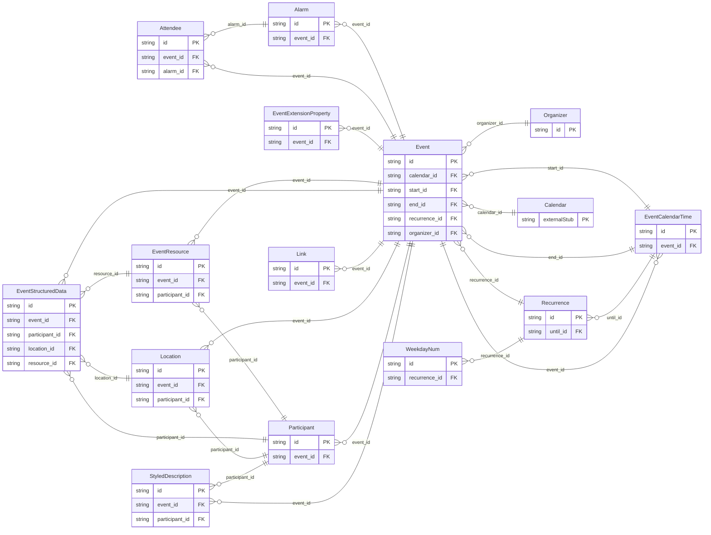

<!-- Code generated by protoc-gen-store. DO NOT EDIT. -->

# `rfc/rfc5545/event/` — Prisma schema

Generated from Protobuf by protoc-gen-store. Source of truth is the `.proto` files — regenerate rather than editing.

| Models | Enums |
| ---: | ---: |
| 14 | 18 |

## Entity relationships

## Subfolders

- [`alarm/`](./alarm/README.md)
- [`alarm_types/`](./alarm_types/README.md)
- [`event/`](./event/README.md)
- [`links/`](./links/README.md)
- [`participant/`](./participant/README.md)
- [`publishing/`](./publishing/README.md)
- [`publishing_types/`](./publishing_types/README.md)
- [`recurrence/`](./recurrence/README.md)
- [`recurrence_parts/`](./recurrence_parts/README.md)
- [`types/`](./types/README.md)
