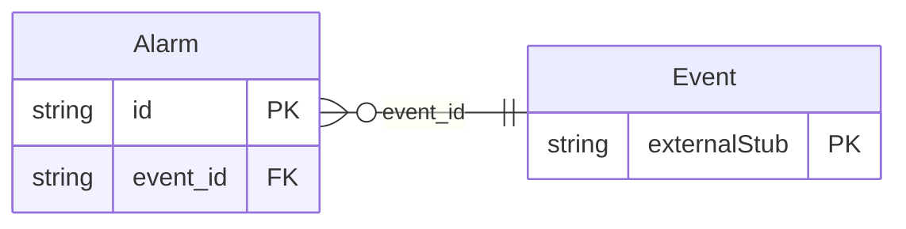

<!-- Code generated by protoc-gen-store. DO NOT EDIT. -->

# `rfc/rfc5545/event/alarm/` — Prisma schema

Generated from Protobuf by protoc-gen-store. Source of truth is the `.proto` files — regenerate rather than editing.

| Models | Enums |
| ---: | ---: |
| 1 | 1 |

## Entity relationships

Schema file: [`alarm.postgres.prisma`](./alarm.postgres.prisma)

### `Alarm` → `alarms`

Alarm is the VALARM component, RFC 5545 section 3.6.6 <https://www.rfc-editor.org/rfc/rfc5545.html#section-3.6.6>, as extended by RFC 9074 <https://www.rfc-editor.org/rfc/rfc9074.html>. A sub-component of VEVENT and VTODO, not a component of its own. It is a value object here for the same reason: an alarm has no identity, is never addressed, and disappears with the event that owns it. It gets no resource, no service and no messages file. Which properties are required depends on `action`, which section 3.6.6 <https://www.rfc-editor.org/rfc/rfc5545.html#section-3.6.6> specifies as three different property sets rather than one with optional members. That is expressed here as documented constraints rather than a oneof, because the shared properties -- trigger, repeat -- apply to all three and a oneof would force them to be repeated per branch. Reference: RFC 5545 "Internet Calendaring and Scheduling Core Object Specification (iCalendar)", section 3.6.6. https://www.rfc-editor.org/rfc/rfc5545.html#section-3.6.6

| Column | Type | Null |
| --- | --- | --- |
| `id` | `CHAR(26)` | not null |
| `action` | `AlarmAction` | not null |
| `trigger_offset` | `INTERVAL` | nullable |
| `trigger_time` | `TIMESTAMPTZ` | nullable |
| `trigger_relation` | `TriggerRelation` | nullable |
| `repeat_interval` | `INTERVAL` | nullable |
| `repeat_count` | `INTEGER` | nullable |
| `description` | `VARCHAR(255)` | nullable |
| `summary` | `VARCHAR(255)` | nullable |
| `ical_uid` | `VARCHAR(255)` | nullable |
| `acknowledged_time` | `TIMESTAMPTZ` | nullable |
| `proximity` | `Proximity` | nullable |
| `snoozed_alarm_uid` | `VARCHAR(255)` | nullable |
| `trigger_case` | `AlarmTriggerCase` | nullable |
| `event_id` | `CHAR(26)` | not null |

### Enums

- `AlarmTriggerCase`: TRIGGER_OFFSET, TRIGGER_TIME
