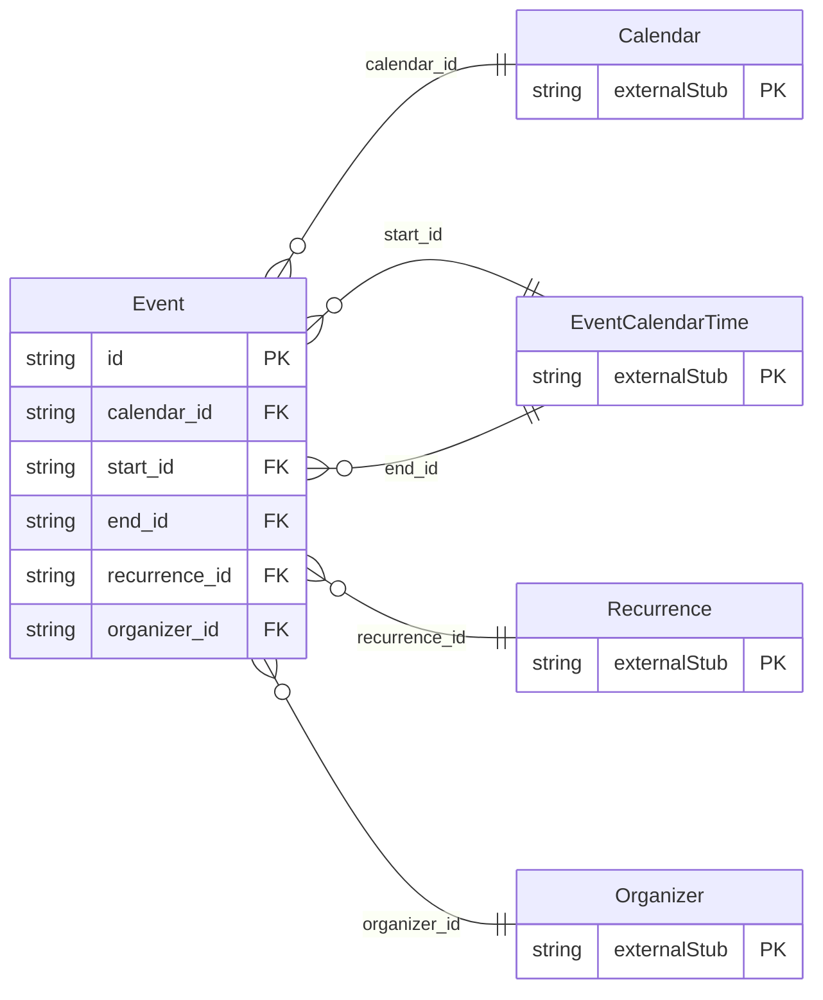

<!-- Code generated by protoc-gen-store. DO NOT EDIT. -->

# `rfc/rfc5545/event/event/` — Prisma schema

Generated from Protobuf by protoc-gen-store. Source of truth is the `.proto` files — regenerate rather than editing.

| Models | Enums |
| ---: | ---: |
| 1 | 1 |

## Entity relationships

Schema file: [`event.postgres.prisma`](./event.postgres.prisma)

### `Event` → `resource`

Event is the VEVENT component, RFC 5545 section 3.6.1 <https://www.rfc-editor.org/rfc/rfc5545.html#section-3.6.1>. Unlike User, which wraps an RFC-shaped value object, the calendar properties sit directly on the resource. VEVENT has no separable property bag: DTSTART, RRULE and STATUS are what an event *is*, not a payload it carries. Recurrence is the only part with enough structure to be its own type. Scope is the properties a scheduler needs. Section 3.6.1 permits about thirty more -- ATTENDEE, ORGANIZER, ATTACH, CATEGORIES, VALARM sub-components -- added when a consumer needs them. Reference: RFC 5545 "Internet Calendaring and Scheduling Core Object Specification (iCalendar)", section 3.6.1. https://www.rfc-editor.org/rfc/rfc5545.html#section-3.6.1

| Column | Type | Null |
| --- | --- | --- |
| `id` | `CHAR(26)` | not null |
| `name` | `VARCHAR(255)` | not null |
| `uid` | `VARCHAR(255)` | nullable |
| `ical_uid` | `VARCHAR(255)` | nullable |
| `summary` | `VARCHAR(255)` | nullable |
| `description` | `VARCHAR(255)` | nullable |
| `location` | `VARCHAR(255)` | nullable |
| `duration` | `INTERVAL` | nullable |
| `confirmation` | `Confirmation` | nullable |
| `classification` | `EventClassification` | nullable |
| `transparency` | `Transparency` | nullable |
| `sequence` | `INTEGER` | nullable |
| `create_time` | `TIMESTAMPTZ` | not null |
| `update_time` | `TIMESTAMPTZ` | not null |
| `etag` | `VARCHAR(255)` | nullable |
| `delete_time` | `TIMESTAMPTZ` | nullable |
| `expire_time` | `TIMESTAMPTZ` | nullable |
| `position` | `POINT` | nullable |
| `concepts` | `VARCHAR(255)[]` | nullable |
| `refids` | `VARCHAR(255)[]` | nullable |
| `ends_case` | `EventEndsCase` | nullable |
| `calendar_id` | `CHAR(26)` | not null |
| `start_id` | `CHAR(26)` | not null |
| `end_id` | `CHAR(26)` | nullable |
| `recurrence_id` | `CHAR(26)` | nullable |
| `organizer_id` | `CHAR(26)` | nullable |

### Enums

- `EventEndsCase`: END, DURATION
