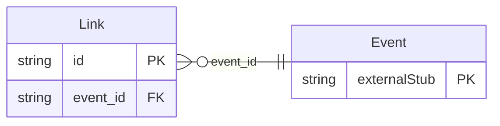

<!-- Code generated by protoc-gen-store. DO NOT EDIT. -->

# `rfc/rfc5545/event/links/` — Prisma schema

Generated from Protobuf by protoc-gen-store. Source of truth is the `.proto` files — regenerate rather than editing.

| Models | Enums |
| ---: | ---: |
| 1 | 1 |

## Entity relationships

Schema file: [`links.postgres.prisma`](./links.postgres.prisma)

### `Link` → `links`

Link is the LINK property, RFC 9253 section 8.2 <https://www.rfc-editor.org/rfc/rfc9253.html#section-8.2>. A reference to information related to the component. Section 8.2 gives it three value types -- URI, UID and XML-REFERENCE -- and requires VALUE to say which, so the oneof carries the same distinction rather than guessing from the string's shape. This is deliberately not the same thing as ATTACH (RFC 5545 section 3.8.1.1 <https://www.rfc-editor.org/rfc/rfc5545.html#section-3.8.1.1>). ATTACH carries a document belonging to the event; LINK states a typed relationship to something else, which is what `relation` names. Reference: RFC 9253 "Support for iCalendar Relationships", section 8.2. https://www.rfc-editor.org/rfc/rfc9253.html#section-8.2

| Column | Type | Null |
| --- | --- | --- |
| `id` | `CHAR(26)` | not null |
| `uri` | `VARCHAR(255)` | nullable |
| `ical_uid` | `VARCHAR(255)` | nullable |
| `xml_reference` | `VARCHAR(255)` | nullable |
| `relation` | `VARCHAR(255)` | not null |
| `format_type` | `VARCHAR(255)` | nullable |
| `label` | `VARCHAR(255)` | nullable |
| `language_code` | `VARCHAR(255)` | nullable |
| `value_case` | `LinkValueCase` | nullable |
| `event_id` | `CHAR(26)` | not null |

### Enums

- `LinkValueCase`: URI, ICAL_UID, XML_REFERENCE
