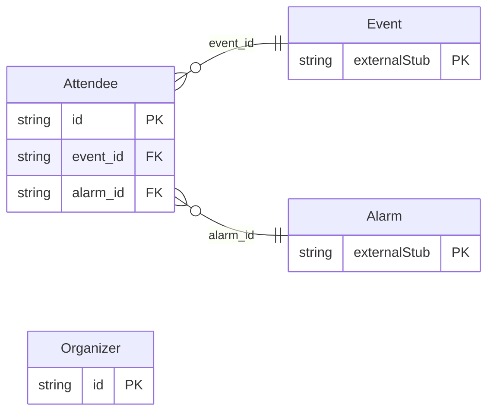

<!-- Code generated by protoc-gen-store. DO NOT EDIT. -->

# `rfc/rfc5545/event/participant/` — Prisma schema

Generated from Protobuf by protoc-gen-store. Source of truth is the `.proto` files — regenerate rather than editing.

| Models | Enums |
| ---: | ---: |
| 2 | 3 |

## Entity relationships

Schema file: [`participant.postgres.prisma`](./participant.postgres.prisma)

### `Organizer` → `organizers`

Organizer is the ORGANIZER property, RFC 5545 section 3.8.4.3 <https://www.rfc-editor.org/rfc/rfc5545.html#section-3.8.4.3>. Distinct from an Attendee with ROLE=CHAIR: the organizer owns the event and is who iTIP replies are addressed to, which is a scheduling fact rather than a statement about who runs the meeting. Reference: RFC 5545 "Internet Calendaring and Scheduling Core Object Specification (iCalendar)", section 3.8.4.3. https://www.rfc-editor.org/rfc/rfc5545.html#section-3.8.4.3

| Column | Type | Null |
| --- | --- | --- |
| `id` | `CHAR(26)` | not null |
| `address` | `VARCHAR(255)` | not null |
| `display_name` | `VARCHAR(255)` | nullable |
| `sender` | `VARCHAR(255)` | nullable |

### `Attendee` → `attendees`

Attendee is the ATTENDEE property, RFC 5545 section 3.8.4.1 <https://www.rfc-editor.org/rfc/rfc5545.html#section-3.8.4.1>. The property value is a CAL-ADDRESS -- in practice a mailto: URI -- and everything that makes an attendee useful is carried in its parameters rather than its value. Those parameters are the fields below. Reference: RFC 5545 "Internet Calendaring and Scheduling Core Object Specification (iCalendar)", section 3.8.4.1. https://www.rfc-editor.org/rfc/rfc5545.html#section-3.8.4.1

| Column | Type | Null |
| --- | --- | --- |
| `id` | `CHAR(26)` | not null |
| `address` | `VARCHAR(255)` | not null |
| `display_name` | `VARCHAR(255)` | nullable |
| `role` | `ParticipationRole` | nullable |
| `participation` | `Participation` | nullable |
| `user_type` | `CalendarUserType` | nullable |
| `rsvp` | `BOOLEAN` | nullable |
| `delegatees` | `VARCHAR(255)[]` | nullable |
| `delegators` | `VARCHAR(255)[]` | nullable |
| `event_id` | `CHAR(26)` | not null |
| `alarm_id` | `CHAR(26)` | not null |

### Enums

- `ParticipationRole`: CHAIR, REQUIRED, OPTIONAL, NON_PARTICIPANT
- `Participation`: NEEDS_ACTION, ACCEPTED, DECLINED, TENTATIVE, DELEGATED
- `CalendarUserType`: INDIVIDUAL, GROUP, RESOURCE, ROOM, UNKNOWN
