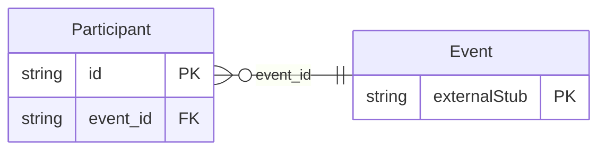

<!-- Code generated by protoc-gen-store. DO NOT EDIT. -->

# `rfc/rfc5545/event/publishing/` — Prisma schema

Generated from Protobuf by protoc-gen-store. Source of truth is the `.proto` files — regenerate rather than editing.

| Models | Enums |
| ---: | ---: |
| 1 | 0 |

## Entity relationships

Schema file: [`publishing.postgres.prisma`](./publishing.postgres.prisma)

### `Participant` → `participants`

Participant is the PARTICIPANT component, RFC 9073 section 7.1 <https://www.rfc-editor.org/rfc/rfc9073.html#section-7.1>. **Not an Attendee.** RFC 5545 section 3.8.4.1 <https://www.rfc-editor.org/rfc/rfc5545.html#section-3.8.4.1>'s ATTENDEE is a scheduling party: someone iTIP sends invitations to and collects replies from, keyed on a calendar address they must have. A Participant is someone the event *involves* -- a speaker, a sponsor, a performer, an emergency contact -- who may have no calendar address at all and is never sent a REQUEST. The two overlap without either containing the other, which is why RFC 9073 added a component instead of a parameter on ATTENDEE, and why this is a separate message rather than a field on Attendee. A person who both speaks at an event and is invited to it appears as both, and that is correct. Reference: RFC 9073 "Event Publishing Extensions to iCalendar", section 7.1. https://www.rfc-editor.org/rfc/rfc9073.html#section-7.1

| Column | Type | Null |
| --- | --- | --- |
| `id` | `CHAR(26)` | not null |
| `ical_uid` | `VARCHAR(255)` | nullable |
| `participant_types` | `` | not null |
| `calendar_address` | `VARCHAR(255)` | nullable |
| `summary` | `VARCHAR(255)` | nullable |
| `description` | `VARCHAR(255)` | nullable |
| `url` | `VARCHAR(255)` | nullable |
| `position` | `POINT` | nullable |
| `event_id` | `CHAR(26)` | not null |
