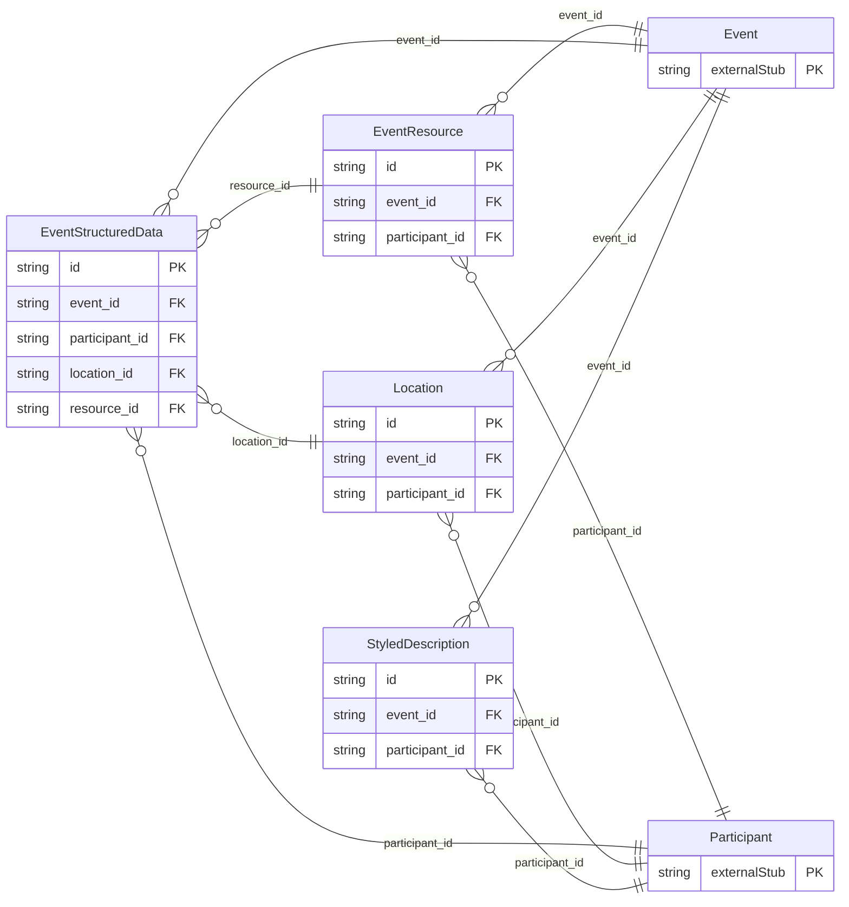

<!-- Code generated by protoc-gen-store. DO NOT EDIT. -->

# `rfc/rfc5545/event/publishing_types/` — Prisma schema

Generated from Protobuf by protoc-gen-store. Source of truth is the `.proto` files — regenerate rather than editing.

| Models | Enums |
| ---: | ---: |
| 4 | 2 |

## Entity relationships

Schema file: [`publishing_types.postgres.prisma`](./publishing_types.postgres.prisma)

### `Location` → `locations`

Location is the VLOCATION component, RFC 9073 section 7.2 <https://www.rfc-editor.org/rfc/rfc9073.html#section-7.2>. Structured location information, as opposed to Event.location, which is RFC 5545 section 3.8.1.7 <https://www.rfc-editor.org/rfc/rfc5545.html#section-3.8.1.7>'s single free-text line. An event may have several -- a venue, its car park, the station to arrive at -- and `location_type` says which is which, so a client can route to the right one rather than guessing from prose. Reference: RFC 9073 "Event Publishing Extensions to iCalendar", section 7.2. https://www.rfc-editor.org/rfc/rfc9073.html#section-7.2

| Column | Type | Null |
| --- | --- | --- |
| `id` | `CHAR(26)` | not null |
| `ical_uid` | `VARCHAR(255)` | nullable |
| `display_name` | `VARCHAR(255)` | nullable |
| `description` | `VARCHAR(255)` | nullable |
| `location_types` | `VARCHAR(255)[]` | nullable |
| `position` | `POINT` | nullable |
| `event_id` | `CHAR(26)` | not null |
| `participant_id` | `CHAR(26)` | not null |

### `EventResource` → `resources`

Resource is the VRESOURCE component, RFC 9073 section 7.3 <https://www.rfc-editor.org/rfc/rfc9073.html#section-7.3>. Something the event needs that is not a person and not a place: a projector, a minibus, a signer. RFC 5545 section 3.8.1.10 <https://www.rfc-editor.org/rfc/rfc5545.html#section-3.8.1.10> already had a free-text RESOURCES property; this is its structured replacement, and that one is deliberately not modelled rather than carried alongside as a second way to say the same thing. Reference: RFC 9073 "Event Publishing Extensions to iCalendar", section 7.3. https://www.rfc-editor.org/rfc/rfc9073.html#section-7.3

| Column | Type | Null |
| --- | --- | --- |
| `id` | `CHAR(26)` | not null |
| `ical_uid` | `VARCHAR(255)` | nullable |
| `display_name` | `VARCHAR(255)` | nullable |
| `description` | `VARCHAR(255)` | nullable |
| `resource_types` | `VARCHAR(255)[]` | nullable |
| `position` | `POINT` | nullable |
| `event_id` | `CHAR(26)` | not null |
| `participant_id` | `CHAR(26)` | not null |

### `StyledDescription` → `styled_descriptions`

StyledDescription is the STYLED-DESCRIPTION property, RFC 9073 section 6.5 <https://www.rfc-editor.org/rfc/rfc9073.html#section-6.5>. A rich-text description, where RFC 5545 section 3.8.1.5 <https://www.rfc-editor.org/rfc/rfc5545.html#section-3.8.1.5>'s DESCRIPTION is plain text only. Section 6.5 requires that a component carrying one also carry a plain DESCRIPTION saying the same thing, so a client that cannot render HTML is never left with nothing -- which is why this supplements Event.description rather than replacing it. Reference: RFC 9073 "Event Publishing Extensions to iCalendar", section 6.5. https://www.rfc-editor.org/rfc/rfc9073.html#section-6.5

| Column | Type | Null |
| --- | --- | --- |
| `id` | `CHAR(26)` | not null |
| `text` | `VARCHAR(255)` | nullable |
| `uri` | `VARCHAR(255)` | nullable |
| `format_type` | `VARCHAR(255)` | nullable |
| `derived` | `BOOLEAN` | nullable |
| `value_case` | `StyledDescriptionValueCase` | nullable |
| `event_id` | `CHAR(26)` | not null |
| `participant_id` | `CHAR(26)` | not null |

### `EventStructuredData` → `structured_datas`

StructuredData is the STRUCTURED-DATA property, RFC 9073 section 6.6 <https://www.rfc-editor.org/rfc/rfc9073.html#section-6.6>. Machine-readable data about the component, for a consumer that understands the named schema -- a schema.org Event, a vCard, a JSON-LD graph. It is the escape hatch for publishing detail iCalendar has no property for, and is deliberately opaque here: this schema does not parse it. Reference: RFC 9073 "Event Publishing Extensions to iCalendar", section 6.6. https://www.rfc-editor.org/rfc/rfc9073.html#section-6.6

| Column | Type | Null |
| --- | --- | --- |
| `id` | `CHAR(26)` | not null |
| `text` | `VARCHAR(255)` | nullable |
| `uri` | `VARCHAR(255)` | nullable |
| `binary` | `BYTEA` | nullable |
| `format_type` | `VARCHAR(255)` | nullable |
| `schema` | `VARCHAR(255)` | nullable |
| `value_case` | `EventStructuredDataValueCase` | nullable |
| `event_id` | `CHAR(26)` | not null |
| `participant_id` | `CHAR(26)` | not null |
| `location_id` | `CHAR(26)` | not null |
| `resource_id` | `CHAR(26)` | not null |

### Enums

- `StyledDescriptionValueCase`: TEXT, URI
- `EventStructuredDataValueCase`: TEXT, URI, BINARY
