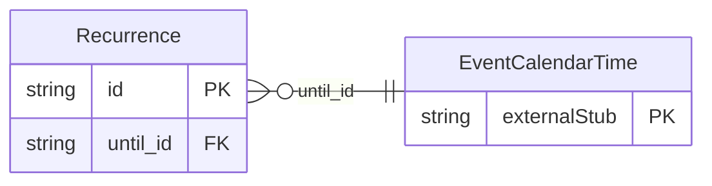

<!-- Code generated by protoc-gen-store. DO NOT EDIT. -->

# `rfc/rfc5545/event/recurrence/` — Prisma schema

Generated from Protobuf by protoc-gen-store. Source of truth is the `.proto` files — regenerate rather than editing.

| Models | Enums |
| ---: | ---: |
| 1 | 1 |

## Entity relationships

Schema file: [`recurrence.postgres.prisma`](./recurrence.postgres.prisma)

### `Recurrence` → `recurrences`

Recurrence is the RECUR value type, RFC 5545 section 3.3.10 <https://www.rfc-editor.org/rfc/rfc5545.html#section-3.3.10>, carried by the RRULE property of section 3.8.5.3 <https://www.rfc-editor.org/rfc/rfc5545.html#section-3.8.5.3>. Structured rather than the raw "FREQ=MONTHLY;BYDAY=-1FR" string. The string is what iCalendar puts on the wire, but it is opaque to a database: a structured rule is what makes "which billing schedules fire on the last Friday" answerable without parsing every row. Reference: RFC 5545 "Internet Calendaring and Scheduling Core Object Specification (iCalendar)", section 3.3.10. https://www.rfc-editor.org/rfc/rfc5545.html#section-3.3.10

| Column | Type | Null |
| --- | --- | --- |
| `id` | `CHAR(26)` | not null |
| `frequency` | `Frequency` | not null |
| `count` | `INTEGER` | nullable |
| `interval` | `INTEGER` | nullable |
| `second_numbers` | `INTEGER[]` | nullable |
| `minute_numbers` | `INTEGER[]` | nullable |
| `hour_numbers` | `INTEGER[]` | nullable |
| `month_days` | `INTEGER[]` | nullable |
| `year_days` | `INTEGER[]` | nullable |
| `week_numbers` | `INTEGER[]` | nullable |
| `months` | `` | nullable |
| `set_positions` | `INTEGER[]` | nullable |
| `week_start` | `DayOfWeek` | nullable |
| `rscale` | `VARCHAR(255)` | nullable |
| `skip` | `RecurrenceSkip` | nullable |
| `leap_months` | `` | nullable |
| `bound_case` | `RecurrenceBoundCase` | nullable |
| `until_id` | `CHAR(26)` | nullable |

### Enums

- `RecurrenceBoundCase`: UNTIL, COUNT
