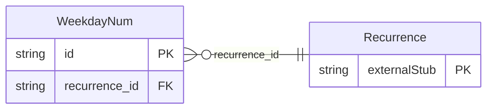

<!-- Code generated by protoc-gen-store. DO NOT EDIT. -->

# `rfc/rfc5545/event/recurrence_parts/` — Prisma schema

Generated from Protobuf by protoc-gen-store. Source of truth is the `.proto` files — regenerate rather than editing.

| Models | Enums |
| ---: | ---: |
| 1 | 2 |

## Entity relationships

Schema file: [`recurrence_parts.postgres.prisma`](./recurrence_parts.postgres.prisma)

### `WeekdayNum` → `weekday_nums`

WeekdayNum is one BYDAY entry, RFC 5545 section 3.3.10 <https://www.rfc-editor.org/rfc/rfc5545.html#section-3.3.10>. Reference: RFC 5545 "Internet Calendaring and Scheduling Core Object Specification (iCalendar)", section 3.3.10. https://www.rfc-editor.org/rfc/rfc5545.html#section-3.3.10

| Column | Type | Null |
| --- | --- | --- |
| `id` | `CHAR(26)` | not null |
| `day` | `DayOfWeek` | not null |
| `ordinal` | `INTEGER` | nullable |
| `recurrence_id` | `CHAR(26)` | not null |

### Enums

- `Frequency`: SECONDLY, MINUTELY, HOURLY, DAILY, WEEKLY, MONTHLY, YEARLY
- `RecurrenceSkip`: OMIT, BACKWARD, FORWARD
