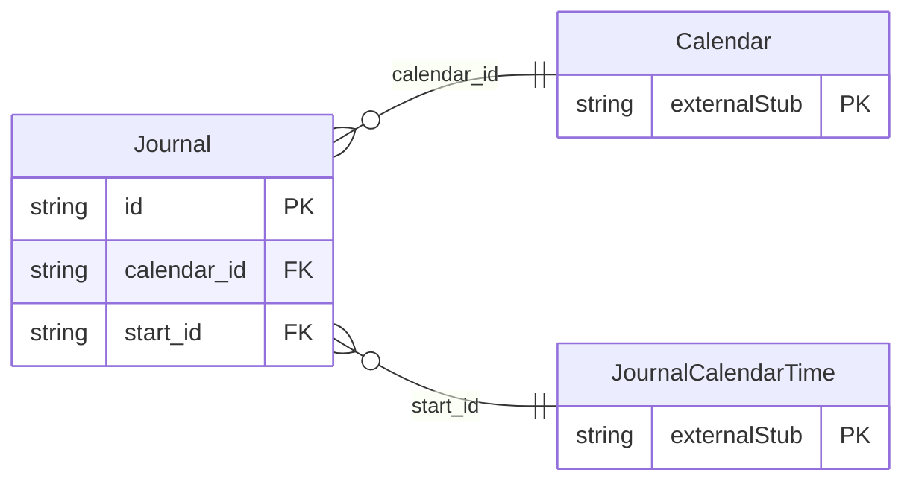

<!-- Code generated by protoc-gen-store. DO NOT EDIT. -->

# `rfc/rfc5545/journal/journal/` — Prisma schema

Generated from Protobuf by protoc-gen-store. Source of truth is the `.proto` files — regenerate rather than editing.

| Models | Enums |
| ---: | ---: |
| 1 | 0 |

## Entity relationships

Schema file: [`journal.postgres.prisma`](./journal.postgres.prisma)

### `Journal` → `resource`

Journal is the VJOURNAL component, RFC 5545 section 3.6.3 <https://www.rfc-editor.org/rfc/rfc5545.html#section-3.6.3>. A dated note attached to a calendar. Unlike Event and Todo it consumes no time -- section 3.6.3 <https://www.rfc-editor.org/rfc/rfc5545.html#section-3.6.3> gives it no DTEND, DURATION or DUE, and it never affects free/busy. Scope note: its Classification enum is a copy of the one in protobuf.rfc5545.event.v1, not a reference. AIP-215 permits no cross-package message reference, so value types shared between iCalendar components are duplicated per component package. Reference: RFC 5545 "Internet Calendaring and Scheduling Core Object Specification (iCalendar)", section 3.6.3. https://www.rfc-editor.org/rfc/rfc5545.html#section-3.6.3

| Column | Type | Null |
| --- | --- | --- |
| `id` | `CHAR(26)` | not null |
| `name` | `VARCHAR(255)` | not null |
| `uid` | `VARCHAR(255)` | nullable |
| `ical_uid` | `VARCHAR(255)` | nullable |
| `summary` | `VARCHAR(255)` | nullable |
| `descriptions` | `VARCHAR(255)[]` | nullable |
| `publication` | `Publication` | nullable |
| `classification` | `JournalClassification` | nullable |
| `etag` | `VARCHAR(255)` | nullable |
| `delete_time` | `TIMESTAMPTZ` | nullable |
| `expire_time` | `TIMESTAMPTZ` | nullable |
| `create_time` | `TIMESTAMPTZ` | not null |
| `update_time` | `TIMESTAMPTZ` | not null |
| `calendar_id` | `CHAR(26)` | not null |
| `start_id` | `CHAR(26)` | not null |
