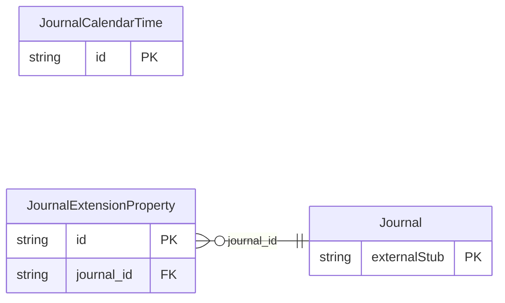

<!-- Code generated by protoc-gen-store. DO NOT EDIT. -->

# `rfc/rfc5545/journal/types/` — Prisma schema

Generated from Protobuf by protoc-gen-store. Source of truth is the `.proto` files — regenerate rather than editing.

| Models | Enums |
| ---: | ---: |
| 2 | 3 |

## Entity relationships

Schema file: [`types.postgres.prisma`](./types.postgres.prisma)

### `JournalCalendarTime` → `calendar_times`

Publication is the STATUS property for a VJOURNAL, RFC 5545 section 3.8.1.11 <https://www.rfc-editor.org/rfc/rfc5545.html#section-3.8.1.11>. Not named Status or State: AIP-216 <https://aip.dev/216> reserves both for server-owned lifecycle. An author sets this one by publishing. VEVENT and VTODO define different value sets for the same property, so each has its own enum. ExtensionProperty carries an iCalendar property this schema does not model. Not a hole punched in a typed schema: RFC 5545 section 3.8.8.1 <https://www.rfc-editor.org/rfc/rfc5545.html#section-3.8.8.1> reserves IANA-registered properties and section 3.8.8.2 <https://www.rfc-editor.org/rfc/rfc5545.html#section-3.8.8.2> non-standard X- properties, and requires that applications ignore what they do not recognise rather than reject it. A calendar that round-trips without them is lossy by construction. It is also what keeps the modelled properties honest. Anything the schema has not earned a typed field for survives here instead of forcing a speculative field table, and a property graduates out of this message when a consumer needs to query it. CalendarTime is an iCalendar DATE or DATE-TIME value, RFC 5545 sections 3.3.4 <https://www.rfc-editor.org/rfc/rfc5545.html#section-3.3.4> and 3.3.5 <https://www.rfc-editor.org/rfc/rfc5545.html#section-3.3.5>. google.protobuf.Timestamp cannot express what iCalendar needs. Section 3.3.5 <https://www.rfc-editor.org/rfc/rfc5545.html#section-3.3.5> gives DATE-TIME three forms and a Timestamp holds only one: form #1, floating    local time, no zone -- "09:00 wherever you are" form #2, UTC         an absolute instant form #3, with TZID   local time plus a zone reference The difference is not academic. A recurring 09:00 standup is floating time: it stays at 09:00 across a DST boundary, where an absolute instant shifts by an hour. Section 3.3.4 <https://www.rfc-editor.org/rfc/rfc5545.html#section-3.3.4> adds a fourth case, the all-day DATE, which a Timestamp can only approximate by picking a midnight in some zone. google.type.DateTime carries all three date-time forms: omit its time_offset for floating, set utc_offset for absolute, set time_zone for a zone reference. It is a google.* type, so AIP-215 <https://aip.dev/215> permits referencing it across packages -- which is the only reason this value object can be built from shared parts rather than hand-rolled. Reference: RFC 5545 "Internet Calendaring and Scheduling Core Object Specification (iCalendar)", section 3.3.5. https://www.rfc-editor.org/rfc/rfc5545.html#section-3.3.5

| Column | Type | Null |
| --- | --- | --- |
| `id` | `CHAR(26)` | not null |
| `date` | `DATE` | nullable |
| `date_time` | `TIMESTAMPTZ` | nullable |
| `value_case` | `JournalCalendarTimeValueCase` | nullable |

### `JournalExtensionProperty` → `extension_properties`

Reference: RFC 5545 "Internet Calendaring and Scheduling Core Object Specification (iCalendar)", section 3.8.8.2. https://www.rfc-editor.org/rfc/rfc5545.html#section-3.8.8.2

| Column | Type | Null |
| --- | --- | --- |
| `id` | `CHAR(26)` | not null |
| `key` | `VARCHAR(255)` | not null |
| `values` | `VARCHAR(255)[]` | nullable |
| `parameters` | `JSONB` | nullable |
| `journal_id` | `CHAR(26)` | not null |

### Enums

- `Publication`: DRAFT, FINAL, CANCELLED
- `JournalClassification`: PUBLIC, PRIVATE, CONFIDENTIAL
- `JournalCalendarTimeValueCase`: DATE, DATE_TIME
