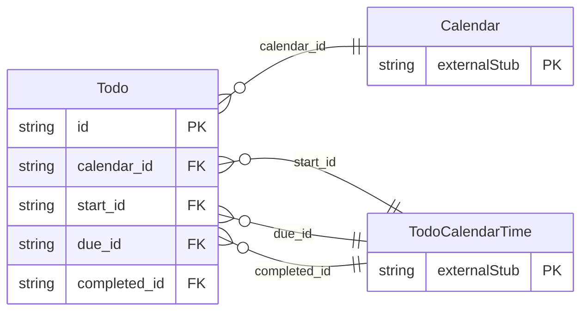

<!-- Code generated by protoc-gen-store. DO NOT EDIT. -->

# `rfc/rfc5545/todo/todo/` — Prisma schema

Generated from Protobuf by protoc-gen-store. Source of truth is the `.proto` files — regenerate rather than editing.

| Models | Enums |
| ---: | ---: |
| 1 | 1 |

## Entity relationships

Schema file: [`todo.postgres.prisma`](./todo.postgres.prisma)

### `Todo` → `resource`

Todo is the VTODO component, RFC 5545 section 3.6.2 <https://www.rfc-editor.org/rfc/rfc5545.html#section-3.6.2>. Same shape as Event: a resource whose calendar properties sit directly on it, parented by a Calendar. What it adds over an event is a notion of finishing -- a due date, a completion instant, and a percentage. Scope note: CLASS is modelled here, and its enum is a copy of the one in protobuf.rfc5545.event.v1 rather than a reference. AIP-215 permits no cross-package message reference, so every value type shared between iCalendar components must be duplicated per component package. RRULE, ATTENDEE, ORGANIZER and VALARM are therefore deliberately absent until a consumer needs them on a todo -- see the AIP-215 duplication tax in docs/decisions.md. Reference: RFC 5545 "Internet Calendaring and Scheduling Core Object Specification (iCalendar)", section 3.6.2. https://www.rfc-editor.org/rfc/rfc5545.html#section-3.6.2

| Column | Type | Null |
| --- | --- | --- |
| `id` | `CHAR(26)` | not null |
| `name` | `VARCHAR(255)` | not null |
| `uid` | `VARCHAR(255)` | nullable |
| `ical_uid` | `VARCHAR(255)` | nullable |
| `summary` | `VARCHAR(255)` | nullable |
| `description` | `VARCHAR(255)` | nullable |
| `location` | `VARCHAR(255)` | nullable |
| `duration` | `INTERVAL` | nullable |
| `percent_complete` | `INTEGER` | nullable |
| `priority` | `INTEGER` | nullable |
| `completion` | `Completion` | nullable |
| `classification` | `TodoClassification` | nullable |
| `etag` | `VARCHAR(255)` | nullable |
| `delete_time` | `TIMESTAMPTZ` | nullable |
| `expire_time` | `TIMESTAMPTZ` | nullable |
| `create_time` | `TIMESTAMPTZ` | not null |
| `update_time` | `TIMESTAMPTZ` | not null |
| `deadline_case` | `TodoDeadlineCase` | nullable |
| `calendar_id` | `CHAR(26)` | not null |
| `start_id` | `CHAR(26)` | nullable |
| `due_id` | `CHAR(26)` | nullable |
| `completed_id` | `CHAR(26)` | nullable |

### Enums

- `TodoDeadlineCase`: DUE, DURATION
