<!-- Code generated by protoc-gen-store. DO NOT EDIT. -->

# `rfc/rfc6350/` — Prisma schema

Generated from Protobuf by protoc-gen-store. Source of truth is the `.proto` files — regenerate rather than editing.

| Models | Enums |
| ---: | ---: |
| 20 | 8 |

## Entity relationships

```mermaid
erDiagram
    direction LR
    Contact {
        string id PK
        string name_components_id FK
        string birthday_id FK
        string anniversary_id FK
    }
    DateOrText {
        string id PK
    }
    Email {
        string id PK
        string contact_id FK
    }
    Geo {
        string id PK
        string contact_id FK
    }
    GrammaticalGender {
        string id PK
        string contact_id FK
    }
    InstantMessage {
        string id PK
        string contact_id FK
    }
    Language {
        string id PK
        string contact_id FK
    }
    Nickname {
        string id PK
        string contact_id FK
    }
    Pronouns {
        string id PK
        string contact_id FK
    }
    Relation {
        string id PK
        string contact_id FK
    }
    Role {
        string id PK
        string contact_id FK
    }
    SocialProfile {
        string id PK
        string contact_id FK
    }
    Telephone {
        string id PK
        string contact_id FK
    }
    Timezone {
        string id PK
        string contact_id FK
    }
    Url {
        string id PK
        string contact_id FK
    }
    Vcard {
        string id PK
        string contact_id FK
    }
    VcardAddress {
        string id PK
        string contact_id FK
    }
    VcardExtensionProperty {
        string id PK
        string contact_id FK
    }
    VcardName {
        string id PK
    }
    VcardOrganization {
        string id PK
        string contact_id FK
    }
    Contact }o--|| VcardName : "name_components_id"
    Contact }o--|| DateOrText : "birthday_id"
    Contact }o--|| DateOrText : "anniversary_id"
    Email }o--|| Contact : "contact_id"
    Geo }o--|| Contact : "contact_id"
    GrammaticalGender }o--|| Contact : "contact_id"
    InstantMessage }o--|| Contact : "contact_id"
    Language }o--|| Contact : "contact_id"
    Nickname }o--|| Contact : "contact_id"
    Pronouns }o--|| Contact : "contact_id"
    Relation }o--|| Contact : "contact_id"
    Role }o--|| Contact : "contact_id"
    SocialProfile }o--|| Contact : "contact_id"
    Telephone }o--|| Contact : "contact_id"
    Timezone }o--|| Contact : "contact_id"
    Url }o--|| Contact : "contact_id"
    Vcard }o--|| Contact : "contact_id"
    VcardAddress }o--|| Contact : "contact_id"
    VcardExtensionProperty }o--|| Contact : "contact_id"
    VcardOrganization }o--|| Contact : "contact_id"
```

## Subfolders

- [`vcard/`](./vcard/README.md)
