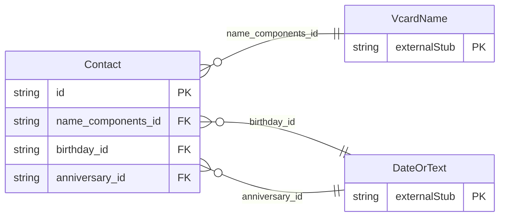

<!-- Code generated by protoc-gen-store. DO NOT EDIT. -->

# `rfc/rfc6350/vcard/contact/` — Prisma schema

Generated from Protobuf by protoc-gen-store. Source of truth is the `.proto` files — regenerate rather than editing.

| Models | Enums |
| ---: | ---: |
| 1 | 0 |

## Entity relationships

Schema file: [`contact.postgres.prisma`](./contact.postgres.prisma)

### `Contact` → `contacts`

Contact is the vCard property set, RFC 6350 section 6 <https://www.rfc-editor.org/rfc/rfc6350.html#section-6>. A value object with no identity of its own: Vcard carries the identity and embeds this. RFC 6350 specifies what a contact is and says nothing about how one is named, stored or listed, so a resource name has no place here. Scope is nineteen RFC 6350 properties -- KIND, FN, N, EMAIL, TEL, ADR, ORG, TITLE, NOTE, BDAY, ANNIVERSARY, NICKNAME, URL, ROLE, IMPP, LANG, GEO, TZ, RELATED -- plus CATEGORIES as a flat filter target, and four from RFC 9554: PRONOUNS, GRAMGENDER, SOCIALPROFILE and LANGUAGE. CREATED, the fifth RFC 9554 property, is on Vcard with the other document-level provenance. MEMBER is deliberately not among them: it is the same problem Group and Membership already solve, in protobuf.rfc4519.membership.v1, so it stays there rather than duplicating group affiliation as a second mechanism on Contact -- see Relation for the reasoning. Section 6 defines roughly fifteen more properties; they get added when a consumer needs them. Reference: RFC 6350 "vCard Format Specification", section 6. https://www.rfc-editor.org/rfc/rfc6350.html#section-6 Reference: RFC 9554 "vCard Format Extensions for JSContact", section 3. https://www.rfc-editor.org/rfc/rfc9554.html#section-3

| Column | Type | Null |
| --- | --- | --- |
| `id` | `CHAR(26)` | not null |
| `kind` | `VcardKind` | nullable |
| `display_names` | `VARCHAR(255)[]` | not null |
| `titles` | `VARCHAR(255)[]` | nullable |
| `notes` | `VARCHAR(255)[]` | nullable |
| `categories` | `VARCHAR(255)[]` | nullable |
| `default_language_code` | `VARCHAR(255)` | nullable |
| `name_components_id` | `CHAR(26)` | nullable |
| `birthday_id` | `CHAR(26)` | nullable |
| `anniversary_id` | `CHAR(26)` | nullable |
