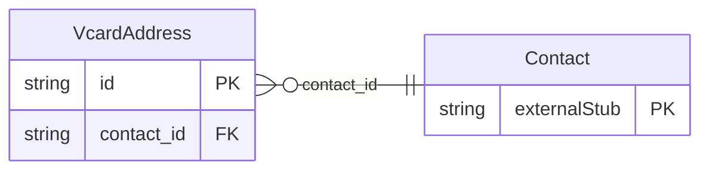

<!-- Code generated by protoc-gen-store. DO NOT EDIT. -->

# `rfc/rfc6350/vcard/contact_address/` — Prisma schema

Generated from Protobuf by protoc-gen-store. Source of truth is the `.proto` files — regenerate rather than editing.

| Models | Enums |
| ---: | ---: |
| 1 | 0 |

## Entity relationships

Schema file: [`contact_address.postgres.prisma`](./contact_address.postgres.prisma)

### `VcardAddress` → `address`

Address is the ADR property, RFC 6350 section 6.3.1 <https://www.rfc-editor.org/rfc/rfc6350.html#section-6.3.1>, as extended by RFC 9554 section 2.1 <https://www.rfc-editor.org/rfc/rfc9554.html#section-2.1>. RFC 6350 fixed seven components in a defined order; RFC 9554 section 2.1 appends eleven more, so an address can name a room, a floor, a block or a landmark instead of flattening all of it into street_addresses. This is what makes addresses outside the seven-component Western model representable, and it is why google.type.PostalAddress was rejected for this package -- see docs/adding-data.md. Component order in the wire format is the order of the fields here. Reference: RFC 6350 "vCard Format Specification", section 6.3.1. https://www.rfc-editor.org/rfc/rfc6350.html#section-6.3.1 Reference: RFC 9554 "vCard Format Extensions for JSContact", section 2.1. https://www.rfc-editor.org/rfc/rfc9554.html#section-2.1

| Column | Type | Null |
| --- | --- | --- |
| `id` | `CHAR(26)` | not null |
| `post_office_box` | `VARCHAR(255)[]` | nullable |
| `extended_addresses` | `VARCHAR(255)[]` | nullable |
| `street_addresses` | `VARCHAR(255)[]` | nullable |
| `localities` | `VARCHAR(255)[]` | nullable |
| `regions` | `VARCHAR(255)[]` | nullable |
| `postal_codes` | `VARCHAR(255)[]` | nullable |
| `countries` | `VARCHAR(255)[]` | nullable |
| `types` | `` | nullable |
| `pref` | `INTEGER` | nullable |
| `rooms` | `VARCHAR(255)[]` | nullable |
| `apartments` | `VARCHAR(255)[]` | nullable |
| `floors` | `VARCHAR(255)[]` | nullable |
| `street_numbers` | `VARCHAR(255)[]` | nullable |
| `streets` | `VARCHAR(255)[]` | nullable |
| `buildings` | `VARCHAR(255)[]` | nullable |
| `blocks` | `VARCHAR(255)[]` | nullable |
| `subdistricts` | `VARCHAR(255)[]` | nullable |
| `districts` | `VARCHAR(255)[]` | nullable |
| `landmarks` | `VARCHAR(255)[]` | nullable |
| `directions` | `VARCHAR(255)[]` | nullable |
| `label` | `VARCHAR(255)` | nullable |
| `phonetic` | `VcardPhoneticSystem` | nullable |
| `script` | `VARCHAR(255)` | nullable |
| `contact_id` | `CHAR(26)` | not null |
