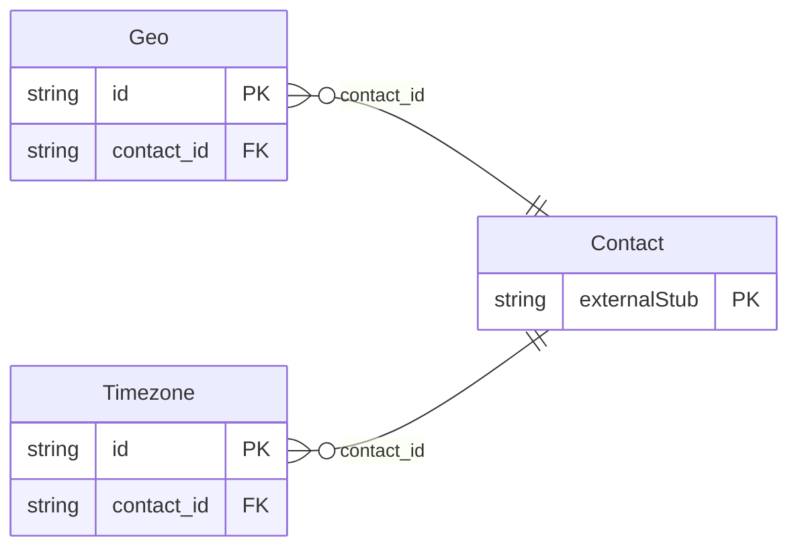

<!-- Code generated by protoc-gen-store. DO NOT EDIT. -->

# `rfc/rfc6350/vcard/contact_location/` — Prisma schema

Generated from Protobuf by protoc-gen-store. Source of truth is the `.proto` files — regenerate rather than editing.

| Models | Enums |
| ---: | ---: |
| 2 | 1 |

## Entity relationships

Schema file: [`contact_location.postgres.prisma`](./contact_location.postgres.prisma)

### `Geo` → `geos`

Geo is the GEO property, RFC 6350 section 6.5.2 <https://www.rfc-editor.org/rfc/rfc6350.html#section-6.5.2>. Reference: RFC 6350 "vCard Format Specification", section 6.5.2. https://www.rfc-editor.org/rfc/rfc6350.html#section-6.5.2

| Column | Type | Null |
| --- | --- | --- |
| `id` | `CHAR(26)` | not null |
| `value` | `VARCHAR(255)` | not null |
| `types` | `` | nullable |
| `pref` | `INTEGER` | nullable |
| `contact_id` | `CHAR(26)` | not null |

### `Timezone` → `timezones`

Timezone is the TZ property, RFC 6350 section 6.5.1 <https://www.rfc-editor.org/rfc/rfc6350.html#section-6.5.1>. Reference: RFC 6350 "vCard Format Specification", section 6.5.1. https://www.rfc-editor.org/rfc/rfc6350.html#section-6.5.1

| Column | Type | Null |
| --- | --- | --- |
| `id` | `CHAR(26)` | not null |
| `text` | `VARCHAR(255)` | nullable |
| `uri` | `VARCHAR(255)` | nullable |
| `utc_offset` | `VARCHAR(255)` | nullable |
| `types` | `` | nullable |
| `pref` | `INTEGER` | nullable |
| `value_case` | `TimezoneValueCase` | nullable |
| `contact_id` | `CHAR(26)` | not null |

### Enums

- `TimezoneValueCase`: TEXT, URI, UTC_OFFSET
