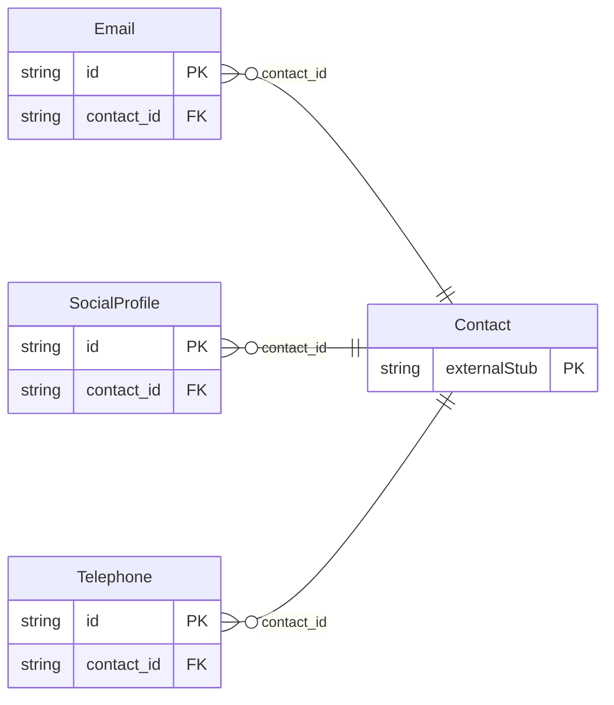

<!-- Code generated by protoc-gen-store. DO NOT EDIT. -->

# `rfc/rfc6350/vcard/contact_method/` — Prisma schema

Generated from Protobuf by protoc-gen-store. Source of truth is the `.proto` files — regenerate rather than editing.

| Models | Enums |
| ---: | ---: |
| 3 | 2 |

## Entity relationships

Schema file: [`contact_method.postgres.prisma`](./contact_method.postgres.prisma)

### `Email` → `emails`

Email is the EMAIL property, RFC 6350 section 6.4.2 <https://www.rfc-editor.org/rfc/rfc6350.html#section-6.4.2>. Reference: RFC 6350 "vCard Format Specification", section 6.4.2. https://www.rfc-editor.org/rfc/rfc6350.html#section-6.4.2

| Column | Type | Null |
| --- | --- | --- |
| `id` | `CHAR(26)` | not null |
| `value` | `VARCHAR(255)` | not null |
| `types` | `` | nullable |
| `pref` | `INTEGER` | nullable |
| `contact_id` | `CHAR(26)` | not null |

### `Telephone` → `telephones`

Telephone is the TEL property, RFC 6350 section 6.4.1 <https://www.rfc-editor.org/rfc/rfc6350.html#section-6.4.1>. Reference: RFC 6350 "vCard Format Specification", section 6.4.1. https://www.rfc-editor.org/rfc/rfc6350.html#section-6.4.1

| Column | Type | Null |
| --- | --- | --- |
| `id` | `CHAR(26)` | not null |
| `uri` | `VARCHAR(255)` | nullable |
| `text` | `VARCHAR(255)` | nullable |
| `types` | `` | nullable |
| `features` | `` | nullable |
| `pref` | `INTEGER` | nullable |
| `value_case` | `TelephoneValueCase` | nullable |
| `contact_id` | `CHAR(26)` | not null |

### `SocialProfile` → `social_profiles`

SocialProfile is the SOCIALPROFILE property, RFC 9554 section 3.5 <https://www.rfc-editor.org/rfc/rfc9554.html#section-3.5>. A presence on a social service. Section 3.5 gives the value type as URI by default but permits TEXT, because a handle is not always resolvable to a URI -- hence the oneof rather than a single string, which would have to guess which it received. Distinct from InstantMessage (IMPP, RFC 6350 section 6.4.3 <https://www.rfc-editor.org/rfc/rfc6350.html#section-6.4.3>): IMPP addresses a real-time messaging endpoint, this names a profile page or account. A service that is both gets both properties, which is what section 3.5 intends. Reference: RFC 9554 "vCard Format Extensions for JSContact", section 3.5. https://www.rfc-editor.org/rfc/rfc9554.html#section-3.5

| Column | Type | Null |
| --- | --- | --- |
| `id` | `CHAR(26)` | not null |
| `uri` | `VARCHAR(255)` | nullable |
| `text` | `VARCHAR(255)` | nullable |
| `service_type` | `VARCHAR(255)` | nullable |
| `username` | `VARCHAR(255)` | nullable |
| `types` | `` | nullable |
| `pref` | `INTEGER` | nullable |
| `value_case` | `SocialProfileValueCase` | nullable |
| `contact_id` | `CHAR(26)` | not null |

### Enums

- `TelephoneValueCase`: URI, TEXT
- `SocialProfileValueCase`: URI, TEXT
