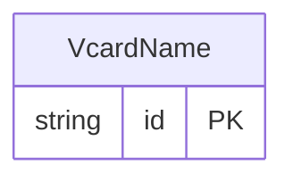

<!-- Code generated by protoc-gen-store. DO NOT EDIT. -->

# `rfc/rfc6350/vcard/contact_name/` — Prisma schema

Generated from Protobuf by protoc-gen-store. Source of truth is the `.proto` files — regenerate rather than editing.

| Models | Enums |
| ---: | ---: |
| 1 | 1 |

## Entity relationships

Schema file: [`contact_name.postgres.prisma`](./contact_name.postgres.prisma)

### `VcardName` → `names`

Name is the N property, RFC 6350 section 6.2.2 <https://www.rfc-editor.org/rfc/rfc6350.html#section-6.2.2>, as extended by RFC 9554 section 2.2 <https://www.rfc-editor.org/rfc/rfc9554.html#section-2.2>. RFC 6350 defined five components; RFC 9554 section 2.2 appends two more, secondary surname and generation, so that names which distinguish a paternal from a maternal surname, or carry "Jr"/"III" as a distinct component rather than a honorific suffix, survive conversion to JSContact. Component order in the wire format is the order of the fields here. Split into its own file rather than living in types.proto: rule 2 caps every file at 200 lines and the phonetic parameters below do not fit there. Reference: RFC 6350 "vCard Format Specification", section 6.2.2. https://www.rfc-editor.org/rfc/rfc6350.html#section-6.2.2 Reference: RFC 9554 "vCard Format Extensions for JSContact", section 2.2. https://www.rfc-editor.org/rfc/rfc9554.html#section-2.2

| Column | Type | Null |
| --- | --- | --- |
| `id` | `CHAR(26)` | not null |
| `family_name` | `VARCHAR(255)[]` | nullable |
| `given_name` | `VARCHAR(255)[]` | nullable |
| `middle_names` | `VARCHAR(255)[]` | nullable |
| `honorific_prefixes` | `VARCHAR(255)[]` | nullable |
| `honorific_suffixes` | `VARCHAR(255)[]` | nullable |
| `secondary_surnames` | `VARCHAR(255)[]` | nullable |
| `generations` | `VARCHAR(255)[]` | nullable |
| `phonetic` | `VcardPhoneticSystem` | nullable |
| `script` | `VARCHAR(255)` | nullable |

### Enums

- `VcardPhoneticSystem`: IPA, PINY, JYUT, SCRIPT
