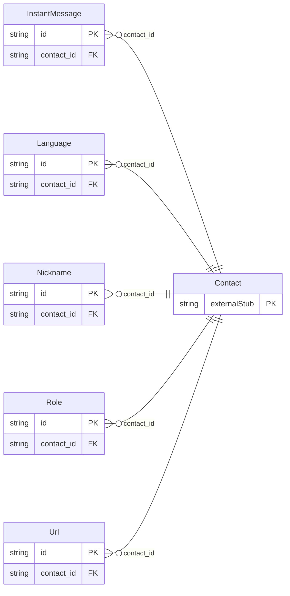

<!-- Code generated by protoc-gen-store. DO NOT EDIT. -->

# `rfc/rfc6350/vcard/contact_property/` — Prisma schema

Generated from Protobuf by protoc-gen-store. Source of truth is the `.proto` files — regenerate rather than editing.

| Models | Enums |
| ---: | ---: |
| 5 | 0 |

## Entity relationships

Schema file: [`contact_property.postgres.prisma`](./contact_property.postgres.prisma)

### `Nickname` → `nicknames`

Nickname is the NICKNAME property, RFC 6350 section 6.2.3 <https://www.rfc-editor.org/rfc/rfc6350.html#section-6.2.3>. Reference: RFC 6350 "vCard Format Specification", section 6.2.3. https://www.rfc-editor.org/rfc/rfc6350.html#section-6.2.3

| Column | Type | Null |
| --- | --- | --- |
| `id` | `CHAR(26)` | not null |
| `values` | `VARCHAR(255)[]` | not null |
| `types` | `` | nullable |
| `pref` | `INTEGER` | nullable |
| `contact_id` | `CHAR(26)` | not null |

### `Url` → `urls`

Url is the URL property, RFC 6350 section 6.7.8 <https://www.rfc-editor.org/rfc/rfc6350.html#section-6.7.8>. Reference: RFC 6350 "vCard Format Specification", section 6.7.8. https://www.rfc-editor.org/rfc/rfc6350.html#section-6.7.8

| Column | Type | Null |
| --- | --- | --- |
| `id` | `CHAR(26)` | not null |
| `value` | `VARCHAR(255)` | not null |
| `types` | `` | nullable |
| `pref` | `INTEGER` | nullable |
| `contact_id` | `CHAR(26)` | not null |

### `Role` → `roles`

Role is the ROLE property, RFC 6350 section 6.6.2 <https://www.rfc-editor.org/rfc/rfc6350.html#section-6.6.2>. A distinct property from TITLE, section 6.6.1 <https://www.rfc-editor.org/rfc/rfc6350.html#section-6.6.1>: TITLE is a job title, ROLE is the function performed, kept separate to match the RFC's own distinction rather than merged into one field. Reference: RFC 6350 "vCard Format Specification", section 6.6.2. https://www.rfc-editor.org/rfc/rfc6350.html#section-6.6.2

| Column | Type | Null |
| --- | --- | --- |
| `id` | `CHAR(26)` | not null |
| `value` | `VARCHAR(255)` | not null |
| `types` | `` | nullable |
| `pref` | `INTEGER` | nullable |
| `contact_id` | `CHAR(26)` | not null |

### `InstantMessage` → `instant_messages`

InstantMessage is the IMPP property, RFC 6350 section 6.4.3 <https://www.rfc-editor.org/rfc/rfc6350.html#section-6.4.3> (Instant Messaging and Presence Protocol). Reference: RFC 6350 "vCard Format Specification", section 6.4.3. https://www.rfc-editor.org/rfc/rfc6350.html#section-6.4.3

| Column | Type | Null |
| --- | --- | --- |
| `id` | `CHAR(26)` | not null |
| `value` | `VARCHAR(255)` | not null |
| `types` | `` | nullable |
| `pref` | `INTEGER` | nullable |
| `contact_id` | `CHAR(26)` | not null |

### `Language` → `languages`

Language is the LANG property, RFC 6350 section 6.4.4 <https://www.rfc-editor.org/rfc/rfc6350.html#section-6.4.4>. Reference: RFC 6350 "vCard Format Specification", section 6.4.4. https://www.rfc-editor.org/rfc/rfc6350.html#section-6.4.4

| Column | Type | Null |
| --- | --- | --- |
| `id` | `CHAR(26)` | not null |
| `value` | `VARCHAR(255)` | not null |
| `types` | `` | nullable |
| `pref` | `INTEGER` | nullable |
| `contact_id` | `CHAR(26)` | not null |
