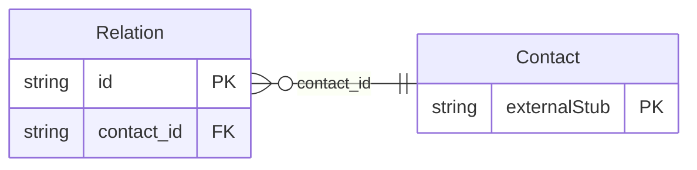

<!-- Code generated by protoc-gen-store. DO NOT EDIT. -->

# `rfc/rfc6350/vcard/contact_relation/` — Prisma schema

Generated from Protobuf by protoc-gen-store. Source of truth is the `.proto` files — regenerate rather than editing.

| Models | Enums |
| ---: | ---: |
| 1 | 1 |

## Entity relationships

Schema file: [`contact_relation.postgres.prisma`](./contact_relation.postgres.prisma)

### `Relation` → `relations`

Relation is the RELATED property, RFC 6350 section 6.6.6 <https://www.rfc-editor.org/rfc/rfc6350.html#section-6.6.6>. Not MEMBER (section 6.6.5 <https://www.rfc-editor.org/rfc/rfc6350.html#section-6.6.5>): MEMBER expresses a KIND=group vCard's membership and is not modelled here at all, because it is the same problem `Group` and `Membership` already solve in `rfc4519/v1` -- a KIND_GROUP Contact's members belong in a Membership pointing at `vcards/{vcard}`, not in a second, parallel list on Contact. RELATED is a different, unaddressed capability: a typed relationship between two arbitrary contacts, which Membership's group-affiliation model does not express. Reference: RFC 6350 "vCard Format Specification", section 6.6.6. https://www.rfc-editor.org/rfc/rfc6350.html#section-6.6.6

| Column | Type | Null |
| --- | --- | --- |
| `id` | `CHAR(26)` | not null |
| `uri` | `VARCHAR(255)` | nullable |
| `text` | `VARCHAR(255)` | nullable |
| `relation_types` | `` | nullable |
| `pref` | `INTEGER` | nullable |
| `value_case` | `RelationValueCase` | nullable |
| `contact_id` | `CHAR(26)` | not null |

### Enums

- `RelationValueCase`: URI, TEXT
