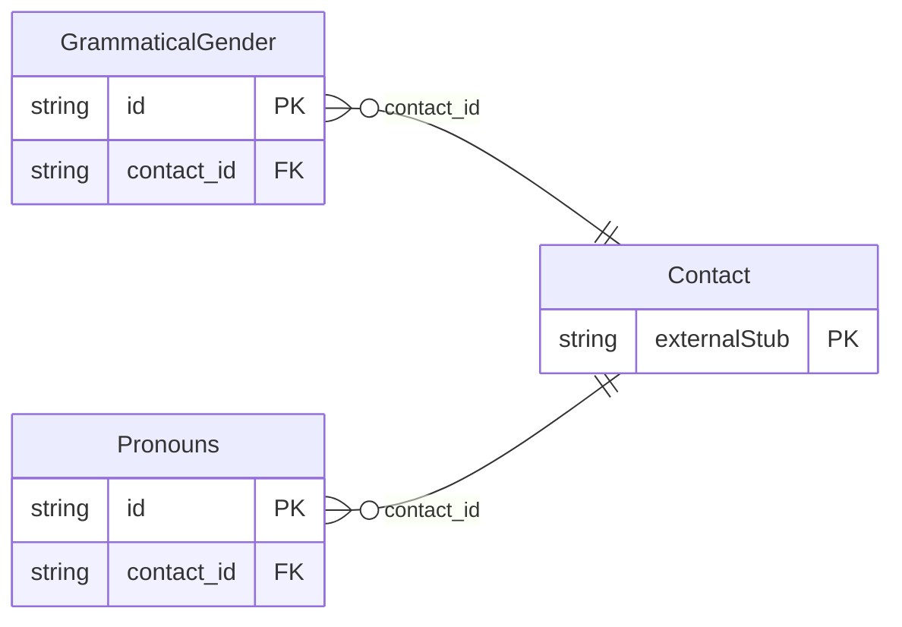

<!-- Code generated by protoc-gen-store. DO NOT EDIT. -->

# `rfc/rfc6350/vcard/contact_speech/` — Prisma schema

Generated from Protobuf by protoc-gen-store. Source of truth is the `.proto` files — regenerate rather than editing.

| Models | Enums |
| ---: | ---: |
| 2 | 1 |

## Entity relationships

Schema file: [`contact_speech.postgres.prisma`](./contact_speech.postgres.prisma)

### `Pronouns` → `pronouns`

Pronouns is the PRONOUNS property, RFC 9554 section 3.4 <https://www.rfc-editor.org/rfc/rfc9554.html#section-3.4>. Free text, not an enumeration: section 3.4 defines the value as a single text value precisely because the set of pronouns is open and varies by language. A closed enum here would reject valid input, so the RFC's own choice is kept. Cardinality * -- repeated, because a person may list pronouns in more than one language, which is what the LANGUAGE parameter distinguishes. Reference: RFC 9554 "vCard Format Extensions for JSContact", section 3.4. https://www.rfc-editor.org/rfc/rfc9554.html#section-3.4

| Column | Type | Null |
| --- | --- | --- |
| `id` | `CHAR(26)` | not null |
| `value` | `VARCHAR(255)` | not null |
| `language_code` | `VARCHAR(255)` | nullable |
| `types` | `` | nullable |
| `pref` | `INTEGER` | nullable |
| `contact_id` | `CHAR(26)` | not null |

### `GrammaticalGender` → `grammatical_genders`

GrammaticalGender is the GRAMGENDER property, RFC 9554 section 3.2 <https://www.rfc-editor.org/rfc/rfc9554.html#section-3.2>. Grammatical gender for generating correct prose about the person in a gendered language. Section 3.2 is explicit that this is a property of the language, not a statement of the person's gender identity -- PRONOUNS carries that -- and the two are deliberately separate properties. Cardinality * -- repeated, one per language, which is why LANGUAGE is on the message rather than on Contact. Reference: RFC 9554 "vCard Format Extensions for JSContact", section 3.2. https://www.rfc-editor.org/rfc/rfc9554.html#section-3.2

| Column | Type | Null |
| --- | --- | --- |
| `id` | `CHAR(26)` | not null |
| `kind` | `GrammaticalGenderKind` | not null |
| `language_code` | `VARCHAR(255)` | nullable |
| `contact_id` | `CHAR(26)` | not null |

### Enums

- `GrammaticalGenderKind`: ANIMATE, COMMON, FEMININE, INANIMATE, MASCULINE, NEUTER
