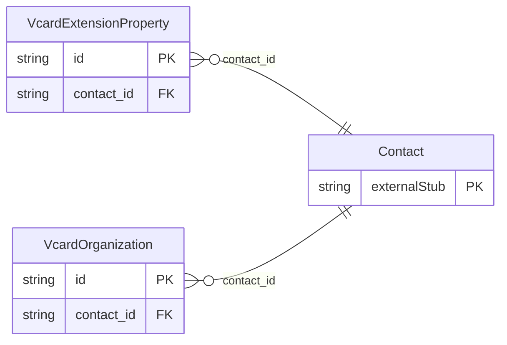

<!-- Code generated by protoc-gen-store. DO NOT EDIT. -->

# `rfc/rfc6350/vcard/types/` — Prisma schema

Generated from Protobuf by protoc-gen-store. Source of truth is the `.proto` files — regenerate rather than editing.

| Models | Enums |
| ---: | ---: |
| 2 | 1 |

## Entity relationships

Schema file: [`types.postgres.prisma`](./types.postgres.prisma)

### `VcardOrganization` → `organizations`

Organization is the ORG property, RFC 6350 section 6.6.4 <https://www.rfc-editor.org/rfc/rfc6350.html#section-6.6.4>. Semicolon-separated on the wire: the first component is the organization, the rest are progressively narrower units. Reference: RFC 6350 "vCard Format Specification", section 6.6.4. https://www.rfc-editor.org/rfc/rfc6350.html#section-6.6.4

| Column | Type | Null |
| --- | --- | --- |
| `id` | `CHAR(26)` | not null |
| `value` | `VARCHAR(255)` | not null |
| `units` | `VARCHAR(255)[]` | nullable |
| `types` | `` | nullable |
| `contact_id` | `CHAR(26)` | not null |

### `VcardExtensionProperty` → `extension_properties`

Kind is the KIND property, RFC 6350 section 6.1.4 <https://www.rfc-editor.org/rfc/rfc6350.html#section-6.1.4>. ExtensionProperty carries a vCard property this schema does not model. Not a hole punched in a typed schema: RFC 6350 section 6.10 <https://www.rfc-editor.org/rfc/rfc6350.html#section-6.10> defines exactly this, and section 3.3 <https://www.rfc-editor.org/rfc/rfc6350.html#section-3.3> types a property name as `iana-token / x-name`. Properties "with a name starting with X- may be defined bilaterally between two cooperating agents without outside registration", so a vCard that round-trips without them is lossy by construction. It is also what keeps the nine modelled properties honest. Anything the schema has not earned a typed field for survives here instead of forcing a speculative field table, and a property graduates out of this message when a consumer needs to query it. Reference: RFC 6350 "vCard Format Specification", section 6.10. https://www.rfc-editor.org/rfc/rfc6350.html#section-6.10

| Column | Type | Null |
| --- | --- | --- |
| `id` | `CHAR(26)` | not null |
| `key` | `VARCHAR(255)` | not null |
| `values` | `VARCHAR(255)[]` | nullable |
| `parameters` | `JSONB` | nullable |
| `group` | `VARCHAR(255)` | nullable |
| `contact_id` | `CHAR(26)` | not null |

### Enums

- `VcardKind`: INDIVIDUAL, GROUP, ORG, LOCATION
