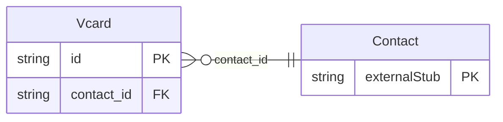

<!-- Code generated by protoc-gen-store. DO NOT EDIT. -->

# `rfc/rfc6350/vcard/vcard/` — Prisma schema

Generated from Protobuf by protoc-gen-store. Source of truth is the `.proto` files — regenerate rather than editing.

| Models | Enums |
| ---: | ---: |
| 1 | 0 |

## Entity relationships

Schema file: [`vcard.postgres.prisma`](./vcard.postgres.prisma)

### `Vcard` → `resource`

Vcard is an addressable person, as RFC 6350 describes one. Identity is ours, the property vocabulary is RFC 6350's. This is the shape to copy for Event, Todo and the rest: a thin resource shell over an RFC-shaped value object. Named for the format rather than for what it holds, per rule 14: RFC 6350 is the legacy layer of the contact lineage, and the canonical `User` of RFC 7643 takes the plain name. A vCard is what this is, so `VcardUser` would only repeat itself. Reference: RFC 6350 "vCard Format Specification". https://www.rfc-editor.org/rfc/rfc6350.html

| Column | Type | Null |
| --- | --- | --- |
| `id` | `CHAR(26)` | not null |
| `name` | `VARCHAR(255)` | not null |
| `uid` | `VARCHAR(255)` | nullable |
| `vcard_uid` | `VARCHAR(255)` | nullable |
| `vcard_create_time` | `TIMESTAMPTZ` | nullable |
| `create_time` | `TIMESTAMPTZ` | not null |
| `update_time` | `TIMESTAMPTZ` | not null |
| `etag` | `VARCHAR(255)` | nullable |
| `delete_time` | `TIMESTAMPTZ` | nullable |
| `expire_time` | `TIMESTAMPTZ` | nullable |
| `contact_id` | `CHAR(26)` | not null |
