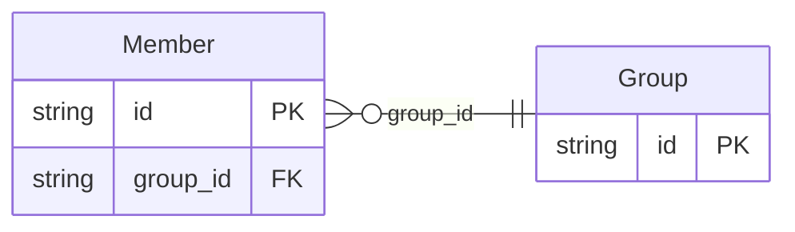

<!-- Code generated by protoc-gen-store. DO NOT EDIT. -->

# `rfc/rfc7643/group/group/` — Prisma schema

Generated from Protobuf by protoc-gen-store. Source of truth is the `.proto` files — regenerate rather than editing.

| Models | Enums |
| ---: | ---: |
| 2 | 0 |

## Entity relationships

Schema file: [`group.postgres.prisma`](./group.postgres.prisma)

### `Group` → `resource`

Group is the SCIM Group resource, RFC 7643 section 4.2 <https://www.rfc-editor.org/rfc/rfc7643.html#section-4.2>. **The canonical group model** under rule 14, holding the plain name RFC 4519's `groupOfNames` gave up when it became `LdapGroup`. Membership is a field here, not a separate resource. That is the opposite of the choice protobuf.rfc4519.membership.v1 made, and deliberately so: section 4.2 defines `members` as an attribute of the Group and RFC 7644 changes it by PATCHing the Group, so a separate Membership resource would invent an addressing scheme SCIM does not have. The LDAP package split it out because `member` there is a bare DN with no room for a role; SCIM's member has `type` and `$ref` and needs no such rescue. The cost is the one rule 6 already names in reverse: creating a group with members is one call here and two in the LDAP package, and the two lineages therefore do not have matching call graphs. Reference: RFC 7643 "System for Cross-domain Identity Management: Core Schema", section 4.2. https://www.rfc-editor.org/rfc/rfc7643.html#section-4.2

| Column | Type | Null |
| --- | --- | --- |
| `id` | `CHAR(26)` | not null |
| `name` | `VARCHAR(255)` | not null |
| `uid` | `VARCHAR(255)` | nullable |
| `external_uid` | `VARCHAR(255)` | nullable |
| `display_name` | `VARCHAR(255)` | not null |
| `etag` | `VARCHAR(255)` | nullable |
| `delete_time` | `TIMESTAMPTZ` | nullable |
| `expire_time` | `TIMESTAMPTZ` | nullable |
| `create_time` | `TIMESTAMPTZ` | not null |
| `update_time` | `TIMESTAMPTZ` | not null |

### `Member` → `members`

Member is one entry of a Group's "members", RFC 7643 section 4.2 <https://www.rfc-editor.org/rfc/rfc7643.html#section-4.2>. Section 4.2 makes every sub-attribute immutable: a membership is added and removed, never edited in place. That is the same reasoning that made protobuf.rfc4519.membership.v1's Membership delete permanently rather than soft-delete -- an edge either exists or it does not. Reference: RFC 7643 "System for Cross-domain Identity Management: Core Schema", section 4.2. https://www.rfc-editor.org/rfc/rfc7643.html#section-4.2

| Column | Type | Null |
| --- | --- | --- |
| `id` | `CHAR(26)` | not null |
| `value` | `VARCHAR(255)` | not null |
| `reference_uri` | `VARCHAR(255)` | nullable |
| `attribute_type` | `VARCHAR(255)` | nullable |
| `display` | `VARCHAR(255)` | nullable |
| `group_id` | `CHAR(26)` | not null |
