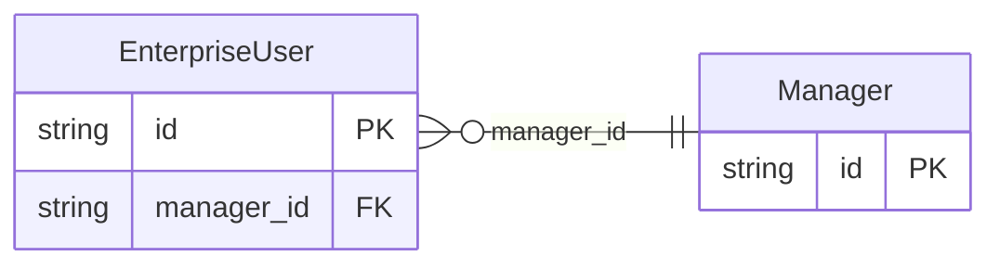

<!-- Code generated by protoc-gen-store. DO NOT EDIT. -->

# `rfc/rfc7643/user/enterprise/` — Prisma schema

Generated from Protobuf by protoc-gen-store. Source of truth is the `.proto` files — regenerate rather than editing.

| Models | Enums |
| ---: | ---: |
| 2 | 0 |

## Entity relationships

Schema file: [`enterprise.postgres.prisma`](./enterprise.postgres.prisma)

### `EnterpriseUser` → `enterprise_users`

EnterpriseUser is the Enterprise User schema extension, RFC 7643 section 4.3 <https://www.rfc-editor.org/rfc/rfc7643.html#section-4.3>. Identified in SCIM by the URN "urn:ietf:params:scim:schemas:extension:enterprise:2.0:User". A schema extension in SCIM is a namespaced block of extra attributes on a resource, which is a nested message here -- it has no identity of its own and no lifecycle apart from the User, so rule 8 makes it a value object. Reference: RFC 7643 "System for Cross-domain Identity Management: Core Schema", section 4.3. https://www.rfc-editor.org/rfc/rfc7643.html#section-4.3

| Column | Type | Null |
| --- | --- | --- |
| `id` | `CHAR(26)` | not null |
| `employee_number` | `VARCHAR(255)` | nullable |
| `cost_center` | `VARCHAR(255)` | nullable |
| `organization` | `VARCHAR(255)` | nullable |
| `division` | `VARCHAR(255)` | nullable |
| `department` | `VARCHAR(255)` | nullable |
| `manager_id` | `CHAR(26)` | nullable |

### `Manager` → `managers`

Manager is the Enterprise User "manager" attribute, RFC 7643 section 4.3 <https://www.rfc-editor.org/rfc/rfc7643.html#section-4.3>. Reference: RFC 7643 "System for Cross-domain Identity Management: Core Schema", section 4.3. https://www.rfc-editor.org/rfc/rfc7643.html#section-4.3

| Column | Type | Null |
| --- | --- | --- |
| `id` | `CHAR(26)` | not null |
| `value` | `VARCHAR(255)` | nullable |
| `reference_uri` | `VARCHAR(255)` | nullable |
| `display_name` | `VARCHAR(255)` | nullable |
