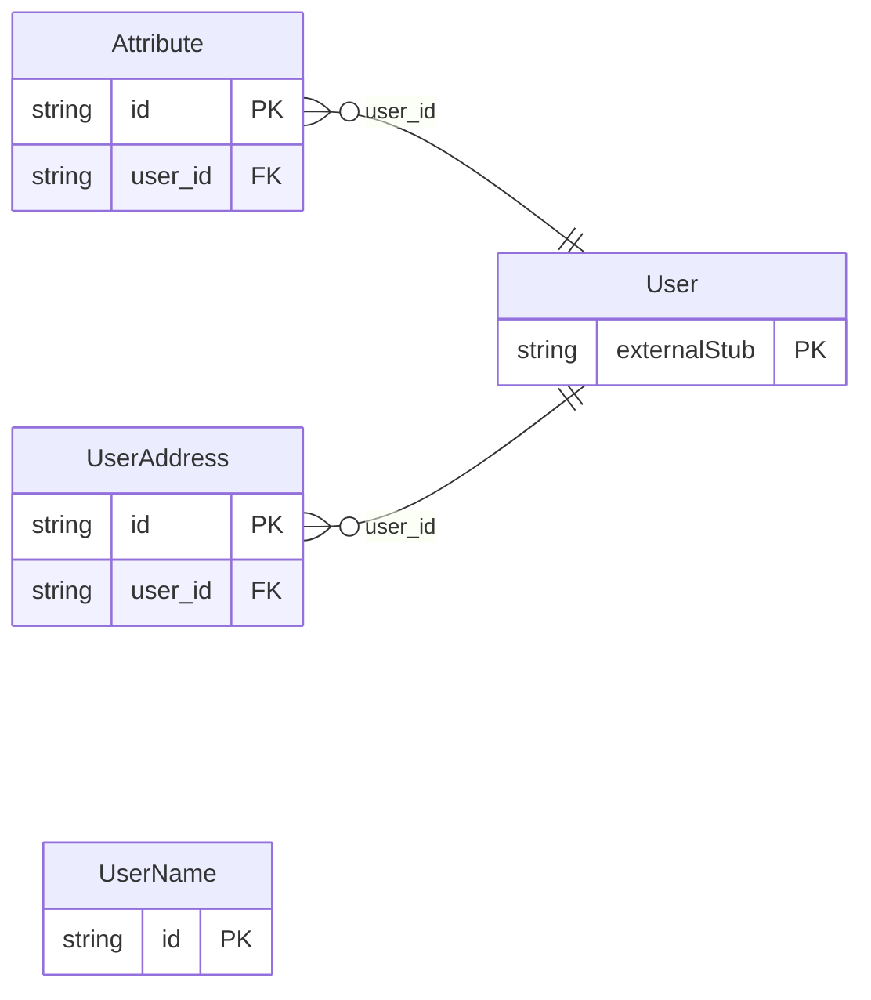

<!-- Code generated by protoc-gen-store. DO NOT EDIT. -->

# `rfc/rfc7643/user/types/` — Prisma schema

Generated from Protobuf by protoc-gen-store. Source of truth is the `.proto` files — regenerate rather than editing.

| Models | Enums |
| ---: | ---: |
| 3 | 0 |

## Entity relationships

Schema file: [`types.postgres.prisma`](./types.postgres.prisma)

### `UserName` → `names`

Name is the User "name" attribute, RFC 7643 section 4.1.1 <https://www.rfc-editor.org/rfc/rfc7643.html#section-4.1.1>. Positional in the same way vCard's N is, and with the same limitation: five fixed slots plus a formatted string. SCIM predates RFC 9553's componentised model and has no equivalent, so a name that does not fit these slots loses structure here in a way it would not in a JSContact Card. Reference: RFC 7643 "System for Cross-domain Identity Management: Core Schema", section 4.1.1. https://www.rfc-editor.org/rfc/rfc7643.html#section-4.1.1

| Column | Type | Null |
| --- | --- | --- |
| `id` | `CHAR(26)` | not null |
| `display_name` | `VARCHAR(255)` | nullable |
| `family_name` | `VARCHAR(255)` | nullable |
| `given_name` | `VARCHAR(255)` | nullable |
| `middle_names` | `VARCHAR(255)` | nullable |
| `honorific_prefix` | `VARCHAR(255)` | nullable |
| `honorific_suffix` | `VARCHAR(255)` | nullable |

### `Attribute` → `attributes`

Attribute is SCIM's default multi-valued attribute, RFC 7643 section 2.4 <https://www.rfc-editor.org/rfc/rfc7643.html#section-2.4>. One shape for emails, phone numbers, IMs, photos, entitlements, roles and certificates alike -- section 2.4 defines `value`, `display`, `type` and `primary` once and every multi-valued attribute reuses them. That uniformity is deliberate in SCIM and is why this is a single message rather than one per attribute, which is the opposite of the choice RFC 9553 forced in the JSContact package. Reference: RFC 7643 "System for Cross-domain Identity Management: Core Schema", section 2.4. https://www.rfc-editor.org/rfc/rfc7643.html#section-2.4

| Column | Type | Null |
| --- | --- | --- |
| `id` | `CHAR(26)` | not null |
| `value` | `VARCHAR(255)` | nullable |
| `display` | `VARCHAR(255)` | nullable |
| `attribute_type` | `VARCHAR(255)` | nullable |
| `primary` | `BOOLEAN` | nullable |
| `reference_uri` | `VARCHAR(255)` | nullable |
| `user_id` | `CHAR(26)` | not null |

### `UserAddress` → `address`

Address is the User "addresses" attribute, RFC 7643 section 4.1.2 <https://www.rfc-editor.org/rfc/rfc7643.html#section-4.1.2>. Section 4.1.2 gives addresses their own sub-attributes rather than reusing Attribute's `value`, which is why this is a message of its own. Reference: RFC 7643 "System for Cross-domain Identity Management: Core Schema", section 4.1.2. https://www.rfc-editor.org/rfc/rfc7643.html#section-4.1.2

| Column | Type | Null |
| --- | --- | --- |
| `id` | `CHAR(26)` | not null |
| `full_address` | `VARCHAR(255)` | nullable |
| `street_address` | `VARCHAR(255)` | nullable |
| `locality` | `VARCHAR(255)` | nullable |
| `region` | `VARCHAR(255)` | nullable |
| `postal_code` | `VARCHAR(255)` | nullable |
| `region_code` | `VARCHAR(255)` | nullable |
| `attribute_type` | `VARCHAR(255)` | nullable |
| `primary` | `BOOLEAN` | nullable |
| `user_id` | `CHAR(26)` | not null |
