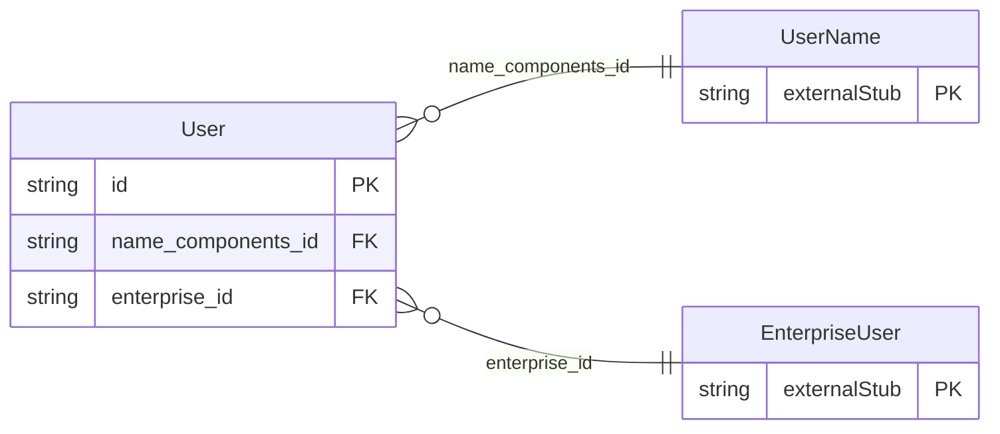

<!-- Code generated by protoc-gen-store. DO NOT EDIT. -->

# `rfc/rfc7643/user/user/` — Prisma schema

Generated from Protobuf by protoc-gen-store. Source of truth is the `.proto` files — regenerate rather than editing.

| Models | Enums |
| ---: | ---: |
| 1 | 0 |

## Entity relationships

Schema file: [`user.postgres.prisma`](./user.postgres.prisma)

### `User` → `resource`

User is the SCIM User resource, RFC 7643 section 4.1 <https://www.rfc-editor.org/rfc/rfc7643.html#section-4.1>. **The canonical identity model** under rule 14, holding the plain name that RFC 6350's vCard gave up when it became `Vcard`. protobuf.rfc4519.group.v1 and its LDAP siblings remain first-class packages with their own CRUD; this is what identity data is stored as. One caution that does not apply to the contact lineage: **there is no IETF-specified SCIM-to-LDAP conversion.** RFC 9555 maps vCard to JSContact element by element, so that codec follows a specification. Nothing equivalent exists here, so any mapping between this and RFC 4519 is a local decision and is labelled as one wherever it appears -- see rule 14 in docs/ontology.md. SCIM's own `id` (section 3.1 <https://www.rfc-editor.org/rfc/rfc7643.html#section-3.1>) is the service provider's identifier, and this schema *is* the service provider, so it maps to `uid` rather than to a second field. `external_uid` is the client's identifier, which is the one that arrives from outside and must survive a round trip -- the same split rule 9 draws everywhere else. Reference: RFC 7643 "System for Cross-domain Identity Management: Core Schema", section 4.1. https://www.rfc-editor.org/rfc/rfc7643.html#section-4.1

| Column | Type | Null |
| --- | --- | --- |
| `id` | `CHAR(26)` | not null |
| `name` | `VARCHAR(255)` | not null |
| `uid` | `VARCHAR(255)` | nullable |
| `external_uid` | `VARCHAR(255)` | nullable |
| `username` | `VARCHAR(255)` | not null |
| `display_name` | `VARCHAR(255)` | nullable |
| `nickname` | `VARCHAR(255)` | nullable |
| `profile_uri` | `VARCHAR(255)` | nullable |
| `title` | `VARCHAR(255)` | nullable |
| `user_type` | `VARCHAR(255)` | nullable |
| `preferred_language_code` | `VARCHAR(255)` | nullable |
| `locale` | `VARCHAR(255)` | nullable |
| `time_zone` | `VARCHAR(255)` | nullable |
| `active` | `BOOLEAN` | nullable |
| `password` | `VARCHAR(255)` | nullable |
| `etag` | `VARCHAR(255)` | nullable |
| `delete_time` | `TIMESTAMPTZ` | nullable |
| `expire_time` | `TIMESTAMPTZ` | nullable |
| `create_time` | `TIMESTAMPTZ` | not null |
| `update_time` | `TIMESTAMPTZ` | not null |
| `name_components_id` | `CHAR(26)` | nullable |
| `enterprise_id` | `CHAR(26)` | nullable |
