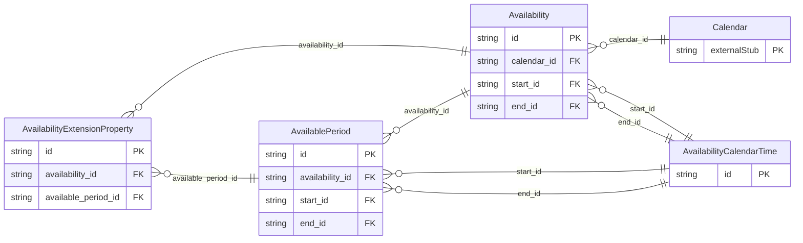

<!-- Code generated by protoc-gen-store. DO NOT EDIT. -->

# `rfc/rfc7953/availability/` — Prisma schema

Generated from Protobuf by protoc-gen-store. Source of truth is the `.proto` files — regenerate rather than editing.

| Models | Enums |
| ---: | ---: |
| 4 | 4 |

## Entity relationships

## Subfolders

- [`availability/`](./availability/README.md)
- [`available/`](./available/README.md)
- [`types/`](./types/README.md)
