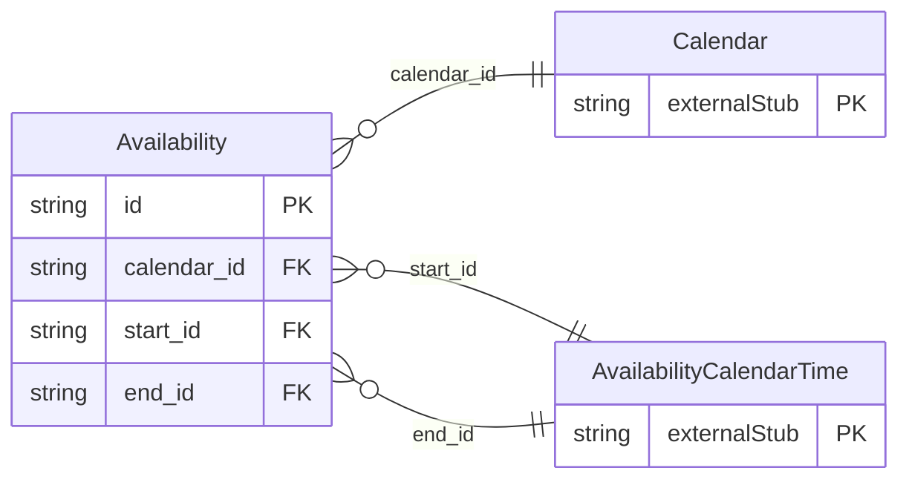

<!-- Code generated by protoc-gen-store. DO NOT EDIT. -->

# `rfc/rfc7953/availability/availability/` — Prisma schema

Generated from Protobuf by protoc-gen-store. Source of truth is the `.proto` files — regenerate rather than editing.

| Models | Enums |
| ---: | ---: |
| 1 | 1 |

## Entity relationships

Schema file: [`availability.postgres.prisma`](./availability.postgres.prisma)

### `Availability` → `availabilities`

Availability is the VAVAILABILITY component, RFC 7953 section 3.1 <https://www.rfc-editor.org/rfc/rfc7953.html#section-3.1>. When someone is willing to be scheduled, as distinct from when they happen to be free. An Event says "this time is taken"; this says "this time was never on offer" -- a weekend, or the hours outside a working day. The polarity is inverted from everything else in the calendar, and section 3.1 is explicit about it: the whole range is **busy by default**, and each AvailablePeriod carves out a window that is not. `busy_type` names how the uncarved remainder counts, defaulting to BUSY-UNAVAILABLE. A resource of its own rather than a value object on Calendar, because it has identity and lifecycle: an availability pattern is created, listed, amended and revoked independently of any calendar entry, which is rule 8's test. It sits under a calendar, so the pattern is nested. Free-busy consumers: RFC 7953 section 5 <https://www.rfc-editor.org/rfc/rfc7953.html#section-5> layers these under the events, so a free-busy reply computes availability first and then overlays actual bookings. protobuf.rfc5545.calendar.v1's Calendars.QueryFreeBusy is where that combination surfaces; it does not reference this package, per AIP-215 <https://aip.dev/215>. Reference: RFC 7953 "Calendar Availability", section 3.1. https://www.rfc-editor.org/rfc/rfc7953.html#section-3.1

| Column | Type | Null |
| --- | --- | --- |
| `id` | `CHAR(26)` | not null |
| `name` | `VARCHAR(255)` | not null |
| `uid` | `VARCHAR(255)` | nullable |
| `ical_uid` | `VARCHAR(255)` | nullable |
| `busy_type` | `BusyType` | nullable |
| `duration` | `INTERVAL` | nullable |
| `summary` | `VARCHAR(255)` | nullable |
| `description` | `VARCHAR(255)` | nullable |
| `organizer` | `VARCHAR(255)` | nullable |
| `priority` | `INTEGER` | nullable |
| `categories` | `VARCHAR(255)[]` | nullable |
| `etag` | `VARCHAR(255)` | nullable |
| `delete_time` | `TIMESTAMPTZ` | nullable |
| `expire_time` | `TIMESTAMPTZ` | nullable |
| `create_time` | `TIMESTAMPTZ` | not null |
| `update_time` | `TIMESTAMPTZ` | not null |
| `end_form_case` | `AvailabilityEndFormCase` | nullable |
| `calendar_id` | `CHAR(26)` | not null |
| `start_id` | `CHAR(26)` | nullable |
| `end_id` | `CHAR(26)` | nullable |

### Enums

- `AvailabilityEndFormCase`: END, DURATION
