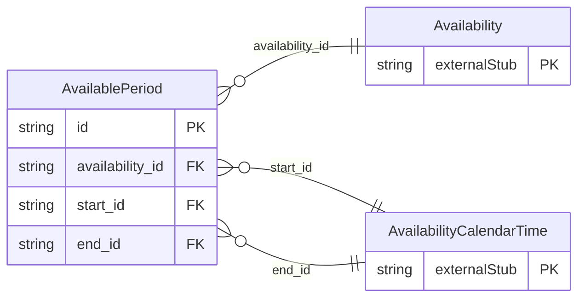

<!-- Code generated by protoc-gen-store. DO NOT EDIT. -->

# `rfc/rfc7953/availability/available/` — Prisma schema

Generated from Protobuf by protoc-gen-store. Source of truth is the `.proto` files — regenerate rather than editing.

| Models | Enums |
| ---: | ---: |
| 1 | 1 |

## Entity relationships

Schema file: [`available.postgres.prisma`](./available.postgres.prisma)

### `AvailablePeriod` → `available_periods`

AvailablePeriod is the AVAILABLE sub-component, RFC 7953 section 3.1 <https://www.rfc-editor.org/rfc/rfc7953.html#section-3.1>. A window of free time inside an Availability. The enclosing VAVAILABILITY declares its whole range busy by default, and each of these carves out a period that is not -- so an ordinary working week is one Availability with one recurring AvailablePeriod, not five hundred separate ones. A value object, not a resource: section 3.1 defines it only as a sub-component of VAVAILABILITY, and it has no identity or lifecycle apart from its parent. Its own UID (`ical_uid`) is interchange identity, the same distinction rule 9 draws everywhere else. Named AvailablePeriod rather than Available: AIP-140 <https://aip.dev/140> wants a noun, and a bare adjective names no thing. Reference: RFC 7953 "Calendar Availability", section 3.1. https://www.rfc-editor.org/rfc/rfc7953.html#section-3.1

| Column | Type | Null |
| --- | --- | --- |
| `id` | `CHAR(26)` | not null |
| `ical_uid` | `VARCHAR(255)` | nullable |
| `duration` | `INTERVAL` | nullable |
| `summary` | `VARCHAR(255)` | nullable |
| `description` | `VARCHAR(255)` | nullable |
| `location` | `VARCHAR(255)` | nullable |
| `recurrence_rule` | `VARCHAR(255)` | nullable |
| `categories` | `VARCHAR(255)[]` | nullable |
| `comments` | `VARCHAR(255)[]` | nullable |
| `end_form_case` | `AvailablePeriodEndFormCase` | nullable |
| `availability_id` | `CHAR(26)` | not null |
| `start_id` | `CHAR(26)` | not null |
| `end_id` | `CHAR(26)` | nullable |

### Enums

- `AvailablePeriodEndFormCase`: END, DURATION
