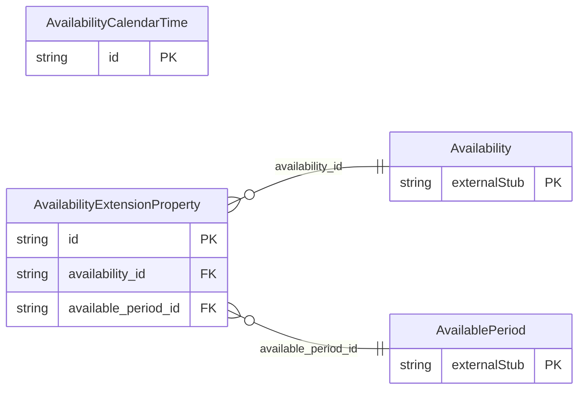

<!-- Code generated by protoc-gen-store. DO NOT EDIT. -->

# `rfc/rfc7953/availability/types/` — Prisma schema

Generated from Protobuf by protoc-gen-store. Source of truth is the `.proto` files — regenerate rather than editing.

| Models | Enums |
| ---: | ---: |
| 2 | 2 |

## Entity relationships

Schema file: [`types.postgres.prisma`](./types.postgres.prisma)

### `AvailabilityCalendarTime` → `calendar_times`

CalendarTime is an iCalendar DATE or DATE-TIME value, RFC 5545 sections 3.3.4 <https://www.rfc-editor.org/rfc/rfc5545.html#section-3.3.4> and 3.3.5 <https://www.rfc-editor.org/rfc/rfc5545.html#section-3.3.5>. A copy of the type in protobuf.rfc5545.event.v1, not a reference: AIP-215 <https://aip.dev/215> permits no cross-package message reference, so a value type shared between iCalendar components is duplicated per package. That tax is documented in docs/decisions.md and paid here for the fifth time. google.protobuf.Timestamp cannot express what iCalendar needs: section 3.3.5 <https://www.rfc-editor.org/rfc/rfc5545.html#section-3.3.5> gives DATE-TIME a floating form, a UTC form and a TZID form, and section 3.3.4 <https://www.rfc-editor.org/rfc/rfc5545.html#section-3.3.4> adds the all-day DATE. Availability is exactly where the difference bites -- "I am free 09:00 to 17:00" is a floating local-time statement that must not shift across a DST boundary. Reference: RFC 5545 "Internet Calendaring and Scheduling Core Object Specification (iCalendar)", section 3.3.5. https://www.rfc-editor.org/rfc/rfc5545.html#section-3.3.5

| Column | Type | Null |
| --- | --- | --- |
| `id` | `CHAR(26)` | not null |
| `date` | `DATE` | nullable |
| `date_time` | `TIMESTAMPTZ` | nullable |
| `value_case` | `AvailabilityCalendarTimeValueCase` | nullable |

### `AvailabilityExtensionProperty` → `extension_properties`

ExtensionProperty carries an iCalendar property this schema does not model. Not a hole punched in a typed schema: RFC 5545 section 3.8.8.1 <https://www.rfc-editor.org/rfc/rfc5545.html#section-3.8.8.1> reserves IANA-registered properties and section 3.8.8.2 <https://www.rfc-editor.org/rfc/rfc5545.html#section-3.8.8.2> non-standard X- properties, and requires applications to ignore what they do not recognise rather than reject it. RFC 7953 section 3.1 <https://www.rfc-editor.org/rfc/rfc7953.html#section-3.1> permits both on VAVAILABILITY and AVAILABLE explicitly. Reference: RFC 5545 "Internet Calendaring and Scheduling Core Object Specification (iCalendar)", section 3.8.8.2. https://www.rfc-editor.org/rfc/rfc5545.html#section-3.8.8.2

| Column | Type | Null |
| --- | --- | --- |
| `id` | `CHAR(26)` | not null |
| `key` | `VARCHAR(255)` | not null |
| `values` | `VARCHAR(255)[]` | nullable |
| `parameters` | `JSONB` | nullable |
| `availability_id` | `CHAR(26)` | not null |
| `available_period_id` | `CHAR(26)` | not null |

### Enums

- `BusyType`: BUSY, BUSY_UNAVAILABLE, BUSY_TENTATIVE
- `AvailabilityCalendarTimeValueCase`: DATE, DATE_TIME
