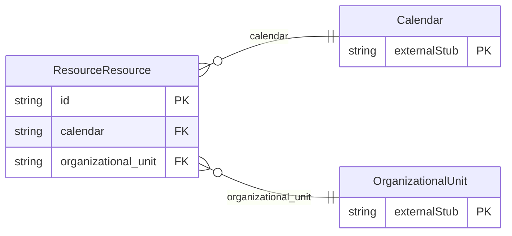

<!-- Code generated by protoc-gen-store. DO NOT EDIT. -->

# `rfc/rfc9073/resource/resource/` — Prisma schema

Generated from Protobuf by protoc-gen-store. Source of truth is the `.proto` files — regenerate rather than editing.

| Models | Enums |
| ---: | ---: |
| 1 | 0 |

## Entity relationships

Schema file: [`resource.postgres.prisma`](./resource.postgres.prisma)

### `ResourceResource` → `entity`

Resource is the VRESOURCE component, RFC 9073 section 7.3 <https://www.rfc-editor.org/rfc/rfc9073.html#section-7.3>. Something bookable that is not a person and not a place: a projector, a meeting room, a parking bay, a minibus. RFC 5545 section 3.8.1.10 <https://www.rfc-editor.org/rfc/rfc5545.html#section-3.8.1.10> had a free-text RESOURCES property; section 7.3 is its structured replacement. A resource of its own, where `protobuf.rfc5545.event.v1.Resource` is a value object on an event. The two are the same component serving the two uses section 7.3 describes: the value object says *this booking needs a room*, and this says *here is the room*, addressable on its own so a catalogue can be listed, amended and retired independently of any booking. That is the test in `docs/adding-data.md` for a package rather than a field, and rule 8's for full CRUD. Neither replaces the other and both stay. A flat collection, "resources/{resource}", for the reason OrganizationalUnit is flat: section 7.3 defines the component's properties and says nothing about where it sits, so nesting it under a calendar or an organizational unit would assert a containment the RFC does not require. Reference: RFC 9073 "Event Publishing Extensions to iCalendar", section 7.3. https://www.rfc-editor.org/rfc/rfc9073.html#section-7.3

| Column | Type | Null |
| --- | --- | --- |
| `id` | `CHAR(26)` | not null |
| `name` | `VARCHAR(255)` | not null |
| `uid` | `VARCHAR(255)` | nullable |
| `ical_uid` | `VARCHAR(255)` | nullable |
| `display_name` | `VARCHAR(255)` | nullable |
| `description` | `VARCHAR(255)` | nullable |
| `resource_types` | `VARCHAR(255)[]` | nullable |
| `position` | `POINT` | nullable |
| `calendar` | `CHAR(26)` | nullable |
| `organizational_unit` | `CHAR(26)` | nullable |
| `create_time` | `TIMESTAMPTZ` | not null |
| `update_time` | `TIMESTAMPTZ` | not null |
| `etag` | `VARCHAR(255)` | nullable |
| `delete_time` | `TIMESTAMPTZ` | nullable |
| `expire_time` | `TIMESTAMPTZ` | nullable |
