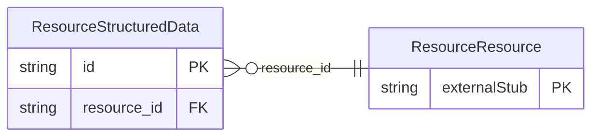

<!-- Code generated by protoc-gen-store. DO NOT EDIT. -->

# `rfc/rfc9073/resource/types/` — Prisma schema

Generated from Protobuf by protoc-gen-store. Source of truth is the `.proto` files — regenerate rather than editing.

| Models | Enums |
| ---: | ---: |
| 1 | 1 |

## Entity relationships

Schema file: [`types.postgres.prisma`](./types.postgres.prisma)

### `ResourceStructuredData` → `structured_datas`

StructuredData is the STRUCTURED-DATA property, RFC 9073 section 6.6 <https://www.rfc-editor.org/rfc/rfc9073.html#section-6.6>. Machine-readable data attached to a resource, with a media type and a schema URI saying how to read it. This is the RFC's own extension point: anything the schema does not model rides here rather than forcing a new field. A copy of `protobuf.rfc5545.event.v1.StructuredData`, not a reference to it. AIP-215 <https://aip.dev/215> permits no cross-package message reference and rule 4 forbids a shared wrapper package, so a value type used by two packages is defined in each. The duplication is the documented cost of that rule; keep the two in step when either changes. Reference: RFC 9073 "Event Publishing Extensions to iCalendar", section 6.6. https://www.rfc-editor.org/rfc/rfc9073.html#section-6.6

| Column | Type | Null |
| --- | --- | --- |
| `id` | `CHAR(26)` | not null |
| `text` | `VARCHAR(255)` | nullable |
| `uri` | `VARCHAR(255)` | nullable |
| `binary` | `BYTEA` | nullable |
| `format_type` | `VARCHAR(255)` | nullable |
| `schema` | `VARCHAR(255)` | nullable |
| `value_case` | `ResourceStructuredDataValueCase` | nullable |
| `resource_id` | `CHAR(26)` | not null |

### Enums

- `ResourceStructuredDataValueCase`: TEXT, URI, BINARY
