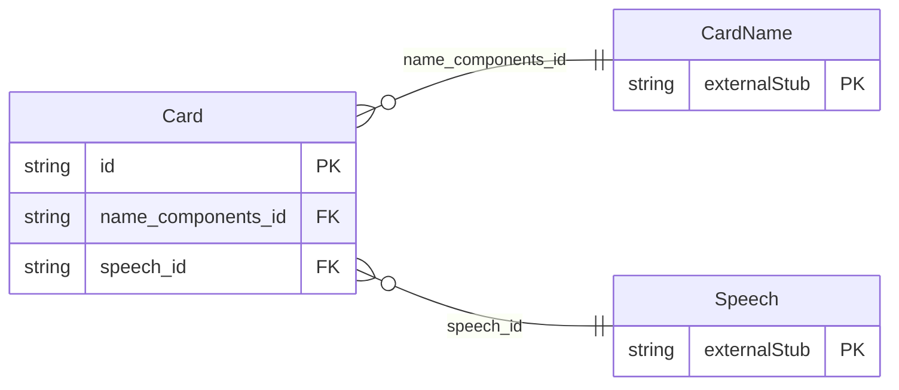

<!-- Code generated by protoc-gen-store. DO NOT EDIT. -->

# `rfc/rfc9553/card/card/` — Prisma schema

Generated from Protobuf by protoc-gen-store. Source of truth is the `.proto` files — regenerate rather than editing.

| Models | Enums |
| ---: | ---: |
| 1 | 0 |

## Entity relationships

Schema file: [`card.postgres.prisma`](./card.postgres.prisma)

### `Card` → `resource`

Card is the JSContact Card object, RFC 9553 <https://www.rfc-editor.org/rfc/rfc9553.html> as amended by RFC 9982 <https://www.rfc-editor.org/rfc/rfc9982.html>. **The canonical contact model** under rule 14: what this schema stores. protobuf.rfc6350.vcard.v1 remains a first-class package with its own CRUD, but it is the legacy representation -- a vCard saved through that API is converted here for storage and converted back on read, per RFC 9555. Most multi-valued properties are **maps keyed by a stable id**, not lists. That is section 1.4.1's `Id` type and it is load-bearing: the key must survive across versions of the same Card, because localizations and patches address individual entries by it. A list would renumber on every edit and break both. RFC 9982 makes `jscontact_uid` optional, where RFC 9553 required it -- the later reading is the one implemented, because auto-generating an ephemeral uid during vCard conversion is exactly what 9982 set out to stop. Reference: RFC 9553 "JSContact: A JSON Representation of Contact Data". https://www.rfc-editor.org/rfc/rfc9553.html Reference: RFC 9982 "JSContact Version 2.0". https://www.rfc-editor.org/rfc/rfc9982.html

| Column | Type | Null |
| --- | --- | --- |
| `id` | `CHAR(26)` | not null |
| `name` | `VARCHAR(255)` | not null |
| `uid` | `VARCHAR(255)` | nullable |
| `jscontact_uid` | `VARCHAR(255)` | nullable |
| `kind` | `CardKind` | nullable |
| `nicknames` | `JSONB` | nullable |
| `organizations` | `JSONB` | nullable |
| `titles` | `JSONB` | nullable |
| `emails` | `JSONB` | nullable |
| `online_services` | `JSONB` | nullable |
| `phones` | `JSONB` | nullable |
| `preferred_languages` | `JSONB` | nullable |
| `calendars` | `JSONB` | nullable |
| `scheduling_addresses` | `JSONB` | nullable |
| `addresses` | `JSONB` | nullable |
| `crypto_keys` | `JSONB` | nullable |
| `directories` | `JSONB` | nullable |
| `links` | `JSONB` | nullable |
| `media` | `JSONB` | nullable |
| `anniversaries` | `JSONB` | nullable |
| `keywords` | `VARCHAR(255)[]` | nullable |
| `notes` | `JSONB` | nullable |
| `personal_info` | `JSONB` | nullable |
| `relations` | `JSONB` | nullable |
| `members` | `VARCHAR(255)[]` | nullable |
| `language_code` | `VARCHAR(255)` | nullable |
| `product_id` | `VARCHAR(255)` | nullable |
| `jscontact_create_time` | `TIMESTAMPTZ` | nullable |
| `jscontact_update_time` | `TIMESTAMPTZ` | nullable |
| `etag` | `VARCHAR(255)` | nullable |
| `delete_time` | `TIMESTAMPTZ` | nullable |
| `expire_time` | `TIMESTAMPTZ` | nullable |
| `create_time` | `TIMESTAMPTZ` | not null |
| `update_time` | `TIMESTAMPTZ` | not null |
| `jscontact_props` | `JSONB` | nullable |
| `name_components_id` | `CHAR(26)` | nullable |
| `speech_id` | `CHAR(26)` | nullable |
