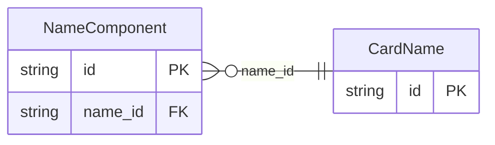

<!-- Code generated by protoc-gen-store. DO NOT EDIT. -->

# `rfc/rfc9553/card/name/` — Prisma schema

Generated from Protobuf by protoc-gen-store. Source of truth is the `.proto` files — regenerate rather than editing.

| Models | Enums |
| ---: | ---: |
| 2 | 1 |

## Entity relationships

Schema file: [`name.postgres.prisma`](./name.postgres.prisma)

### `CardName` → `names`

Name is the Card "name" property, RFC 9553 section 2.2.1.1 <https://www.rfc-editor.org/rfc/rfc9553.html#section-2.2.1.1>. The structural difference from vCard is the point of JSContact. RFC 6350 section 6.2.2 <https://www.rfc-editor.org/rfc/rfc6350.html#section-6.2.2>'s N is five positional components in a fixed order, so a name that does not fit that order cannot be expressed. Here a name is an *ordered list of typed components*, so "given surname2 surname" is as representable as "surname, given" -- and `is_ordered` says whether the order given is meaningful or merely incidental. Reference: RFC 9553 "JSContact: A JSON Representation of Contact Data", section 2.2.1.1. https://www.rfc-editor.org/rfc/rfc9553.html#section-2.2.1.1

| Column | Type | Null |
| --- | --- | --- |
| `id` | `CHAR(26)` | not null |
| `is_ordered` | `BOOLEAN` | nullable |
| `default_separator` | `VARCHAR(255)` | nullable |
| `display_name` | `VARCHAR(255)` | nullable |
| `sort_as` | `JSONB` | nullable |
| `phonetic_script` | `VARCHAR(255)` | nullable |
| `phonetic_system` | `CardPhoneticSystem` | nullable |

### `NameComponent` → `name_components`

NameComponent is one typed part of a Name, RFC 9553 section 2.2.1.2 <https://www.rfc-editor.org/rfc/rfc9553.html#section-2.2.1.2>. Reference: RFC 9553 "JSContact: A JSON Representation of Contact Data", section 2.2.1.2. https://www.rfc-editor.org/rfc/rfc9553.html#section-2.2.1.2

| Column | Type | Null |
| --- | --- | --- |
| `id` | `CHAR(26)` | not null |
| `value` | `VARCHAR(255)` | not null |
| `kind` | `NameComponentKind` | not null |
| `phonetic` | `VARCHAR(255)` | nullable |
| `name_id` | `CHAR(26)` | not null |

### Enums

- `NameComponentKind`: TITLE, GIVEN, GIVEN2, SURNAME, SURNAME2, CREDENTIAL, GENERATION, SEPARATOR
