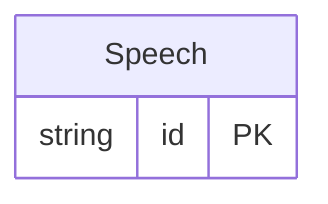

<!-- Code generated by protoc-gen-store. DO NOT EDIT. -->

# `rfc/rfc9553/card/speech/` — Prisma schema

Generated from Protobuf by protoc-gen-store. Source of truth is the `.proto` files — regenerate rather than editing.

| Models | Enums |
| ---: | ---: |
| 1 | 1 |

## Entity relationships

Schema file: [`speech.postgres.prisma`](./speech.postgres.prisma)

### `Speech` → `speeches`

Speech is the Card "speakToAs" property, RFC 9553 section 2.2.4 <https://www.rfc-editor.org/rfc/rfc9553.html#section-2.2.4>. How to refer to the contact in speech and prose. Named `Speech` rather than the RFC's `SpeakToAs`: AIP-140 <https://aip.dev/140> bans prepositions in field names, so the field cannot be `speak_to_as`, and a message whose name does not match its field reads worse than one renamed honestly. Section 2.2.4 is explicit that grammatical gender "does not allow inferring the gender identities or assigned sex of the contact" -- it is a property of the language being written, and `pronouns` is the separate, self-reported thing. The two are deliberately distinct fields here for that reason. Reference: RFC 9553 "JSContact: A JSON Representation of Contact Data", section 2.2.4. https://www.rfc-editor.org/rfc/rfc9553.html#section-2.2.4

| Column | Type | Null |
| --- | --- | --- |
| `id` | `CHAR(26)` | not null |
| `grammatical_gender` | `GrammaticalGender` | nullable |
| `pronouns` | `JSONB` | nullable |

### Enums

- `GrammaticalGender`: ANIMATE, COMMON, FEMININE, INANIMATE, MASCULINE, NEUTER
