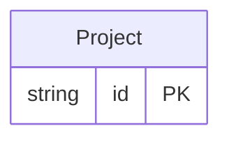

<!-- Code generated by protoc-gen-store. DO NOT EDIT. -->

# `rfc/shared/project/project/` — Prisma schema

Generated from Protobuf by protoc-gen-store. Source of truth is the `.proto` files — regenerate rather than editing.

| Models | Enums |
| ---: | ---: |
| 1 | 0 |

## Entity relationships

Schema file: [`project.postgres.prisma`](./project.postgres.prisma)

### `Project` → `resource`

Project is a scope of work with a lifecycle. Native: no RFC defines it, and under the rules of this repository that demands a reason rather than a citation. The reason is that it is not a Group. A Group (RFC 4519 section 3.5 <https://www.rfc-editor.org/rfc/rfc4519.html#section-3.5>) answers *who belongs*, and its membership edges already carry a role. A Project answers *what work is scoped and when* -- it starts, it ends, it is paused or abandoned, and none of that has anywhere to live on a groupOfNames. The test applied before building it: if Project turned out to be a Group with a role, it would not exist, because Membership.role already covers that. It survives because of start_time, end_time and state, which are lifecycle rather than membership. Membership of a project is deliberately absent. If a project needs members, they are a Group referenced from here, not a second membership mechanism -- two overlapping ways to say who belongs is worse than either alone.

| Column | Type | Null |
| --- | --- | --- |
| `id` | `CHAR(26)` | not null |
| `name` | `VARCHAR(255)` | not null |
| `uid` | `VARCHAR(255)` | nullable |
| `display_name` | `VARCHAR(255)` | not null |
| `description` | `VARCHAR(255)` | nullable |
| `owner` | `VARCHAR(255)` | nullable |
| `start_time` | `TIMESTAMPTZ` | nullable |
| `end_time` | `TIMESTAMPTZ` | nullable |
| `state` | `ProjectState` | nullable |
| `etag` | `VARCHAR(255)` | nullable |
| `delete_time` | `TIMESTAMPTZ` | nullable |
| `expire_time` | `TIMESTAMPTZ` | nullable |
| `create_time` | `TIMESTAMPTZ` | not null |
| `update_time` | `TIMESTAMPTZ` | not null |
