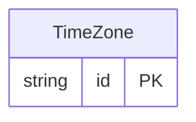

<!-- Code generated by protoc-gen-store. DO NOT EDIT. -->

# `rfc/type/datetime/` — Prisma schema

Generated from Protobuf by protoc-gen-store. Source of truth is the `.proto` files — regenerate rather than editing.

| Models | Enums |
| ---: | ---: |
| 1 | 0 |

## Entity relationships

Schema file: [`datetime.postgres.prisma`](./datetime.postgres.prisma)

### `TimeZone` → `time_zones`

Represents a time zone from the [IANA Time Zone Database](https://www.iana.org/time-zones).

| Column | Type | Null |
| --- | --- | --- |
| `id` | `VARCHAR(255)` | not null |
| `version` | `VARCHAR(255)` | nullable |
